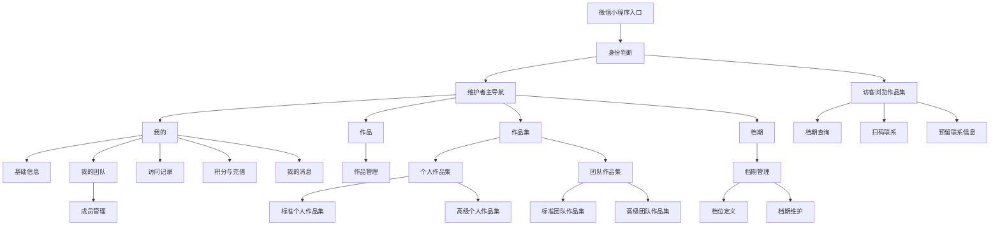

# SaaS 微信小程序需求文档

版本：v2.0
日期：2026-06-27
产品暂名：映期Folio

本文档以 `design/prototype.html` 的 29 个页面设计稿为主要交互依据，并保留设计稿尚未覆盖但属于 MVP 闭环的业务能力。页面文案用于说明业务意图，最终上线文案可在不改变业务规则的前提下优化。

### 版本变更

| 版本 | 日期 | 主要变更 |
| --- | --- | --- |
| v1.0 | 2026-06-17 | 完成产品范围、核心流程和数据模型初稿 |
| v1.1 | 2026-06-22 | 对齐详细设计稿；补充工作台指标、作品批量管理、团队成员权限、作品集多实例与发布规则、AI 失败扣费规则、访客档期筛选及页面覆盖矩阵 |
| v1.2 | 2026-06-22 | 团队角色调整为拥有者、管理者、普通成员；三种角色均可查看成员，移除成员展示范围，明确内容引用、成员维护、团队作品集管理、预览和分享的角色边界 |
| v1.3 | 2026-06-22 | 高级作品集组件库新增预留联系信息组件；补充访客提交联系人、手机、微信、档期和需求的校验、线索归属、权限及隐私规则 |
| v1.4 | 2026-06-23 | 预留联系信息组件扩展至标准作品集（个人+团队），制定三期迭代规划，新增对象存储与流量成本预估 |
| v1.5 | 2026-06-24 | 新增基础信息页设计稿，明确从“我的”头像入口进入，支持头像和自定义标签维护，并补充退出登录操作 |
| v1.6 | 2026-06-24 | 基础信息页新增个人简介和服务城市，服务城市支持多个城市并用顿号直接分隔 |
| v1.7 | 2026-06-24 | 基础信息页头像摘要仅保留个人唯一码，表单内容超出手机视口时通过上下滚动完整查看 |
| v1.8 | 2026-06-25 | 基础信息页新增标签输入窗口默认隐藏，仅在点击“+ 添加标签”后展示 |
| v1.9 | 2026-06-26 | “我的”页新增“我的消息”，补充系统消息、未读统计、单条/批量/全量已读和消息模型 |
| v2.0 | 2026-06-27 | 重整档期维护 PRD：取消默认档位初始化，限定档期记录级备注，明确维护端保存/删除接口、唯一索引修复和联系人存储口径 |

## 1. 项目概述

本项目是面向婚庆与演艺服务从业者的 SaaS 微信小程序，帮助个人与团队快速维护作品、档期、作品集展示页，并追踪客户访问记录。

主要服务对象包括：

- 婚庆司仪、婚庆司仪团队
- 婚庆公司
- 婚庆化妆师、造型团队
- 模特、模特团队
- 其他以“作品展示 + 档期查询 + 客资跟进”为核心需求的服务者

产品核心价值：

- 维护者快速生成专业作品集，并通过微信分享给客户。
- 访客可直接查看作品、查询档期、扫码联系或主动预留联系信息。
- 团队可统一展示成员作品集，并查询团队整体档期。
- 维护者可看到客户访问记录，辅助二次跟进。
- 高级作品集通过 AI 生成个性化排版，降低定制展示页制作门槛。

## 2. 角色定义

### 2.1 访客

通过微信分享卡片、二维码或链接进入作品集页面的客户。访客无需维护内容，可以浏览作品集、查询档期、查看联系方式，其访问会被记录。

### 2.2 维护者

需要维护作品、档期、作品集、团队和访问记录的用户。维护者首次登录时需完成微信登录和手机号绑定，系统生成个人唯一码。

### 2.3 团队拥有者、管理者与普通成员

- 团队拥有者：创建团队的维护者或接受团队所有权转移的维护者。每个团队同时只能有一名拥有者，可查看和维护团队成员、管理团队作品集，并可预览和分享团队作品集。
- 团队管理者：由拥有者指定，可查看团队成员、管理团队作品集，并可预览和分享团队作品集；不能添加、移除成员或调整成员角色。
- 普通成员：已接受团队邀请的维护者，可查看团队成员、预览和分享团队作品集；不能维护成员，也不能创建、编辑、保存、发布或删除团队作品集。
- 管理者和普通成员仍独立维护自己的个人资料、作品、档期和个人作品集；团队仅按授权范围引用其资料和内容。
- 同一维护者可以同时加入多个团队；其在不同团队中的角色、加入状态和内容引用权限相互独立。

## 3. 核心名词

- 个人唯一码：系统为每个维护者生成的唯一身份编码，用于被团队添加。
- 团队唯一码：系统为团队生成的唯一编码，用于团队识别和后续扩展邀请。
- 个人作品：维护者上传的图片或视频素材，可被选择进个人作品集。
- 个人作品集：面向访客展示的个人展示页，分为标准个人作品集和高级个人作品集。
- 团队作品集：面向访客展示的团队展示页，分为标准团队作品集和高级团队作品集；团队不设积分账户，团队作品集维护由执行编辑的维护者个人账户扣除积分。
- 作品集草稿版本：维护者正在编辑、可预览但访客不可访问的作品集配置。
- 作品集发布版本：最近一次成功发布、访客实际访问的只读版本；已发布作品集再次编辑时，旧发布版本继续对访客可用，直到重新发布成功。
- 成员内容引用权限：团队拥有者可分别控制成员的个人作品集、头像资料和个人作品素材能否被团队作品集引用。
- 档位定义：维护者预先定义的可预约时间段模板，包含档位名称、开始时间、结束时间和展示颜色。
- 档期维护：维护者在具体日期选择已定义的档位，并记录该日期该档位的状态、联系人、电话、档期备注等信息。
- 档期：由具体日期与档位定义组合形成的日期占用状态，支持个人查询和团队聚合查询。
- 访问记录：访客访问作品集产生的记录，包括来源、访问时间、访问页面、停留行为等。
- 联系线索：访客通过预留联系信息组件主动提交的联系人、手机、微信、意向档期和需求，可关联本次访问记录用于后续跟进。
- 系统消息：由平台或业务流程产生的站内消息，包括积分不足提醒、团队邀请、团队角色变更和系统公告，不包含用户私聊。
- 积分：维护者用于上传作品、维护作品集、承接个人作品集访客浏览消耗的计费单位。
- 积分余额：维护者个人账户当前可用积分，余额不足时限制对应消耗动作。
- 积分流水：积分充值、赠送、消耗、回退等变动记录。

## 4. 产品范围

### 4.1 MVP 范围

- 登录页支持注册、微信授权登录、手机登录、账号密码登录四个入口；注册支持选填推荐码并通过微信授权获取手机号
- “我的”工作台、我的消息、基础信息、个人资料与微信二维码维护
- 个人作品上传、搜索、标签筛选、批量管理、编辑、删除、排序及引用关系查看
- 个人档位定义、档期维护与访客查询
- 标准个人作品集创建、预览、发布、分享
- 高级个人作品集创建、AI 生成、预览、发布
- 团队创建、团队唯一码生成、拥有者/管理者/普通成员三级角色、通过个人唯一码邀请成员、成员确认及内容引用权限管理
- 标准团队作品集创建、预览、发布、分享
- 高级团队作品集创建、AI 生成、预览、发布
- 团队档期查询
- 标准及高级作品集预留联系信息组件、访客线索提交与维护者查看
- 访客访问记录与基础统计
- 积分余额查看、积分充值、积分消耗与积分流水

### 4.2 暂不纳入 MVP

- 会员订阅、分销返佣
- IM 聊天系统
- 合同、报价单、订单管理
- 复杂 CRM 跟进流程
- 复杂财务对账与发票管理
- 多门店组织架构
- 跨平台 H5/PC 官网

说明：注册推荐码与推广关系记录纳入 MVP，但佣金计算、提现、分销返佣结算不纳入 MVP。

## 5. 用户故事

### 5.1 维护者首次登录即注册

作为维护者，我希望首次进入小程序时可以在注册、微信授权登录、手机登录、账号密码登录之间切换；注册时可以选填推荐码，并通过微信授权获取手机号完成注册，系统自动给我生成个人唯一码，方便后续被团队添加和推广追踪。

验收标准：

- 首次进入显示登录页，并以 tab 形式展示注册、微信授权登录、手机登录、账号密码登录。
- 注册 tab 展示推荐码输入框和微信授权按钮，通过微信授权获取手机号并创建注册记录。
- 微信授权登录 tab 仅展示微信授权登录按钮。
- 手机登录 tab 展示手机号和验证码输入。
- 账号密码登录 tab 展示手机号和密码输入。
- 注册时可选填推荐码，推荐码为其他维护者的个人唯一码。
- 推荐码有效时，后台记录推荐人和被推荐人的推广关系。
- 推荐码为空时允许继续注册。
- 推荐码无效时需提示，可修改或跳过。
- 同一用户只能在首次注册时绑定一次推荐关系。
- 绑定成功后生成不可重复的个人唯一码。
- 个人唯一码可复制、可展示为二维码。
- 注册、授权登录或手机号绑定成功后进入”我的”页。
- 手机验证码发送需校验手机号格式并防止重复发送；验证码错误、过期或请求过于频繁时给出明确提示。
- 账号密码不得明文存储或回显；登录失败不暴露手机号是否已注册。

### 5.2 维护个人作品

作为维护者，我希望上传图片和视频，维护我的作品库，并选择其中的素材生成作品集。

验收标准：

- 支持一次选择并上传最多 9 个图片或视频。
- 支持标题、标签、说明、排序。
- 作品标题最长 30 个字符，编辑页实时展示已输入字符数。
- 上传后系统根据素材自动识别图片或视频类型，维护表单不单独填写作品类型。
- 新增作品时，作品标题默认使用文件名，保存后可修改。
- 作品说明可先为空，保存后再补充。
- 作品标签可选；批量上传时选择标签，会同时应用到本次上传的所有作品。
- 批量上传的已选文件列表展示全部已选文件，最多 9 个；每条展示素材缩略图，视频使用封面缩略图并显示视频标识；列表高度超出时支持上下滚动。
- 作品编辑页用于单个作品维护，支持修改标题、标签和说明。
- 作品列表支持按标题或标签搜索，并展示标签筛选项及对应作品数量。
- 作品列表展示媒体类型、视频时长、标签和被作品集引用次数；未被引用时展示“未引用”。
- 批量管理支持选择多个作品后统一加入作品集或调整排序；批量操作完成后保留可识别的成功、失败结果。
- 作品编辑页展示完整引用明细，包括作品集名称、作品集类型和引用组件位置。
- 支持删除素材。
- 已被作品集引用的作品删除时需提示影响范围；未完成解除引用或确认同步移除前不得静默删除。

### 5.3 维护个人档期

作为维护者，我希望先定义常用档位的名称、时间段和颜色，再在具体日期选择已定义档位并维护该档期的预约信息，便于客户按具体时间段查询。

验收标准：

- 支持月历概览；选择日期后仅展示该日期已维护的档位、时间和状态。
- 新用户默认没有档位定义；维护者需先新增档位定义，才能在具体日期维护档期。
- 档位定义支持新增、编辑、停用档位，例如迎亲档、午后仪式档、After Party 档；每个档位定义包含名称、开始时间、结束时间和展示颜色。
- 档位定义颜色默认提供 8 种可选；月历当天格子按已维护档期对应的档位颜色进行多色彩标记。
- 档期维护支持在具体日期选择一个或多个已定义档位，并为每个日期档位标记空闲、已约、待定、休息。
- 档期维护支持记录联系人姓名、联系电话、档期备注等信息，仅维护者可见。
- 访客只能看到日期、档位名称、时间段和是否可预约，不展示联系人、电话和档期备注。

### 5.4 创建标准个人作品集

作为维护者，我希望选择固定模板快速生成个人作品集，用于发给客户。

验收标准：

- 可设置小程序分享封面和头像。
- 页面顶部为轮播图组件，可选择多张个人作品图片，并在预览页和访客页自动轮播展示。
- 轮播图下方为档期查询组件。
- 作品列表每行两个，可选择图片或视频作品。
- 作品列表下方为预留联系信息组件，访客可提交联系方式与需求。
- 页面底部展示个人微信二维码。
- 标准作品集包含维护页、预览页、访客页。
- 维护页支持保存草稿、预览、发布、复制分享路径。
- 分享入口仅在作品集发布成功后提供。
- 预览页和访客页展示效果一致；预览页有返回按钮，预览页内任何查看、播放、档期查询、二维码点击均不扣除积分。

### 5.5 创建高级个人作品集

作为维护者，我希望通过自然语言描述，让 AI 根据我选择的作品生成更个性化的展示页。

验收标准：

- 维护者选择个人作品并为每个素材标记序号。
- 维护者输入自然语言描述，例如：“1号、2号、3号作品使用轮播图组件放最上面，下面放头像，再下面把5号、6号、7号、8号作品放列表，再下面放档期查询组件，最下面放微信二维码。不要白底背景，要高级感。”
- AI 输出结构化页面组件方案。
- 系统渲染可预览页面，而不是直接执行 AI 生成代码。
- 维护者可调整组件顺序、替换素材、重新生成。
- 高级作品集包含维护页、预览页、访客页。
- 维护页支持保存草稿、重新生成、预览和发布。
- 发布前必须完成预览确认；预览页和访客页展示效果一致，预览页有返回按钮，预览页内任何查看、播放、档期查询、二维码点击均不扣除积分。

### 5.6 创建团队

作为维护者，我希望创建团队并添加其他维护者为成员，方便统一展示团队能力。

验收标准：

- 创建团队后生成团队唯一码。
- 创建者默认为团队拥有者，且同一团队同时只能有一名拥有者。
- 可通过其他维护者的个人唯一码搜索并添加成员。
- 可设置成员状态：待确认、已加入、已移除。
- 团队成员至少包含头像、姓名、角色、个人作品集入口。
- 已加入的拥有者、管理者和普通成员均可查看团队成员列表及成员公开信息。
- 成员邀请默认需要本人确认；待确认成员仅在管理端展示，不计入访客端团队成员和团队档期聚合。
- 只有团队拥有者可以添加、移除成员，设置管理者/普通成员角色，以及配置内容引用权限。
- 团队拥有者不可在普通角色选择器中直接新增；所有权只能通过单独的团队所有权转移流程变更。
- 三种角色均可在已加入成员中按姓名、职业或个人唯一码搜索；仅拥有者的管理视图支持按全部、待确认、已加入等管理状态筛选。

### 5.7 创建标准团队作品集

作为团队拥有者或管理者，我希望使用固定模板生成团队作品集，让客户查看团队成员和整体档期；作为普通成员，我希望可以预览并分享已发布团队作品集。

验收标准：

- 可设置小程序分享封面和头像。
- 页面顶部为轮播图组件，可选择个人作品图片。
- 轮播图下方为团队档期查询组件，可查询团队所有成员是否有人可约。
- 团队成员个人作品集列表每行两个，展示封面，可点击跳转。
- 页面底部展示团队或联系人微信二维码。
- 拥有者和管理者可以创建、编辑、保存、发布和删除团队作品集，并可以预览和分享。
- 普通成员不能管理团队作品集，只能预览团队已保存的作品集；分享入口仅在作品集已发布时提供。

### 5.8 创建高级团队作品集

作为团队拥有者或管理者，我希望通过自然语言描述，让 AI 根据团队素材与成员作品集生成更个性化的团队展示页；作为普通成员，我希望可以预览并分享发布后的高级团队作品集。

验收标准：

- 可选择自己的个人作品或团队成员的个人作品集并标记序号。
- 支持自然语言描述组件顺序和展示规则。
- 支持团队档期查询组件、成员作品集列表、微信二维码等组件。
- AI 输出结构化组件方案，系统渲染预览。
- 拥有者或管理者确认后发布。
- 普通成员只能预览，且只能分享已发布版本，不显示 AI 生成、编辑、保存、发布和删除操作。

### 5.9 访客访问作品集

作为访客，我希望不用注册就能查看别人分享的作品集、查询档期并找到联系方式。

验收标准：

- 可打开个人或团队作品集。
- 支持浏览轮播图、图片、视频、作品集列表。
- 支持选择日期查询个人或团队档期。
- 可查看微信二维码并长按识别。
- 访问行为会形成访问记录。
- 当个人作品集所属维护者积分余额不足以承接访客访问或媒体查看扣费时，访客端仍打开作品集页面骨架，但内容区整体加灰色磨砂遮罩，并分两行明文提示“UNDER MAINTENANCE / 维护中”。
- 团队无积分账户，团队作品集访问无消耗；访客从团队作品集点击进入个人作品集后，再按个人作品集所属维护者的积分规则处理。

### 5.10 访客预留联系信息

作为访客，我希望在作品集内主动提交联系方式、意向档期和需求，方便作品集维护者与我进一步沟通。

验收标准：

- 预留联系信息组件支持联系人、手机、微信、意向档期、需求五个字段。
- 联系人为必填；手机和微信至少填写一项；意向档期和需求可选填。
- 提交前明确说明信息接收方和使用目的，访客主动提交视为授权作品集维护方仅用于本次咨询联系。
- 提交成功后展示成功反馈并禁止同一请求重复创建线索；失败时保留已填写内容并支持重试。
- 维护者预览页仅展示禁用示例，不保存信息、不创建线索、不计入访问统计。
- 个人作品集线索仅归属该作品集维护者；团队作品集线索仅团队拥有者和管理者可查看，普通成员不可查看。
- 联系方式在列表中脱敏展示，仅有权限的用户进入详情后可查看完整信息。

### 5.11 查看访问记录

作为维护者，我希望查看客户访问了哪个作品集、什么时候访问、访问了几次，以便跟进。

验收标准：

- 展示访问总量、今日访问、近 7 日趋势。
- 展示档期查询次数，并标记近 7 日趋势相对上一周期的升降比例。
- 展示访问记录列表：访问时间、访问作品集、访客标识、来源、访问次数。
- 支持按作品集、时间范围、访客类型筛选。
- 支持标记跟进状态：未跟进、已联系、已成交、无效。
- 支持单条或批量更新跟进状态。
- 访问记录需统计同一访客对同一作品集的累计访问次数。
- 访问明细摘要需展示来源、查看作品次数、查询档期日期、点击或长按二维码行为。
- 系统不维护“高意向”状态，由维护者根据访问次数和行为摘要自行判断客户意向。

### 5.12 查看积分与充值

作为维护者，我希望在“我的”页进入我的积分页，查看当前积分余额、近期消耗和充值记录，并在余额不足时快速充值。

验收标准：

- “我的”页展示当前积分余额和充值入口。
- 支持查看积分余额、累计充值积分、累计消耗积分、近期积分流水。
- 支持充值 1 元、10 元、50 元、100 元四个档位。
- 余额低于 50 积分时，在“我的”和充值页展示低余额提醒；该提醒不阻断正常操作。
- 充值成功后积分实时到账并写入充值记录。
- 上传作品、维护个人或团队作品集、访客访问个人作品集、图片查看、视频查看等行为按规则扣减积分。
- 团队没有积分账户；团队作品集由实际执行编辑、保存或发布动作的维护者个人账户扣除维护积分。
- 团队作品集的访客访问不扣除积分；访客从团队作品集跳转到个人作品集后，按个人作品集所属维护者扣除个人作品集访问、图片查看和视频查看积分。
- 余额不足时，维护端操作需提示充值；访客端访问需扣费的个人作品集时，内容区整体加灰色磨砂遮罩，并分两行明文提示“UNDER MAINTENANCE / 维护中”。
- 充值积分不可提现，仅可用于本产品内的积分消耗；支付失败、取消或超时不得增加积分。

### 5.13 查看我的消息

作为维护者，我希望在“我的”页进入“我的消息”，查看系统提醒、团队邀请和积分不足提示，并能及时标记已读。

验收标准：

- “我的”页在“我的团队”下方展示“我的消息”入口，入口可展示未读数量提示。
- 消息均为系统消息，不支持用户之间私聊、群聊或回复。
- 消息列表支持查看全部消息，并支持按未读、团队、积分筛选。
- 消息类型至少包含积分不足消息、团队邀请消息、团队角色变更消息和系统公告。
- 支持单条消息标记已读。
- 支持选中多条未读消息后批量标记已读。
- 支持将当前用户全部未读消息标记为已读；在团队或积分筛选下可按当前分类全量标记已读。
- 团队邀请消息提供“去处理”入口，跳转到团队邀请处理页面；消息列表内不直接接受或拒绝邀请。
- 积分不足消息可提供“去查看”入口，跳转到积分相关页面或后续配置页面。
- 已读、批量已读和全量已读都必须按当前登录用户隔离，不能读取或修改其他用户消息。

## 6. 信息架构



维护者端底部主导航固定为四项：

1. 我的：原工作台页面，展示个人信息、积分余额，并承载访问记录、“我的团队”和“我的消息”入口。
2. 作品：原作品列表页，作为一级 tab 页面，不展示返回按钮。
3. 作品集：原作品集列表页，作为一级 tab 页面，不展示返回按钮。
4. 档期：原档期维护页，作为一级 tab 页面，不展示返回按钮，内部包含档位定义与档期维护。

底部主导航样式参考微信小程序底部导航：每一项均为图标 + 文字，不使用单字文字块代替图标；选中项通过图标和文字颜色高亮。

访问记录、“我的团队”和“我的消息”不进入底部主导航，统一从“我的”页进入，并根据各自业务状态展示可用功能。

## 7. 功能需求

### 7.1 登录与账号

功能说明：

- 登录页使用 tab 结构，包含注册、微信授权登录、手机登录、账号密码登录。
- 注册 tab：展示推荐码输入框和微信授权按钮，通过微信授权获取手机号后创建注册记录。
- 微信授权登录 tab：仅展示微信授权按钮，用于已有账号快速登录。
- 手机登录 tab：展示手机号、验证码输入框。
- 账号密码登录 tab：展示手机号、密码输入框。
- 注册时可选填推荐码，推荐码为其他维护者的个人唯一码。
- 推荐码有效时记录推广关系；推广关系仅用于后台统计和后续运营，不包含 MVP 内的佣金结算。
- 系统生成个人唯一码。
- 访客可匿名访问作品集，也可保留微信 openid 作为去重标识。

字段建议：

- 用户 ID
- 微信 openid / unionid
- 手机号
- 昵称
- 头像
- 个人唯一码
- 注册时填写的推荐码
- 推荐人用户 ID
- 注册时间
- 最近登录时间

推荐码规则：

- 推荐码来源于推荐人的个人唯一码。
- 用户不能绑定自己的个人唯一码作为推荐码。
- 同一注册用户只能绑定一个推荐人。
- 推荐关系一旦绑定，普通用户不可自行修改。
- 若填写的推荐码不存在、对应账号异常或被平台禁用，提示推荐码无效。

### 7.2 个人资料

“我的”页作为维护者工作台，需展示：

- 头像、姓名/艺名、职业、服务城市、标签和个人唯一码。
- 当前积分余额、今日消耗和余额低于 50 积分提醒，并提供充值入口。
- 作品素材数量、已发布作品集数量、近 7 日访问次数。
- 访问记录、“我的团队”和“我的消息”入口；“我的消息”入口可展示未读数量，“我的”页不直接承载复杂编辑表单。
- 点击“我的”页头像资料卡进入独立基础信息页，基础信息页承载头像、姓名/艺名、职业、个人简介、服务城市和标签维护。
- 基础信息页头像摘要区仅展示姓名/艺名、职业身份和个人唯一码，不展示服务城市或其它可编辑字段。

维护者可维护：

- 头像
- 姓名 / 艺名
- 职业身份：司仪、化妆师、模特、摄影、摄像、婚庆公司等
- 服务城市：可填写多个城市，直接使用顿号分隔，例如“上海、杭州、苏州”
- 个人简介
- 微信二维码
- 联系电话
- 标签：维护者自定义文本，例如高端婚礼、户外婚礼、双语主持、国风妆造等

标签规则：

- 单个标签长度不超过 10 个字。
- 每个维护者最多保留 10 个标签。
- 标签为空、重复、超长或数量超过上限时不得保存，并需提示具体原因。
- 新增标签输入窗口默认不展示；维护者点击“+ 添加标签”后打开新增标签窗口，窗口内展示标签输入、数量提示、取消和添加操作。

基础信息页的服务城市在编辑表单中作为普通输入项展示，不额外展示编辑图标。

基础信息页内容超过手机视口时，内容区需支持上下滚动，不得压缩字段卡或标签卡高度，也不得遮挡输入内容。

基础信息页需提供“保存修改”按钮和红色“退出登录”按钮。退出登录仅清除当前设备登录态并返回登录页，不删除账号、作品、档期、团队关系或已发布作品集。

个人资料保存后，使用个人资料的草稿作品集立即读取最新数据；已发布作品集是否更新以其发布版本为准，避免维护者修改资料后访客页未经确认发生变化。

### 7.3 作品管理

素材类型：

- 图片
- 视频

作品字段：

- 作品标题
- 素材地址
- 封面图
- 标签
- 描述
- 拍摄/服务日期（可选；当前设计稿未提供维护入口，不作为 MVP 必填项）
- 排序

核心规则：

- 素材类型由上传文件自动识别，用于列表展示和组件选择，不作为维护者手动填写字段。
- 新增作品支持批量上传，单次最多选择 9 个图片或视频文件。
- 批量上传保存时，每个文件生成一条作品记录；作品标题默认使用文件名，后续可在作品编辑页修改。
- 作品说明允许为空，维护者可在保存后逐个补充。
- 作品标签为可选项；批量上传时如选择标签，所选标签同时写入本次上传的所有作品。
- 作品编辑页仅面向单个作品，支持修改作品标题、标签和说明，不提供作品状态、手动作品类型字段或替换素材入口。
- 作品标题最长 30 个字符；标题为空时不得保存。
- 作品管理列表页支持按作品标题或标签关键词搜索，并通过标签筛选作品；筛选标签来自作品自身的标签字段，每个标签展示对应作品数量。
- 列表项展示图片/视频类型、视频时长、标签、引用次数；点击引用次数可查看作品集名称、作品集类型和引用组件位置。
- 批量管理支持选择多个作品后统一加入作品集或调整排序；未选择作品时批量操作按钮不可执行。
- 批量上传存在部分失败时，仅对成功上传并成功保存的作品创建记录和扣除积分，页面需逐项标识结果并允许重试失败项。
- 图片可用于轮播图、作品列表、封面。
- 视频可用于作品列表，但标准模板轮播图默认只支持图片。
- 删除作品时，如被作品集引用，提示需要先从作品集中移除或确认同步移除。

### 7.4 档期管理

状态设计：

- 空闲
- 已约
- 待定
- 休息

档期管理分为两个能力：

1. 档位定义：确定可复用档位的名称、开始时间、结束时间和展示颜色。
2. 档期维护：在具体日期选择已定义档位，维护该日期该档位的状态和相关信息。

档位定义规则：

- 系统不自动初始化默认档位；新用户首次进入档位定义页时列表为空，通过空态引导新增定义。
- 维护者可以新增、编辑、停用个人档位定义。
- 档位定义页展示全部定义，不只展示启用定义；每条定义右侧提供启用或停用操作。
- 新增定义按钮位于定义列表底部。
- 档位定义列表需完整展示全部定义和新增按钮，不得被列表容器裁切；内容超过可视区域时通过页面滚动查看。
- 编辑档位定义表单不在页面常驻展示，仅在点击具体档位定义后以弹层打开。
- 新增档位定义表单仅在点击新增定义按钮后以弹层打开。
- 档位定义弹层支持取消和保存；保存后关闭弹层并刷新定义列表。
- 每个档位定义包含档位名称、开始时间、结束时间、展示颜色和启用状态。
- 档位定义列表按开始时间升序展示；开始时间相同时按创建顺序稳定展示。
- 档位颜色选择器默认提供 8 种颜色；颜色用于月历格子的多色彩标记，同一天存在多个档期时，月历当天显示多个对应颜色。
- 已被历史档期使用的档位定义不建议物理删除，可改为停用；停用后不再出现在新增档期维护的可选列表中，历史档期仍保留原档位信息。
- 同一维护者的启用档位定义时间不建议重叠，如存在重叠需提示维护者确认。

档期维护规则：

- 维护者按日期选择一个或多个已定义档位生成当天档期。
- 每条档期记录包含日期、档位定义、状态、联系人姓名、联系电话和档期备注。
- 状态为已约或待定时，建议填写联系人姓名或联系电话；状态为空闲或休息时联系人信息可为空。
- 联系人姓名、联系电话和档期备注仅维护者端可见，不在访客端展示；维护端日志不得打印联系电话。
- 档期维护联系人不做单独加密，按现有档期表联系人字段保存。
- 修改档位定义的名称、时间段或颜色后，未锁定快照的未来档期同步展示最新定义；已发生或已锁定的历史档期保留创建时的档位快照。

维护者端能力：

- 通过月历查看每天档期概览，月历格子用档位颜色标记当天安排。
- 月历上方展示当前查看年月，并提供上一月、下一月和切换年月入口；年月工具条需与月历主体视觉相连，中间不留空隙，且两者必须同时可见，不得被外层容器裁切。
- 月历展示当月日期及必要的相邻月份日期；设计稿中的农历、传统节日信息作为辅助信息展示，不参与档期计算和筛选。
- 选择月历日期后，仅展示当前选中日期的档期明细，不同时展示其他日期。
- 当前选中日期的档期明细按档位开始时间升序展示。
- 档位定义与档期维护作为“档期”一级 tab 内的二级页签视图，切换时保留底部主导航，且不展示返回按钮。
- 点击日期后进入档期维护，选择已定义档位并维护具体状态。
- “维护当天档期”按钮归属于当前选中日期详情区，用于新增或编辑该日期档期。
- 支持使用维护者已定义且启用中的档位。
- 支持在档期维护页新增、编辑、删除当天档期记录，但不在此处直接修改档位名称、时间段和颜色。
- 仅支持档期记录级备注，不提供日期级备注。

维护者端接口约定：

- 档位定义读取：`GET /api/mine/schedule/slot-definitions`，返回当前维护者全部档位定义。
- 月历档期读取：`GET /api/mine/schedule/month?month=yyyy-MM`，返回当月月历标记。
- 某日档期读取：`GET /api/mine/schedule/day?date=yyyy-MM-dd`，返回指定日期档期明细。
- 新增档位定义：`POST /api/mine/schedule/slot-definitions`。
- 编辑档位定义：`POST /api/mine/schedule/slot-definitions/save/{id}`。
- 启用或停用档位定义：`POST /api/mine/schedule/slot-definitions/status/{id}`。
- 删除档位定义：`POST /api/mine/schedule/slot-definitions/delete/{id}`，仅允许删除已停用且无关联档期的定义。
- 保存档期记录：`POST /api/mine/schedule/items/save`。请求包含 `scheduleId` 时更新该记录；不包含 `scheduleId` 时新增，若同日同档位已存在则返回错误。
- 删除档期记录：`POST /api/mine/schedule/items/delete/{id}`。不使用 HTTP `DELETE`，服务端执行逻辑删除。
- 档期记录唯一性由数据库兜底：`user_id + schedule_date + slot_definition_id + deleted` 在未删除记录内唯一。

访客端能力：

- 选择日期和档位查询是否可约。
- 访客档期查询页需展示所选日期下维护者开放的全部档位、每档起止时间和状态。
- 访客可按“全部档位、仅可约、含待定”切换查询范围；切换范围不改变维护者原始档期状态。
- 查询结果顶部展示当日开放档位数和可约档位数，结果按开始时间升序展示。
- 查询结果需提示“档期结果仅供参考，最终以双方沟通为准”。
- 个人档期返回单人对应时间段状态。
- 团队档期返回团队对应时间段的可约人数与可约成员摘要。

作品集通用状态：

- 作品集状态仅分为草稿和已发布。
- 保存草稿后作品集保持草稿状态，草稿态不提供访客分享入口。
- 草稿态作品集在作品集列表展示“发布”按钮。
- 发布成功后作品集状态变为已发布。
- 已发布作品集在作品集列表展示“分享”按钮。
- 已发布作品集可继续编辑，重新发布后更新访客可访问版本。
- 一个维护者或团队可创建多个作品集，也可同时发布多个作品集；每个作品集拥有独立分享路径、访问统计和发布版本。
- 已发布作品集进入编辑后，访客继续访问最近一次发布版本；保存草稿不会覆盖线上版本，重新发布成功后才切换线上版本。
- 作品集列表按“个人 / 团队”筛选，分别展示已发布数和草稿数；草稿项提供发布操作，已发布项提供分享操作，并展示最近更新时间、类型和访问次数。

### 7.5 标准个人作品集

固定组件顺序：

1. 分享信息配置：封面、头像、标题、简介
2. 轮播图组件：选择多张个人作品图片，自动轮播并显示当前图片指示点
3. 个人档期查询组件
4. 个人作品列表：每行两个，支持图片和视频
5. 预留联系信息组件：支持配置字段显隐和必填规则，联系人必填，手机和微信至少填一项
6. 微信二维码联系组件

配置项：

- 作品集标题
- 作品集简介
- 分享封面
- 分享头像
- 轮播图作品
- 列表作品
- 微信二维码
- 发布状态：草稿 / 已发布
- 分享封面、分享头像、标题和简介共同用于分享卡片与访客首屏；缺少必填分享信息时不得发布。

页面形态：

- 维护页：用于配置分享信息、固定组件素材、联系信息组件字段、保存草稿、预览和发布。
- 预览页：展示效果与访客页一致，但顶部保留返回维护页按钮；预览页内的查看、播放、档期查询、联系信息输入、二维码点击不扣除积分，也不计入访客访问统计，不创建真实线索。
- 访客页：面向客户分享访问，按个人作品集访客扣费规则扣除所属维护者积分。
- 预览页和访客页为纵向滚动页面；当组件内容超过手机视窗高度时，头图、资料卡、档期查询、作品列表和联系方式整体上下滚动，不压缩组件高度或相互遮挡。

### 7.6 高级个人作品集

核心流程：

1. 选择个人作品。
2. 系统给已选素材分配序号，支持手动调整。
3. 输入自然语言布局描述。
4. AI 生成结构化页面 schema。
5. 系统根据 schema 渲染预览。
6. 维护者微调、保存、预览、发布。

建议支持组件：

- 轮播图组件
- 头像组件
- 个人介绍组件
- 图片/视频列表组件
- 大图展示组件
- 档期查询组件
- 预留联系信息组件
- 微信二维码组件
- 文案段落组件
- 分隔标题组件

组件库简介页：

- 页面名称为“组件库简介”。
- 面向婚庆公司、司仪、化妆师等维护者，不面向前端开发人员。
- 使用维护者能理解的业务语言解释组件，例如“轮播图用于首屏展示代表作品”“档期查询用于让客户查看可约时间”“预留联系信息用于让客户主动提交联系人和需求”“扫码联系用于承接咨询”。
- 避免使用“前端组件”“代码”“schema”“白名单”等技术表达作为主要说明文案。
- 维护者可通过组件库简介理解高级作品集由哪些页面模块组成，再用自然语言描述页面顺序和展示重点。
- 组件说明卡片高度需要由文案和示意内容自然撑开，不允许裁切说明文字；页面内容超过一屏时使用上下滚动完整查看。

AI 输出 schema 示例：

```json
{
  "type": "portfolio_page",
  "version": "1.0",
  "components": [
    {
      "component": "carousel",
      "sourceIndexes": [1, 2, 3]
    },
    {
      "component": "profile_header",
      "fields": ["avatar", "name", "title", "tags"]
    },
    {
      "component": "media_grid",
      "sourceIndexes": [5, 6, 7, 8],
      "columns": 2
    },
    {
      "component": "schedule_query",
      "mode": "personal"
    },
    {
      "component": "contact_lead_form",
      "fields": ["contactName", "phone", "wechat", "desiredSchedule", "needs"],
      "required": ["contactName"],
      "requireAny": [["phone", "wechat"]]
    },
    {
      "component": "wechat_qr"
    }
  ]
}
```

限制规则：

- AI 只能生成白名单组件和配置，不生成可执行代码。
- 系统校验 sourceIndexes 是否存在。
- 系统校验至少包含一种联系方式组件（预留联系信息或微信二维码），否则明确提示未配置。
- 预留联系信息组件仅允许配置字段显隐、必填规则和说明文案，不允许改变线索接收方；联系人必填，手机和微信至少保留并要求填写一项。
- 生成前展示预计消耗 10 积分；余额不足时禁止发起生成并提供充值入口。
- AI 生成失败、超时或 schema 校验失败不扣除积分，并保留已选择素材和自然语言描述，支持直接重试。
- AI 成功生成后，生成结果按组件顺序展示，维护者可拖拽调整组件顺序，再保存草稿、预览或发布。
- 高级作品集维护页为纵向滚动页面；当素材选择、自然语言描述、生成结果和底部操作超过手机视窗高度时，内容区整体上下滚动，不压缩组件高度或相互遮挡。
- 高级作品集维护页的已选素材区按序号展示缩略图，超过可视宽度时横向滑动选择；自然语言描述和生成结果列表需按内容完整撑开卡片高度，不裁切文字或列表项。
- 自然语言描述可包含视觉风格约束；当维护者要求“不要白底背景，要高级感”时，高级作品集预览页和访客页应使用非白底的高级视觉风格，例如深色底、暖金细线、暗色卡片和沉稳图片遮罩。
- 发布前必须预览；预览页展示效果与访客页一致，但顶部保留返回维护页按钮。
- 预览页内任何查看、播放、档期查询、二维码点击不扣除积分，也不计入访客访问统计。

### 7.7 团队管理

团队字段：

- 团队 ID
- 团队唯一码
- 团队名称
- 团队头像
- 团队简介
- 所在城市
- 团队微信二维码
- 当前拥有者 ID
- 创建时间

成员字段：

- 团队 ID
- 用户 ID
- 成员角色：拥有者、管理者、普通成员
- 职业身份
- 加入状态：待确认、已加入、已拒绝、已移除
- 可引用内容：个人作品集、头像资料、个人作品素材
- 加入时间

核心规则：

- 创建者默认是团队拥有者；每个团队必须且只能有一名拥有者。
- 只有拥有者可以添加、移除成员，调整管理者/普通成员角色，以及维护成员可引用内容。
- 添加成员时只能选择管理者或普通成员；拥有者角色不出现在添加成员角色选择器中。
- 通过个人唯一码精确匹配维护者，匹配结果展示头像、姓名、服务城市、职业和作品数量，由拥有者确认后发送邀请。
- 成员加入默认需要本人确认；发送后状态为待确认，确认前仅出现在管理端，不进入团队访客页、团队档期聚合或团队作品集素材选择范围。
- 三种角色均可在已加入成员中按姓名、职业或个人唯一码搜索；仅拥有者的管理视图展示待确认等非正式成员状态筛选。
- 拥有者不能直接退出团队或移除自己；退出前必须将所有权转移给一名已加入的管理者或普通成员。
- 所有权转移必须原子完成：原拥有者降级为管理者或普通成员，新拥有者立即获得成员维护权限，任何时刻不得出现零个或多个拥有者。
- 管理者不能进入成员维护页，也不能添加、移除成员、调整成员角色、修改内容引用权限或发起所有权转移。
- 被移除成员的作品集不再出现在团队作品集可选范围内。

角色权限矩阵：

| 能力 | 拥有者 | 管理者 | 普通成员 |
| --- | --- | --- | --- |
| 查看团队成员列表 | 允许 | 允许 | 允许 |
| 维护团队成员与角色 | 允许 | 不允许 | 不允许 |
| 创建、编辑、保存、发布、删除团队作品集 | 允许 | 允许 | 不允许 |
| 预览团队作品集 | 允许 | 允许 | 允许 |
| 分享已发布团队作品集 | 允许 | 允许 | 允许 |

权限展示规则：

- 三种角色均可进入团队成员列表，查看和搜索已加入成员及对其可见的公开信息。
- 拥有者在团队成员列表看到添加成员、移除成员、调整角色和所有权转移入口。
- 管理者和普通成员进入成员列表时为只读模式，不展示添加、移除、调整角色和所有权转移入口；直接访问成员维护地址时返回无权限状态。
- 拥有者和管理者在团队作品集列表看到管理、预览按钮；已发布作品集额外展示分享按钮。
- 普通成员只看到预览按钮；已发布作品集额外展示分享按钮，不展示新建、编辑、保存、发布或删除入口。
- 添加成员页默认隐藏角色权限说明；“团队角色”标题右侧展示问号按钮，点击后以气泡说明三种角色权限，再次点击、点击气泡外区域或按 Esc 关闭。

### 7.8 标准团队作品集

固定组件顺序：

1. 分享信息配置：封面、头像、标题、简介
2. 轮播图组件：拥有者或管理者可选择自己或已授权成员的多张图片作品，自动轮播并显示当前图片指示点，后续可扩展团队公共素材
3. 团队档期查询组件：查询团队所有成员档期
4. 团队成员个人作品集列表：每行两个，展示封面，点击跳转
5. 预留联系信息组件：访客可提交联系方式与需求
6. 微信二维码联系组件

团队档期查询逻辑：

- 访客选择日期。
- 系统查询团队内有效成员的个人档期。
- 返回可约成员数量、已约成员数量、待定成员数量。
- 可选择展示可约成员姓名/头像，默认保护隐私可只展示数量。

页面形态：

- 维护页：仅拥有者和管理者可进入，用于配置团队作品集素材、成员作品集入口、团队档期组件、联系信息组件、保存草稿、预览和发布。
- 预览页：展示效果与访客页一致，但顶部保留返回维护页按钮；预览页内任何查看、档期查询、联系信息输入、成员跳转点击不扣除积分，也不计入访客访问统计，不创建真实线索。
- 访客页：团队作品集本身的访问、团队档期查询、团队二维码点击不扣除积分；从团队作品集跳转到成员个人作品集后，按个人作品集所属维护者的积分规则扣除积分。
- 已加入的拥有者、管理者和普通成员均可预览团队作品集；普通成员从预览页返回团队作品集列表，不进入维护页。
- 已发布团队作品集对三种角色均展示分享入口；草稿不允许分享。

### 7.9 高级团队作品集

核心流程：

1. 选择素材：自己的个人作品、团队成员个人作品集。
2. 系统给已选对象分配序号。
3. 输入自然语言布局描述。
4. AI 生成结构化页面 schema。
5. 系统渲染预览。
6. 拥有者或管理者微调、保存、预览、发布。

建议支持组件：

- 轮播图组件
- 团队头像组件
- 团队介绍组件
- 团队成员作品集列表
- 图片/视频展示组件
- 团队档期查询组件
- 预留联系信息组件
- 微信二维码组件
- 文案段落组件

页面形态：

- 维护页：仅拥有者和管理者可进入，用于选择素材、输入自然语言、生成组件 schema、微调组件顺序、保存草稿、预览和发布。
- 预览页：展示效果与访客页一致，但顶部保留返回维护页按钮；预览页内任何查看、档期查询、成员跳转点击不扣除积分，也不计入访客访问统计。
- 访客页：团队作品集本身的访问不扣除积分；跳转进入成员个人作品集后，按个人作品集所属维护者的积分规则扣除积分。
- 普通成员可预览已保存的高级团队作品集，但不显示 AI 生成、组件调整、保存、发布或删除入口；已发布后可分享。

### 7.10 预留联系信息与线索

组件字段与校验：

- 联系人：必填，最多 50 个字符。
- 手机：与微信至少填写一项；按手机号格式校验，最多 20 个字符。
- 微信：与手机至少填写一项，最多 50 个字符。
- 意向档期：选填，可使用日期和档位选择器，也可提交自由文本，最多 100 个字符。
- 需求：选填，多行文本，最多 1000 个字符；需进行内容安全校验。
- 提交按钮请求中禁用，服务端使用幂等键防止连点、网络重试或重复回调产生多条相同线索。

提交与反馈：

- 组件仅在已发布作品集的真实访客页创建线索；维护者预览页展示禁用示例并明确提示不会提交。
- 提交前展示隐私说明，明确接收方及“仅用于本次咨询联系”的使用目的。
- 提交成功后显示成功状态，不在页面回显完整手机和微信；提交失败保留访客输入并提供重试。
- 每次成功提交需关联作品集、发布版本、访问记录和来源；线索提交作为访问行为事件记录，但不额外产生积分消耗。
- 接口按访客、作品集和时间窗口限流，并结合验证码、风控或内容安全能力防止批量垃圾提交。

线索归属与查看权限：

- 个人作品集线索归属作品集维护者，仅该维护者和平台授权管理员可查看。
- 团队作品集线索归属团队，仅团队拥有者和管理者可查看；普通成员不可查看团队联系线索。
- 线索列表默认对手机、微信脱敏，查看完整信息时再次校验数据归属和当前角色权限。
- 线索可关联访问记录，并支持未跟进、已联系、已成交、无效四种跟进状态；状态修改不改变原始提交内容。

### 7.11 访客记录

记录触发：

- 打开作品集
- 播放视频
- 查询档期
- 长按/点击微信二维码区域
- 点击团队成员作品集
- 提交预留联系信息
- 多次访问同一作品集
- 维护者打开预览页不触发访客访问记录，不累计访问次数，不扣除积分。

记录字段：

- 访问记录 ID
- 访客标识：openid、匿名 ID 或设备标识
- 作品集 ID
- 作品集类型：个人/团队
- 维护者 ID 或团队 ID
- 来源：分享卡片、二维码、具体团队作品集跳转、具体个人作品集跳转、未知
- 来源作品集 ID、名称、类型，可空
- 访问时间
- 访问次数：同一访客对同一作品集的累计访问次数
- 停留时长
- 行为类型
- 查看作品次数
- 查询档期日期
- 二维码点击或长按次数
- 联系线索 ID，可空
- 跟进状态：未跟进、已联系、已成交、无效
- 备注

访问明细摘要：

- 需展示来源，例如“来自团队作品集「星曜司仪团」跳转”或“来自个人作品集「林安婚礼司仪」分享”。
- 需展示查看作品次数、视频播放次数、查询档期日期、点击或长按二维码行为。
- 列表顶部展示累计访问次数、今日访问次数、档期查询次数和近 7 日趋势；趋势同时展示与上一周期相比的升降比例。
- 支持单条修改或批量标记跟进状态；批量操作只修改跟进状态，不合并或删除原始访问行为。
- 高意向不作为系统状态，由维护者根据访问次数和行为摘要自行判断。

隐私要求：

- 不向维护者展示未经授权的访客手机号。
- 访客标识应做脱敏展示，例如“微信访客 8A21”。
- 数据采集需符合微信平台规范和个人信息保护要求。

### 7.12 积分与充值

积分用途：

- 上传一个图片消耗 1 积分，上传一个视频消耗 5 积分；批量上传按成功保存的作品类型和数量累计扣除。
- 新建团队消耗 1000 积分，由创建团队的维护者个人账户扣除。
- 维护一次标准作品集消耗 1 积分，个人作品集扣所属维护者，团队作品集扣本次执行编辑、保存或发布的维护者。
- 维护一次高级作品集消耗 10 积分，个人作品集扣所属维护者，团队作品集扣本次执行编辑、保存或发布的维护者。
- 访客访问一次个人标准作品集消耗 1 积分，同一访客访问同一作品集 2 小时内只消耗 1 次积分。
- 访客访问一次个人高级作品集消耗 1 积分，同一访客访问同一作品集 2 小时内只消耗 1 次积分。
- 团队无积分账户，团队作品集访问无消耗；访客从团队作品集跳转到个人作品集后，再按个人作品集规则扣除所属维护者积分。
- 访客在个人作品集查看 10 次图片大图消耗 1 积分，2 小时内同一访客同一图片积分只消耗 1 次。
- 访客在个人作品集查看 1 次视频消耗 1 积分，2 小时内同一访客同一视频积分只消耗 1 次。
- 维护者预览页内的查看、播放、档期查询、二维码点击不扣除积分。
- AI 生成失败、超时或输出校验失败不扣除高级作品集维护积分。

充值档位：

- 1 元：10 积分
- 10 元：100 积分
- 50 元：520 积分
- 100 元：1100 积分

扣费规则：

- 积分只从维护者个人账户扣除，团队不设积分账户。
- 标准作品集每次成功保存草稿或成功发布计为一次维护动作并扣 1 积分；仅打开编辑页、修改未保存、预览或失败请求不扣分。
- 高级作品集每次 AI 成功生成页面，或成功保存草稿/发布，分别计为一次高级维护动作并扣 10 积分；发起动作前必须展示预计消耗，失败不扣分。
- 团队无积分管理，团队作品集无积分消耗；访客从团队作品集跳转后，消耗个人作品集所属维护者的个人作品集积分。
- 上传作品在上传成功并保存作品记录后扣除积分；图片扣 1 积分，视频扣 5 积分；批量上传按成功保存的作品类型和数量累计扣除。
- 新建团队在团队创建成功并生成团队唯一码后扣除 1000 积分。
- 维护个人作品集在保存或发布成功后，从作品集所属维护者账户扣除积分；高级作品集按高级维护规则扣除。
- 维护团队作品集在保存或发布成功后，从本次执行编辑的维护者账户扣除积分。
- 访客访问个人作品集在页面成功打开时扣除积分；同一访客访问同一作品集 2 小时内只消耗 1 次积分，后端按访客标识 + 作品集 ID + 2 小时时间窗口去重。
- 访客访问团队作品集不扣除积分；从团队作品集跳转到个人作品集后，在个人作品集页面成功打开时扣除个人作品集所属维护者积分，同样遵循 2 小时去重规则。
- 图片大图查看按访客标识 + 作品集维度 + 图片 ID 累计计数，每累计 10 次扣除 1 积分，2 小时内同一访客同一图片积分只消耗 1 次。
- 视频查看按每次播放或打开视频详情扣除 1 积分，2 小时内同一访客同一视频积分只消耗 1 次。
- 每次扣费必须生成积分流水，包含业务类型、业务 ID、扣费积分、扣费前余额、扣费后余额。
- 余额不足时，维护端操作需拦截并引导充值；访客端访问需扣费的个人作品集时，内容区整体加灰色磨砂遮罩，并分两行明文提示“UNDER MAINTENANCE / 维护中”。
- 个人作品集因余额不足展示维护中遮罩时，不展示充值入口给访客，不暴露维护者余额原因。
- Under Maintenance 状态保留微信原生导航栏和作品集页面骨架，但内容区不可继续播放视频、查询档期或操作二维码。
- 同一业务动作的重复请求不得重复扣分；积分变更与流水写入必须原子完成，失败时业务动作与积分变更一并回滚或进入可恢复状态。

积分页面能力：

- 我的积分页展示当前余额、累计充值、累计消耗，以及今日消耗、访客消耗、维护消耗三个概览指标。
- 积分流水支持按充值、上传、作品集维护、访问、图片查看、视频查看筛选。
- 我的积分页不单独展示积分消耗规则卡片；积分流水标题右侧提供“查看积分规则”按钮，点击进入积分规则页。
- 充值页展示充值档位、到账积分、优惠积分和支付按钮。
- 充值成功后实时增加积分并生成充值订单与积分流水。
- 充值页默认展示当前余额和低余额提示；选中档位后明确展示支付金额、基础积分、赠送积分和总到账积分。
- 充值积分不可提现；支付取消、失败、订单关闭或重复回调不得增加积分，支付成功回调需保证幂等。

## 8. 页面清单

页面清单按设计稿逻辑分组：登录 → 我的/基础信息/积分/跟进/团队管理 → 作品 → 作品集维护与预览 → 访客展示 → 档期维护。

### 8.1 设计稿页面覆盖矩阵

| 编号 | 页面 | 端 | 核心职责 |
| --- | --- | --- | --- |
| 01 | 首次登录即注册 | 维护者 | 注册、微信授权、手机验证码、账号密码四种入口 |
| 02 | 我的 | 维护者 | 身份摘要、积分余额、业务指标、访问记录和团队入口 |
| 03 | 基础信息 | 维护者 | 头像、姓名/艺名、职业、个人简介、服务城市、自定义标签维护和退出登录 |
| 04 | 我的积分 | 维护者 | 余额、累计充值/消耗、分类指标、积分流水 |
| 05 | 充值积分 | 维护者 | 充值档位选择、支付金额和到账积分确认 |
| 06 | 积分规则 | 维护者 | 维护消耗、访客消耗、账户归属和维护中规则 |
| 07 | 访问记录 | 维护者 | 访问指标、趋势、来源与行为摘要、跟进状态 |
| 07A | 我的消息 | 维护者 | 系统消息列表、未读筛选、团队/积分分类、单条/批量/全量已读 |
| 08 | 我的团队列表页 | 维护者 | 团队摘要、团队列表、创建团队入口和角色标识 |
| 09 | 团队维护页 | 三种团队角色 | 团队资料、成员列表、成员搜索；拥有者额外显示待确认等状态筛选和成员维护入口，其他角色为只读模式 |
| 10 | 添加团队成员页 | 团队拥有者 | 唯一码匹配、管理者/普通成员角色、角色权限气泡、职业、内容引用权限和邀请确认 |
| 11 | 作品 | 维护者 | 搜索、标签筛选、引用次数和批量管理 |
| 12 | 批量添加作品 | 维护者 | 最多 9 个素材、文件列表和统一标签 |
| 13 | 作品编辑页 | 维护者 | 标题、标签、说明及引用明细 |
| 14 | 作品集 | 维护者 | 个人/团队筛选、角色标识及按拥有者/管理者/普通成员展示管理、预览、分享操作 |
| 15 | 标准作品集维护页 | 维护者 | 分享信息、固定组件（含联系信息）、草稿、预览和发布 |
| 16 | 标准作品集预览页 | 维护者 | 模拟访客效果，联系信息禁用预览，保留返回且不统计、不提交、不扣分 |
| 17 | 组件库简介 | 维护者 | 用业务语言说明高级作品集可用模块，包含预留联系信息组件 |
| 18 | 高级作品集维护页 | 维护者 | 素材编号、自然语言、AI 生成、预留联系信息、组件调整和发布 |
| 19 | 高级作品集预览页 | 维护者 | 高级视觉及联系表单禁用预览，保留返回且不统计、不提交、不扣分 |
| 20 | 访客个人作品集 | 访客 | 标准个人作品集浏览、档期查询、主动预留联系信息和扫码联系 |
| 21 | 访客高级作品集 | 访客 | 高级个人作品集浏览、档期查询、主动预留联系信息和扫码联系 |
| 22 | 团队展示与成员 | 访客 | 团队介绍、聚合档期、成员作品集、主动预留联系信息和团队联系 |
| 23 | 访客档期查询页 | 访客 | 日期、查询范围、档位状态和结果提示 |
| 24 | Under Maintenance | 访客 | 余额不足时保留页面骨架并遮罩内容区 |
| 25 | 档期 | 维护者 | 月历概览、日期明细和当天维护入口 |
| 26 | 档位定义页 | 维护者 | 全部定义、启用/停用和新增入口 |
| 27 | 编辑档位定义弹层 | 维护者 | 名称、状态、起止时间、颜色和快照提示 |
| 28 | 新增档位定义弹层 | 维护者 | 新建档位定义但不自动创建具体日期档期 |
| 29 | 档期维护页 | 维护者 | 选择档位、状态、联系人、电话、档期备注、删除和保存 |

### 8.2 设计稿尚未覆盖但 MVP 必须补齐的页面或状态

- 短信验证码异常和账号密码找回。
- 个人唯一码复制/二维码展示。
- 团队列表、团队创建、团队资料编辑、邀请确认和团队所有权转移。
- 标准/高级团队作品集维护页与预览页；当前设计稿仅覆盖团队访客展示页。
- 视频全屏播放、素材上传进度、上传部分失败和重试。
- 各列表及详情页的加载中、空数据、网络失败、权限不足、内容失效和重复提交状态。

上述页面在开发排期前需补充设计稿；在设计稿补齐前，以本 PRD 对应功能规则和通用状态要求为验收依据。

## 9. 数据模型初稿

### 9.1 User（用户）

| 字段 | 类型 | 说明 |
| --- | --- | --- |
| id | string | 用户 ID |
| openid | string | 微信 openid |
| unionid | string | 微信 unionid，可选 |
| phone | string | 绑定手机号 |
| passwordHash | string | 账号密码摘要，可空，不存储明文密码 |
| nickname | string | 昵称 |
| avatarUrl | string | 头像 |
| profession | string | 职业身份 |
| serviceCities | string | 服务城市，多个城市直接使用顿号分隔 |
| bio | string | 个人简介 |
| contactQrUrl | string | 微信联系二维码 |
| tags | array | 个人标签，最多 10 个，单个标签不超过 10 个字 |
| uniqueCode | string | 个人唯一码 |
| referralCodeInput | string | 注册时填写的推荐码，可空 |
| referrerUserId | string | 推荐人用户 ID，可空 |
| pointBalance | number | 当前积分余额，展示冗余字段 |
| roleStatus | string | 账号状态 |
| lastLoginAt | datetime | 最近登录时间 |
| createdAt | datetime | 创建时间 |
| updatedAt | datetime | 更新时间 |

### 9.2 Work（作品）

| 字段 | 类型 | 说明 |
| --- | --- | --- |
| id | string | 作品 ID |
| ownerId | string | 维护者 ID |
| type | enum | image / video，系统根据素材自动识别 |
| title | string | 作品标题，新增时默认使用文件名 |
| mediaUrl | string | 素材地址 |
| coverUrl | string | 封面地址 |
| durationSeconds | number | 视频时长，图片为空 |
| fileSize | number | 文件大小，单位字节 |
| tags | array | 标签，可空 |
| description | string | 描述，可空 |
| sortOrder | number | 排序 |
| createdAt | datetime | 上传时间 |
| updatedAt | datetime | 更新时间 |
| deletedAt | datetime | 软删除时间，可空 |

### 9.3 SlotDefinition（档位定义）

| 字段 | 类型 | 说明 |
| --- | --- | --- |
| id | string | 档位定义 ID |
| ownerId | string | 维护者 ID |
| name | string | 档位名称，例如迎亲档、午后仪式档、After Party |
| startTime | string | 开始时间 |
| endTime | string | 结束时间 |
| color | string | 档位展示颜色，用于月历多色彩标记 |
| status | enum | active / inactive |
| createdAt | datetime | 创建时间 |
| updatedAt | datetime | 更新时间 |

### 9.4 Schedule（档期）

| 字段 | 类型 | 说明 |
| --- | --- | --- |
| id | string | 档期 ID |
| ownerId | string | 维护者 ID |
| date | date | 日期 |
| slotDefinitionId | string | 档位定义 ID |
| slotSnapshot | object | 档位快照，包含名称、开始时间、结束时间和颜色 |
| status | enum | free / booked / pending / rest |
| contactName | string | 联系人姓名，仅维护者可见 |
| contactPhone | string | 联系电话，仅维护者可见，不在访客端返回，不写入业务日志 |
| note | string | 档期记录级备注，仅维护者可见 |
| lockedSnapshot | boolean | 是否锁定档位快照 |
| createdAt | datetime | 创建时间 |
| updatedAt | datetime | 更新时间 |

### 9.5 Portfolio（作品集）

| 字段 | 类型 | 说明 |
| --- | --- | --- |
| id | string | 作品集 ID |
| ownerId | string | 所属用户 |
| teamId | string | 所属团队，可空 |
| type | enum | personal / team |
| templateType | enum | standard / advanced |
| title | string | 标题 |
| intro | string | 作品集简介 |
| shareCoverUrl | string | 分享封面 |
| shareAvatarUrl | string | 分享头像 |
| status | enum | draft / published |
| draftVersionId | string | 当前编辑中的草稿版本 |
| publishedVersionId | string | 访客正在访问的发布版本，可空 |
| publishedAt | datetime | 最近发布时间，可空 |
| createdAt | datetime | 创建时间 |
| updatedAt | datetime | 最近更新时间 |

### 9.6 PortfolioVersion（作品集版本）

| 字段 | 类型 | 说明 |
| --- | --- | --- |
| id | string | 版本 ID |
| portfolioId | string | 所属作品集 ID |
| versionNo | number | 作品集内递增版本号 |
| schema | json | 经白名单校验的页面组件结构和素材引用 |
| aiPrompt | text | 高级作品集自然语言描述，可空 |
| source | enum | manual / ai_generated |
| previewedAt | datetime | 最近预览时间，可空 |
| createdBy | string | 执行编辑的维护者 ID |
| createdAt | datetime | 创建时间 |
| updatedAt | datetime | 更新时间 |

### 9.7 Team（团队）

| 字段 | 类型 | 说明 |
| --- | --- | --- |
| id | string | 团队 ID |
| name | string | 团队名称 |
| uniqueCode | string | 团队唯一码 |
| avatarUrl | string | 团队头像 |
| intro | string | 团队简介 |
| city | string | 所在城市或服务区域 |
| ownerId | string | 当前团队拥有者用户 ID |
| contactQrUrl | string | 团队微信二维码 |
| createdAt | datetime | 创建时间 |
| updatedAt | datetime | 更新时间 |

### 9.8 TeamMember（团队成员）

| 字段 | 类型 | 说明 |
| --- | --- | --- |
| id | string | 团队成员关系 ID |
| teamId | string | 团队 ID |
| userId | string | 维护者 ID |
| role | enum | owner / manager / member |
| profession | string | 在该团队展示的职业身份 |
| joinStatus | enum | pending / joined / rejected / removed |
| allowPortfolio | boolean | 是否允许引用个人作品集 |
| allowProfile | boolean | 是否允许引用头像资料 |
| allowWorks | boolean | 是否允许引用个人作品素材 |
| invitedBy | string | 邀请人用户 ID |
| invitedAt | datetime | 邀请时间 |
| joinedAt | datetime | 确认加入时间，可空 |
| removedAt | datetime | 移除时间，可空 |
| createdAt | datetime | 创建时间 |
| updatedAt | datetime | 更新时间 |

约束：同一团队必须且只能存在一条 `role = owner` 且 `joinStatus = joined` 的有效成员关系；所有权转移需同步更新 Team.ownerId 和对应 TeamMember.role。

### 9.9 VisitRecord（访问记录）

| 字段 | 类型 | 说明 |
| --- | --- | --- |
| id | string | 访问记录 ID |
| visitorId | string | 访客标识 |
| portfolioId | string | 作品集 ID |
| portfolioType | enum | personal / team |
| source | string | 来源 |
| sourcePortfolioId | string | 来源作品集 ID，可空 |
| sourcePortfolioTitle | string | 来源作品集名称，可空 |
| sourcePortfolioType | enum | personal / team / none |
| action | string | 行为 |
| visitCount | number | 同一访客对同一作品集的累计访问次数 |
| viewedWorkCount | number | 本次或累计查看作品次数 |
| queriedScheduleDates | array | 查询过的档期日期 |
| qrClickCount | number | 点击或长按二维码次数 |
| duration | number | 停留秒数 |
| followStatus | enum | none / contacted / won / invalid |
| followNote | string | 跟进备注，可空 |
| lastVisitedAt | datetime | 最近访问时间 |
| createdAt | datetime | 访问时间 |
| updatedAt | datetime | 更新时间 |

### 9.10 VisitEvent（访问事件）

| 字段 | 类型 | 说明 |
| --- | --- | --- |
| id | string | 行为事件 ID |
| visitRecordId | string | 所属访问汇总记录 ID |
| eventType | enum | open / view_work / play_video / query_schedule / qr_action / open_member_portfolio / submit_contact |
| workId | string | 相关作品 ID，可空 |
| queriedDate | date | 查询档期日期，可空 |
| metadata | json | 来源、二维码动作、团队跳转等补充信息 |
| occurredAt | datetime | 行为发生时间 |
| createdAt | datetime | 创建时间 |
| updatedAt | datetime | 更新时间 |

### 9.10.1 SystemMessage（系统消息）

| 字段 | 类型 | 说明 |
| --- | --- | --- |
| id | string | 系统消息 ID |
| userId | string | 消息所属用户 ID |
| messageType | enum | point_low_balance / team_invitation / team_role_changed / system_notice |
| category | enum | point / team / system |
| readStatus | enum | unread / read |
| title | string | 消息标题 |
| content | string | 消息正文 |
| actionType | enum | none / team_invitation / point_recharge / page_navigation |
| actionUrl | string | 小程序跳转路径，可空 |
| bizType | string | 业务来源类型，可空 |
| bizId | string | 业务来源 ID，可空 |
| idempotencyKey | string | 业务幂等键，可空；存在时需保证有效消息内唯一 |
| readAt | datetime | 已读时间，可空 |
| createdAt | datetime | 创建时间 |
| updatedAt | datetime | 更新时间 |
| deleted | number | 逻辑删除：0 未删除 / 1 已删除 |
| version | number | 乐观锁版本号 |

约束：系统消息按 `userId` 隔离；标记已读、批量已读和全量已读只能作用于当前登录用户。消息仅承载系统通知，不承载用户聊天内容。有效幂等键唯一约束需包含逻辑删除字段，以便逻辑删除后可重建。

### 9.11 ContactLead（联系线索）

| 字段 | 类型 | 说明 |
| --- | --- | --- |
| id | string | 联系线索 ID |
| portfolioId | string | 来源作品集 ID |
| portfolioVersionId | string | 提交时访问的发布版本 ID |
| visitRecordId | string | 关联访问记录 ID，可空 |
| ownerUserId | string | 个人作品集维护者 ID；团队线索可空 |
| teamId | string | 团队 ID；个人线索可空 |
| contactName | string | 联系人 |
| phoneEncrypted | string | 加密存储的手机，可空 |
| wechatEncrypted | string | 加密存储的微信，可空 |
| desiredSchedule | string | 意向档期，可空 |
| needs | string | 需求描述，可空 |
| source | string | 分享、二维码、作品集跳转等来源 |
| consentAt | datetime | 访客确认隐私说明并提交的时间 |
| followStatus | enum | none / contacted / won / invalid |
| idempotencyKey | string | 提交幂等键，唯一 |
| submittedAt | datetime | 提交时间 |
| createdAt | datetime | 创建时间 |
| updatedAt | datetime | 更新时间 |

约束：`ownerUserId` 与 `teamId` 必须且只能存在一个；`contactName` 必填；`phoneEncrypted` 与 `wechatEncrypted` 至少存在一个。原始手机号和微信不得明文落库或写入普通业务日志。

### 9.12 PointAccount（积分账户）

| 字段 | 类型 | 说明 |
| --- | --- | --- |
| id | string | 积分账户 ID |
| ownerType | enum | user |
| ownerId | string | 用户 ID |
| balance | number | 当前可用积分 |
| totalRecharged | number | 累计充值积分 |
| totalConsumed | number | 累计消耗积分 |
| createdAt | datetime | 创建时间 |
| updatedAt | datetime | 最近更新时间 |

### 9.13 PointTransaction（积分流水）

| 字段 | 类型 | 说明 |
| --- | --- | --- |
| id | string | 积分流水 ID |
| accountId | string | 积分账户 ID |
| type | enum | recharge / consume / refund / gift |
| scene | enum | upload_work / create_team / edit_portfolio / edit_advanced_portfolio / visit_portfolio / view_images / view_video / manual |
| points | number | 积分变动，充值为正数，消耗为负数 |
| balanceBefore | number | 变动前积分 |
| balanceAfter | number | 变动后积分 |
| businessId | string | 关联业务 ID |
| idempotencyKey | string | 业务幂等键，防止重复扣分或重复入账 |
| createdAt | datetime | 创建时间 |
| updatedAt | datetime | 更新时间 |

### 9.14 RechargeOrder（充值订单）

| 字段 | 类型 | 说明 |
| --- | --- | --- |
| id | string | 充值订单 ID |
| accountId | string | 积分账户 ID |
| amountFen | number | 支付金额，单位分，使用整数 |
| basePoints | number | 基础到账积分 |
| bonusPoints | number | 赠送积分 |
| totalPoints | number | 总到账积分 |
| status | enum | pending / paid / failed / closed |
| payChannel | enum | wechat_pay |
| paymentTransactionId | string | 微信支付交易号，可空且唯一 |
| paidAt | datetime | 支付完成时间 |
| createdAt | datetime | 创建时间 |
| updatedAt | datetime | 更新时间 |

## 10. 关键业务流程

### 10.1 首次登录流程

1. 用户进入小程序。
2. 登录页展示注册、微信授权登录、手机登录、账号密码登录四个 tab。
3. 用户选择注册 tab，可填写推荐码，也可留空。
4. 用户点击微信授权按钮，系统通过微信授权获取手机号并创建注册记录。
5. 如填写推荐码，系统校验推荐码是否有效。
6. 推荐码有效时，后台写入推广关系；推荐码为空时不写入；推荐码无效时提示修改或跳过。
7. 注册成功后生成个人唯一码。
8. 用户选择微信授权登录 tab 时，仅通过微信授权按钮登录已有账号。
9. 用户选择手机登录 tab 时，通过手机号和验证码登录。
10. 用户选择账号密码登录 tab 时，通过手机号和密码登录。
11. 进入维护者主导航的“我的”页。

### 10.2 标准个人作品集发布流程

1. 维护者进入个人作品集。
2. 点击新建标准作品集。
3. 配置标题、分享封面、头像。
4. 配置作品集简介。
5. 选择轮播图作品。
6. 选择列表作品。
7. 确认微信二维码。
8. 保存草稿时生成新的草稿版本，不影响已有发布版本。
9. 在维护页点击预览，进入与访客页效果一致的预览页。
10. 预览页保留返回按钮，预览页内查看、播放、档期查询、二维码点击不扣除积分。
11. 返回维护页确认后点击发布；发布成功后原子切换访客可访问版本。
12. 发布成功后复制分享路径或发起微信分享。

### 10.3 高级作品集 AI 生成流程

1. 维护者选择素材。
2. 系统展示素材序号。
3. 维护者输入自然语言描述。
4. 系统展示本次预计消耗并校验积分余额。
5. 后端调用 AI 生成 schema。
6. 后端校验组件白名单、素材序号和联系方式；失败时不扣分并保留输入。
7. 校验成功后扣除本次生成积分，前端渲染生成结果。
8. 维护者拖拽调整组件顺序、替换素材或重新生成。
9. 维护者保存草稿并进入预览页确认效果；预览页内任何查看、播放、档期查询、联系信息填写或二维码点击不创建真实业务数据、不扣除积分。
10. 返回维护页点击发布；发布成功后切换访客可访问版本。

### 10.4 团队添加成员流程

1. 三种角色均可进入团队成员列表；只有团队拥有者可以从列表进入成员维护流程。
2. 输入成员个人唯一码。
3. 系统查询维护者。
4. 拥有者选择管理者或普通成员角色，并设置职业身份和可引用内容。
5. 拥有者发送邀请，成员状态变为待确认且不进入访客端展示和团队档期聚合。
6. 成员接受后状态变为已加入；拒绝后状态变为已拒绝。
7. 团队成员列表及可引用内容范围更新。

### 10.5 积分充值流程

1. 维护者进入我的积分页。
2. 点击充值积分。
3. 选择充值档位：1 元、10 元、50 元、100 元。
4. 系统创建充值订单。
5. 用户通过微信支付完成付款。
6. 后端验签并按支付订单号做幂等校验。
7. 支付成功后，在同一事务中更新充值订单、积分账户余额和积分流水。
8. 返回我的积分页并展示最新余额。

### 10.6 积分消耗流程

1. 用户或访客触发积分消耗动作。
2. 系统识别动作类型和扣费账户：上传作品扣上传者账户；新建团队扣创建者账户；维护个人作品集扣所属维护者账户；维护团队作品集扣本次执行编辑、保存或发布的维护者账户；访客访问个人作品集扣个人作品集所属维护者账户；访客访问团队作品集不扣费。
3. 若访客从团队作品集跳转到个人作品集，进入个人作品集后再按个人作品集规则识别扣费账户。
4. 维护者预览页内的查看、播放、档期查询、二维码点击不进入扣费流程。
5. 系统为本次动作生成或接收唯一幂等键，并校验是否已经处理。
6. 系统校验账户余额是否足够。
7. 余额充足时执行业务动作，并以原子方式扣减积分和写入积分流水；异步场景必须通过可靠事件保证最终执行且不可重复扣除。
8. 余额不足时阻断维护端动作并引导充值。
9. 访客端访问需扣费的个人作品集余额不足时，内容区整体加灰色磨砂遮罩，并分两行明文提示“UNDER MAINTENANCE / 维护中”。

### 10.7 访客提交联系线索流程

1. 访客在已发布作品集的预留联系信息组件填写联系人、手机或微信、意向档期和需求。
2. 前端完成必填与格式校验，展示信息接收方和用途说明，并为本次提交生成幂等键。
3. 后端校验作品集发布状态、组件配置、字段长度、内容安全、访问频率和幂等键。
4. 后端根据作品集类型确定线索归属：个人作品集归属维护者，团队作品集归属团队。
5. 后端加密手机和微信，在同一事务内创建 ContactLead、关联 VisitRecord，并写入 submit_contact 行为事件。
6. 创建成功后访客页展示成功状态；失败时返回可理解的原因并保留已填写内容供重试。
7. 有权限的维护者在线索或访问记录详情中查看脱敏摘要，进入详情时再次鉴权后查看完整联系方式并更新跟进状态。

## 11. 权限规则

- 访客只能访问已发布作品集。
- 维护者只能管理自己的作品、档期、个人作品集。
- 团队拥有者可查看和维护团队成员，管理、预览和分享团队作品集。
- 团队管理者可查看团队成员，管理、预览和分享团队作品集，不可维护成员或调整角色。
- 普通成员可查看团队成员，只可预览团队作品集，并分享已发布团队作品集。
- 个人作品集联系线索仅该作品集维护者可查看；团队作品集联系线索仅团队拥有者和管理者可查看，普通成员不可查看。
- 后端必须校验角色权限，不能仅依赖前端隐藏按钮；角色变更后原权限应立即失效。
- 待确认、已拒绝和已移除成员不得进入团队档期聚合、访客成员列表或团队作品集素材选择范围。
- 团队作品集只能引用已加入成员明确授权的内容。
- 团队作品集引用成员个人作品集时，若成员退出团队，需提示拥有者或管理者处理失效引用。
- 作品集发布版本引用的成员退出或撤回授权后，相关入口立即标记失效并停止跳转，拥有者或管理者下次编辑或发布前必须处理。
- 团队不设积分账户；团队作品集由实际执行编辑、保存或发布动作的维护者承担对应积分消耗。

## 12. 非功能需求

### 12.1 性能

- 作品集首屏加载目标小于 2 秒。
- 图片需使用压缩图和 CDN。
- 视频默认展示封面，点击后播放。
- 访问记录写入需异步处理，不阻塞页面打开。
- 个人作品集访客访问和媒体查看的积分扣费需异步可靠处理，不阻塞作品集首屏。
- 团队作品集访问无消耗，不进入访客访问扣费流程。

### 12.2 安全

- 微信 openid、登录手机号、联系线索手机号等高敏信息加密存储或脱敏展示；档期维护联系人按档期业务字段保存，仅维护者可见且不得写入普通业务日志。
- 账号密码只保存不可逆密码摘要；验证码需短时有效、限制发送频率并在使用后失效。
- 上传文件需校验类型、大小和内容安全。
- 媒体读取、删除和引用必须校验资源所有者或团队授权，不能仅凭文件地址操作。
- AI 生成内容需经过组件白名单校验。
- 访客记录不得泄露未授权个人信息。
- 联系线索中的手机、微信需加密存储、脱敏展示并限制写入日志；完整信息查询必须校验线索归属和当前角色。
- 联系线索提交接口需校验字段长度和内容安全，并按访客、作品集及时间窗口限流，防止撞库、枚举和垃圾提交。
- 微信支付回调需验签，并保证充值订单和积分到账幂等。
- 积分扣费需防重复扣除，积分流水不可由普通用户修改或删除。

### 12.3 可用性

- 核心编辑流程不超过 5 步。
- 作品集编辑必须支持预览。
- 上传失败、AI 生成失败、发布失败需给出可恢复操作。
- 访客页面要保持轻量，不强制登录。
- 余额不足提示需明确本次操作所需积分和当前余额，并提供充值入口。
- 访客端余额不足提示不得暴露维护者积分余额；需以内容区灰色磨砂遮罩分两行提示“UNDER MAINTENANCE / 维护中”，不遮挡微信小程序原生导航栏和胶囊区域。

### 12.4 通用页面状态与交互

- 列表页必须提供首次加载、下拉刷新、加载更多、空数据、筛选无结果和网络失败重试状态。
- 保存、发布、AI 生成、发送邀请和支付按钮在请求处理中需禁用重复点击，并展示明确进度。
- 联系线索提交按钮在请求处理中需禁用重复点击；失败后保留输入并允许重试，成功后不回显完整联系方式。
- 离开存在未保存修改的编辑页时需二次确认；保存成功后给出结果反馈并更新页面状态。
- 素材、成员或作品集引用失效时，页面展示失效原因和处理入口，不以空白区域替代。
- 所有金额、积分、日期、时间段和状态文案在维护端、预览端、访客端保持一致。
- 预览模式必须携带明确的预览标识，后端据此排除访问统计和积分消耗，不能仅依赖前端不发送事件。

## 13. 指标体系

核心指标：

- 新增维护者数
- 完成手机号绑定率
- 上传作品用户占比
- 创建作品集用户占比
- 发布作品集数量
- 作品集分享次数
- 访客访问次数
- 档期查询次数
- 微信二维码查看/长按次数
- 预留联系信息组件曝光次数
- 联系线索提交次数、提交成功率和提交转化率
- 团队创建数量
- 团队成员添加成功率
- 填写推荐码注册数
- 有效推广关系数
- 积分充值人数
- 积分充值金额
- 积分消耗总量
- 余额不足触发次数
- 充值转化率

## 14. 迭代规划

### 14.1 分期策略

| 约束项 | 一期 | 二期 | 三期 |
|--------|:---:|:---:|:---:|
| 登录方式 | 仅微信授权登录 | — | 手机 / 密码 / 注册推荐码 |
| 积分充值 | ❌ 后台手动增加 | — | ✅ 微信支付 |
| 标准作品集（个人+团队） | ✅ 含联系信息组件 | — | — |
| 高级作品集（个人+团队） | — | ✅ | — |
| 联系线索管理 | ✅ | — | — |
| 团队管理（三级角色） | ✅ | — | — |

### 14.2 一期：基础闭环 + 联系线索（14 个模块，约 100 项功能点）

**核心闭环：** 微信授权登录 → 我的工作台 → 作品管理 / 档期管理 / 标准作品集 / 团队管理 / 我的消息 / 访问记录 / 联系线索 / 积分消耗

| # | 模块 | 功能点摘要 |
|---|------|-----------|
| 1 | 登录（仅微信授权） | 微信授权获取手机号 → 新用户注册 / 老用户登录；生成个人唯一码 |
| 2 | 我的（工作台） | 身份摘要、积分余额 + 低余额提醒、业务指标、访问记录入口、我的团队入口、我的消息入口+未读提示、基础信息编辑、退出登录、唯一码复制+二维码 |
| 3 | 作品管理 | 列表搜索+标签筛选、引用次数与明细、批量管理、批量上传(最多9个)、标题30字符限制、自动识别素材类型、编辑页、删除引用检测、上传进度+失败重试、视频全屏播放 |
| 4 | 档期管理 | 月历概览+多色标记、年月切换、日期档期明细、档位定义CRUD+启停+8色选择、档期维护(空闲/已约/待定/休息)+联系人信息、档位快照机制 |
| 5 | 标准个人作品集 | 分享信息配置、固定组件(轮播图→档期查询→作品列表→联系信息→微信二维码)、维护页/预览页/访客页三态、草稿/发布版本管理、保存扣1积分/发布扣1积分、发布后分享 |
| 6 | 标准团队作品集 | 分享信息配置、固定组件(轮播图→团队档期查询→成员作品集→联系信息→微信二维码)、拥有者/管理者维护发布、普通成员仅预览分享、团队访问无积分消耗 |
| 7 | 团队管理 | 团队列表+创建(扣1000积分)、三级角色权限(拥有者/管理者/普通成员)、唯一码搜索添加成员、角色权限气泡说明、内容引用权限设置、邀请状态管理、所有权转移、成员退出引用失效处理 |
| 8 | 访客端 | 标准作品集浏览、团队展示浏览、档期查询(全部/仅可约/含待定)、Under Maintenance遮罩、免登录访问、二维码长按识别 |
| 9 | 联系线索管理 | 联系信息组件字段(联系人+手机+微信+意向档期+需求)、手机微信至少填一项校验、隐私说明+幂等防重+成功反馈+失败重试、线索归属(个人→维护者/团队→拥有者+管理者)、列表脱敏+详情鉴权、关联访问记录+跟进状态、接口限流+内容安全、手机微信加密存储 |
| 10 | 访问记录 | 指标面板(总量/今日/7日趋势+升降比例)、记录列表(时间/作品集/访客脱敏/来源/次数)、明细摘要(查看作品/查询档期/二维码/线索提交)、筛选、跟进状态标记+批量更新、预览页排除 |
| 11 | 访问事件追踪 | 打开作品集、播放视频、查询档期、长按/点击二维码、点击成员作品集跳转、提交线索、来源追踪 |
| 12 | 积分系统（不含充值） | 积分页(余额/累计/分类消耗)、流水列表+筛选、积分规则页、低余额提醒、全消耗链路(上传/维护/访问/图片/视频)、流水幂等防重扣、余额不足拦截+Under Maintenance |
| 13 | 通用页面状态 | 加载中、下拉刷新、加载更多、空数据、筛选无结果、网络失败重试、内容失效/权限不足、按钮请求禁用+进度、离开未保存二次确认、保存成功反馈、引用失效提示、预览标识传递后端 |
| 14 | 信息架构 | 底部四Tab(我的/作品/作品集/档期)、图标+文字高亮、作品/作品集/档期无返回按钮、访问记录、我的团队和我的消息从"我的"进入 |

### 14.3 二期：高级作品集（2 个模块，约 15 项功能点）

| # | 模块 | 功能点摘要 |
|---|------|-----------|
| 15 | 高级个人作品集 | 素材选择+序号分配、自然语言布局描述(含视觉风格)、AI生成前预计消耗10积分+余额校验、AI生成结构化schema(白名单校验)、AI失败不扣分+保留输入重试、组件库简介页(业务语言)、生成结果拖拽排序+替换素材、联系信息组件自由布局、高级视觉风格渲染(非白底)、维护页全纵向滚动、预览页模拟访客+返回、访客浏览+联系信息提交、AI生成/保存/发布各扣10积分 |
| 16 | 高级团队作品集 | 素材选择(自己作品+成员作品集)、自然语言+AI生成、拥有者/管理者维护发布、普通成员仅预览分享、生成/保存/发布各扣10积分 |

### 14.4 三期：支付 + 完整登录（2 个模块，约 13 项功能点）

| # | 模块 | 功能点摘要 |
|---|------|-----------|
| 17 | 微信支付积分充值 | 充值页四档位(1元/10元/50元/100元)、充值确认(支付金额/基础积分/赠送积分/总到账积分)、微信支付下单+回调验签+幂等到账、原子更新订单+账户+流水、失败不增加积分、充值积分不可提现、低余额充值引导 |
| 18 | 其余登录方式 | 注册Tab(推荐码+微信授权获取手机号)、推荐码校验+推广关系记录、手机验证码登录、账号密码登录、登录页四Tab完整切换、短信验证码发送/校验/防重复、账号密码找回 |

### 14.5 待补设计稿清单

以下页面在 PRD 中已明确需求，开发前需补充设计稿：

1. 个人唯一码复制 + 二维码弹窗
2. 团队列表页
3. 团队创建页
4. 团队资料编辑页
5. 成员邀请确认页（接受/拒绝）
6. 团队所有权转移页
7. 标准团队作品集维护页
8. 标准团队作品集预览页
9. 高级团队作品集维护页
10. 高级团队作品集预览页
11. 视频全屏播放页
12. 素材上传进度 + 部分失败重试状态
13. 账号密码找回流程
14. 各列表/详情页通用状态（加载中/空数据/网络失败/权限不足）

## 15. 待确认问题（已确认）

- **微信二维码类型？** → 微信二维码由维护者自行上传，系统不关注具体类型（个人微信、企业微信、客服二维码均可）。
- **视频素材最大体积、时长和转码规则？** → 图片仅支持 JPEG 和 PNG 格式（iOS 端 `wx.chooseMedia()` 自动处理），后端自动压缩至 2MB 以下；视频遵循微信官方限制，单个文件 ≤ 100MB，时长 ≤ 10 分钟。
- **访客是否需要授权头像昵称？** → 访客需要授权头像和昵称。
- **团队成员邀请、接受、拒绝和权限变更的通知方式？** → 站内系统消息承接团队邀请和权限变更记录，可辅以微信订阅消息提醒；接受和拒绝操作在小程序内点击完成。

## 16. 对象存储与流量成本预估

### 16.0 COS 文件夹路径规范

用户注册时按个人唯一码在 COS 存储桶下创建固定目录结构，后续上传文件按类型归入对应路径：

```text
{uniqueCode}/                  ← 例：WFA3B1E7A2
├── work/
│   ├── image/                 ← 图片作品（.jpg/.png 等）
│   └── video/                 ← 视频作品（.mp4/.mov 等）
├── protfolio/                 ← 作品集额外素材（封面/背景等）
└── others/                    ← 头像、微信二维码等其它素材
```

| 文件类型 | COS 路径 | 示例 |
|---------|---------|------|
| 图片作品 | `{uniqueCode}/work/image/{uuid}.{ext}` | `WFA3B1E7A2/work/image/a1b2c3d4.jpg` |
| 视频作品 | `{uniqueCode}/work/video/{uuid}.{ext}` | `WFA3B1E7A2/work/video/e5f6g7h8.mp4` |
| 头像 | `{uniqueCode}/others/{uuid}.{ext}` | `WFA3B1E7A2/others/avatar.jpg` |
| 作品集素材 | `{uniqueCode}/protfolio/{uuid}.{ext}` | `WFA3B1E7A2/protfolio/cover.jpg` |

**实现规范：**
- 文件夹为 0 字节空对象（Content-Type: application/x-directory），注册时一次性创建
- 初始化失败不影响注册，但会在服务端日志中记录错误
- 文件夹为永久性结构，不随用户状态变更而删除

### 16.1 核心假设

| 假设项 | 取值 | 说明 |
|--------|------|------|
| 每用户数据量 | 200 张图片（2MB/张）+ 20 个视频（100MB/个）= **2.4 GB** | 重度用户上限估算 |
| 月活跃用户（MAU） | 总用户数的 **20%** | 例如 10,000 用户 → 2,000 MAU |
| 月活用户浏览行为 | 50 张缩略图 + 10 张原图 + 2 个完整视频 | 中度使用 |
| 缩略图大小 | ≈ **50 KB/张** | 通过腾讯云数据万象实时生成 |
| CDN 回源流量单价 | **0.15 元/GB** | 腾讯云 CDN 中国大陆 |
| COS 标准存储单价 | **0.118 元/GB/月** | 腾讯云 COS 标准存储 |
| COS 低频存储单价 | **0.08 元/GB/月** | 腾讯云 COS 低频存储 |
| **免费额度** | 前 6 个月 50GB 标准存储 + 50GB/月 CDN 流量 | 新用户专享 |

### 16.2 月度成本总表

| 用户规模 | 总数据量 | MAU | 月存储费 | 月 CDN 流量费 | **月总成本** | 单用户月均 |
|:---|:---|:---|:---|:---|:---|:---|
| **1** | 2.4 GB | 1 | ¥0（免费额度） | ¥0（免费额度） | **≈ ¥0** | ¥0 |
| **100** | 240 GB | 20 | ≈ ¥22 | ¥0（免费额度） | **≈ ¥22** | ¥0.22 |
| **1,000** | 2,400 GB | 200 | ≈ ¥283 | ≈ ¥6.7 | **≈ ¥290** | ¥0.29 |
| **5,000** | 12,000 GB | 1,000 | ≈ ¥1,416 | ≈ ¥33.5 | **≈ ¥1,450** | ¥0.29 |
| **10,000** | 24,000 GB | 2,000 | ≈ ¥2,832 | ≈ ¥67 | **≈ ¥2,899** | ¥0.29 |

> 规律：用户数超过 100 后，成本基本线性增长，单用户月均成本稳定在 **¥0.29** 左右。

### 16.3 10,000 用户明细（成熟期关键阶段）

| 费用项目 | 月用量 | 月费用 | 占比 |
|:---|:---|:---|:---|
| ① 存储费用 | 24,000 GB × 0.118 元 | **≈ ¥2,832** | **97.7%** |
| ② CDN 流量费 | 约 445 GB（见下方拆解） | **≈ ¥67** | **2.3%** |
| ③ API 请求费 | 约 200 万次 × 0.01 元/万次 | ≈ ¥2 | 忽略不计 |
| **合计** | | **≈ ¥2,901** | 100% |

**CDN 流量拆解**（2,000 MAU）：

| 流量类型 | 计算过程 | 月流量 | 费用 |
|:---|:---|:---|:---|
| 缩略图 | 2,000 人 × 50 张 × 50 KB | ≈ 5 GB | ≈ ¥0.75 |
| 原图 | 2,000 人 × 10 张 × 2 MB | ≈ 40 GB | ≈ ¥6 |
| 视频 | 2,000 人 × 2 个 × 100 MB | ≈ 400 GB | ≈ ¥60 |
| **合计** | | **≈ 445 GB** | **≈ ¥67** |

> 💡 存储费是绝对大头（97.7%），流量费因缩略图 + CDN 优化后极少。

### 16.4 存储优化降本方案

| 方案 | 存储费计算 | 月总成本（含流量） | 较标准存储节省 |
|:---|:---|:---|:---|
| 标准存储（当前基线） | 24,000 GB × 0.118 = ¥2,832 | ≈ ¥2,899 | — |
| **✅ 低频存储（推荐）** | 24,000 GB × 0.08 = ¥1,920 | **≈ ¥1,987** | **省 ¥912（31%）** |
| 智能分层存储 | 自动冷热分离，综合约 0.09 元/GB | ≈ ¥2,170 | 省 ¥729（25%） |

**COS 生命周期规则建议：**
- 上传 **90 天后**自动转入低频存储（单价降 32%）。
- 上传 **1 年后**自动转入归档存储（单价 0.03 元/GB，取回需解冻）。

### 16.5 避坑建议

| 序号 | 建议 | 风险说明 |
|:---|:---|:---|
| 1 | **禁止列表页加载原图** | 否则流量费从 ¥67 暴涨至 ¥3,000+，缩略图方案是保命底线 |
| 2 | **视频必须点击播放** | 不自动预加载，避免视频流量成倍放大 |
| 3 | **每月检查费用账单** | 关注 CDN 流量和存储量两项，异常增长时排查爬虫或恶意刷量 |
| 4 | **预留缩略图生成环节** | 图片上传后通过数据万象实时生成缩略图，前端列表仅请求缩略图 URL |

### 16.6 各规模运营建议

| 规模 | 月成本 | 核心关注点 |
|:---|:---|:---|
| **初期（1–100 人）** | ¥0 – ¥22 | 安心开发，免费额度足够覆盖测试和种子用户 |
| **中期（1,000 人）** | ≈ ¥290 | 监控流量，确保缩略图机制生效 |
| **成熟期（10,000 人）** | ≈ ¥2,900（可降至 ¥2,000） | 务必开启低频存储生命周期规则 |
