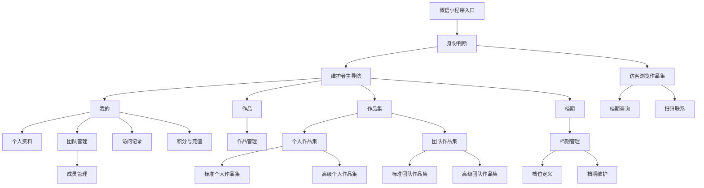

# SaaS 微信小程序需求文档

版本：v1.0  
日期：2026-06-17  
产品暂名：微档集 Pro

## 1. 项目概述

本项目是面向婚庆与演艺服务从业者的 SaaS 微信小程序，帮助个人与团队快速维护作品、档期、作品集展示页，并追踪客户访问记录。

主要服务对象包括：

- 婚庆司仪、婚庆司仪团队
- 婚庆公司
- 婚庆化妆师、造型团队
- 模特、模特团队
- 其他以“作品展示 + 档期查询 + 客资跟进”为核心需求的服务者

产品核心价值：

- 维护者快速生成专业作品集，并通过微信分享给客户。
- 访客可直接查看作品、查询档期、扫码联系。
- 团队可统一展示成员作品集，并查询团队整体档期。
- 维护者可看到客户访问记录，辅助二次跟进。
- 高级作品集通过 AI 生成个性化排版，降低定制展示页制作门槛。

## 2. 角色定义

### 2.1 访客

通过微信分享卡片、二维码或链接进入作品集页面的客户。访客无需维护内容，可以浏览作品集、查询档期、查看联系方式，其访问会被记录。

### 2.2 维护者

需要维护作品、档期、作品集、团队和访问记录的用户。维护者首次登录时需完成微信登录和手机号绑定，系统生成个人唯一码。

## 3. 核心名词

- 个人唯一码：系统为每个维护者生成的唯一身份编码，用于被团队添加。
- 团队唯一码：系统为团队生成的唯一编码，用于团队识别和后续扩展邀请。
- 个人作品：维护者上传的图片或视频素材，可被选择进个人作品集。
- 个人作品集：面向访客展示的个人展示页，分为标准个人作品集和高级个人作品集。
- 团队作品集：面向访客展示的团队展示页，分为标准团队作品集和高级团队作品集；团队不设积分账户，团队作品集维护由执行编辑的维护者个人账户扣除积分。
- 档位定义：维护者预先定义的可预约时间段模板，包含档位名称、开始时间、结束时间和展示颜色。
- 档期维护：维护者在具体日期选择已定义的档位，并记录该日期该档位的状态、联系人、电话、备注等信息。
- 档期：由具体日期与档位定义组合形成的日期占用状态，支持个人查询和团队聚合查询。
- 访问记录：访客访问作品集产生的记录，包括来源、访问时间、访问页面、停留行为等。
- 积分：维护者用于上传作品、维护作品集、承接个人作品集访客浏览消耗的计费单位。
- 积分余额：维护者个人账户当前可用积分，余额不足时限制对应消耗动作。
- 积分流水：积分充值、赠送、消耗、回退等变动记录。

## 4. 产品范围

### 4.1 MVP 范围

- 登录页支持注册、微信授权登录、手机登录、账号密码登录四个入口；注册支持选填推荐码并通过微信授权获取手机号
- 个人资料与微信二维码维护
- 个人作品上传、编辑、删除、排序
- 个人档位定义、档期维护与访客查询
- 标准个人作品集创建、预览、发布、分享
- 高级个人作品集创建、AI 生成、预览、发布
- 团队创建、团队唯一码生成、通过个人唯一码添加成员
- 标准团队作品集创建、预览、发布、分享
- 高级团队作品集创建、AI 生成、预览、发布
- 团队档期查询
- 访客访问记录与基础统计
- 积分余额查看、积分充值、积分消耗与积分流水

### 4.2 暂不纳入 MVP

- 会员订阅、分销返佣
- IM 聊天系统
- 合同、报价单、订单管理
- 复杂 CRM 跟进流程
- 复杂财务对账与发票管理
- 多门店组织架构
- 跨平台 H5/PC 官网

说明：注册推荐码与推广关系记录纳入 MVP，但佣金计算、提现、分销返佣结算不纳入 MVP。

## 5. 用户故事

### 5.1 维护者首次登录即注册

作为维护者，我希望首次进入小程序时可以在注册、微信授权登录、手机登录、账号密码登录之间切换；注册时可以选填推荐码，并通过微信授权获取手机号完成注册，系统自动给我生成个人唯一码，方便后续被团队添加和推广追踪。

验收标准：

- 首次进入显示登录页，并以 tab 形式展示注册、微信授权登录、手机登录、账号密码登录。
- 注册 tab 展示推荐码输入框和微信授权按钮，通过微信授权获取手机号并创建注册记录。
- 微信授权登录 tab 仅展示微信授权登录按钮。
- 手机登录 tab 展示手机号和验证码输入。
- 账号密码登录 tab 展示手机号和密码输入。
- 注册时可选填推荐码，推荐码为其他维护者的个人唯一码。
- 推荐码有效时，后台记录推荐人和被推荐人的推广关系。
- 推荐码为空时允许继续注册。
- 推荐码无效时需提示，可修改或跳过。
- 同一用户只能在首次注册时绑定一次推荐关系。
- 绑定成功后生成不可重复的个人唯一码。
- 个人唯一码可复制、可展示为二维码。

### 5.2 维护个人作品

作为维护者，我希望上传图片和视频，维护我的作品库，并选择其中的素材生成作品集。

验收标准：

- 支持图片、视频上传。
- 支持标题、标签、说明、排序。
- 上传后系统根据素材自动识别图片或视频类型，维护表单不单独填写作品类型。
- 支持删除与替换素材。
- 已被作品集引用的作品删除时需提示影响范围。

### 5.3 维护个人档期

作为维护者，我希望先定义常用档位的名称、时间段和颜色，再在具体日期选择已定义档位并维护该档期的预约信息，便于客户按具体时间段查询。

验收标准：

- 支持月历概览；选择日期后仅展示该日期已维护的档位、时间和状态。
- 系统默认提供中午档和晚间档。
- 默认中午档时间为 10:00-13:00，默认晚间档时间为 17:00-20:00。
- 档位定义支持新增、编辑、停用档位，例如迎亲档、午后仪式档、After Party 档；每个档位定义包含名称、开始时间、结束时间和展示颜色。
- 档位定义颜色默认提供 8 种可选；月历当天格子按已维护档期对应的档位颜色进行多色彩标记。
- 档期维护支持在具体日期选择一个或多个已定义档位，并为每个日期档位标记空闲、已约、待定、休息。
- 档期维护支持记录联系人姓名、联系电话、内部备注等信息，仅维护者可见。
- 支持批量为连续日期选择已定义档位并设置状态。
- 访客只能看到日期、档位名称、时间段和是否可预约，不展示联系人、电话和内部备注。

### 5.4 创建标准个人作品集

作为维护者，我希望选择固定模板快速生成个人作品集，用于发给客户。

验收标准：

- 可设置小程序分享封面和头像。
- 页面顶部为轮播图组件，可选择个人作品图片。
- 轮播图下方为档期查询组件。
- 作品列表每行两个，可选择图片或视频作品。
- 页面底部展示个人微信二维码。
- 标准作品集包含维护页、预览页、访客页。
- 维护页支持保存草稿、预览、发布、复制分享路径。
- 预览页和访客页展示效果一致；预览页有返回按钮，预览页内任何查看、播放、档期查询、二维码点击均不扣除积分。

### 5.5 创建高级个人作品集

作为维护者，我希望通过自然语言描述，让 AI 根据我选择的作品生成更个性化的展示页。

验收标准：

- 维护者选择个人作品并为每个素材标记序号。
- 维护者输入自然语言描述，例如：“1号、2号、3号作品使用轮播图组件放最上面，下面放头像，再下面把5号、6号、7号、8号作品放列表，再下面放档期查询组件，最下面放微信二维码。”
- AI 输出结构化页面组件方案。
- 系统渲染可预览页面，而不是直接执行 AI 生成代码。
- 维护者可调整组件顺序、替换素材、重新生成。
- 高级作品集包含维护页、预览页、访客页。
- 维护页支持保存草稿、重新生成、预览和发布。
- 发布前必须完成预览确认；预览页和访客页展示效果一致，预览页有返回按钮，预览页内任何查看、播放、档期查询、二维码点击均不扣除积分。

### 5.6 创建团队

作为维护者，我希望创建团队并添加其他维护者为成员，方便统一展示团队能力。

验收标准：

- 创建团队后生成团队唯一码。
- 创建者默认为团队管理员。
- 可通过其他维护者的个人唯一码搜索并添加成员。
- 可设置成员状态：待确认、已加入、已移除。
- 团队成员至少包含头像、姓名、角色、个人作品集入口。

### 5.7 创建标准团队作品集

作为团队管理员，我希望使用固定模板生成团队作品集，让客户查看团队成员和整体档期。

验收标准：

- 可设置小程序分享封面和头像。
- 页面顶部为轮播图组件，可选择个人作品图片。
- 轮播图下方为团队档期查询组件，可查询团队所有成员是否有人可约。
- 团队成员个人作品集列表每行两个，展示封面，可点击跳转。
- 页面底部展示团队或联系人微信二维码。

### 5.8 创建高级团队作品集

作为团队管理员，我希望通过自然语言描述，让 AI 根据团队素材与成员作品集生成更个性化的团队展示页。

验收标准：

- 可选择自己的个人作品或团队成员的个人作品集并标记序号。
- 支持自然语言描述组件顺序和展示规则。
- 支持团队档期查询组件、成员作品集列表、微信二维码等组件。
- AI 输出结构化组件方案，系统渲染预览。
- 管理员确认后发布。

### 5.9 访客访问作品集

作为访客，我希望不用注册就能查看别人分享的作品集、查询档期并找到联系方式。

验收标准：

- 可打开个人或团队作品集。
- 支持浏览轮播图、图片、视频、作品集列表。
- 支持选择日期查询个人或团队档期。
- 可查看微信二维码并长按识别。
- 访问行为会形成访问记录。
- 当个人作品集所属维护者积分余额不足以承接访客访问或媒体查看扣费时，访客端仍打开作品集页面骨架，但内容区整体加灰色磨砂遮罩，并分两行明文提示“UNDER MAINTENANCE / 维护中”。
- 团队无积分账户，团队作品集访问无消耗；访客从团队作品集点击进入个人作品集后，再按个人作品集所属维护者的积分规则处理。

### 5.10 查看访问记录

作为维护者，我希望查看客户访问了哪个作品集、什么时候访问、访问了几次，以便跟进。

验收标准：

- 展示访问总量、今日访问、近 7 日趋势。
- 展示访问记录列表：访问时间、访问作品集、访客标识、来源、访问次数。
- 支持按作品集、时间范围、访客类型筛选。
- 支持标记跟进状态：未跟进、已联系、已成交、无效。
- 访问记录需统计同一访客对同一作品集的累计访问次数。
- 访问明细摘要需展示来源、查看作品次数、查询档期日期、点击或长按二维码行为。
- 系统不维护“高意向”状态，由维护者根据访问次数和行为摘要自行判断客户意向。

### 5.11 查看积分与充值

作为维护者，我希望在“我的”页进入我的积分页，查看当前积分余额、近期消耗和充值记录，并在余额不足时快速充值。

验收标准：

- “我的”页展示当前积分余额和充值入口。
- 支持查看积分余额、累计充值积分、累计消耗积分、近期积分流水。
- 支持充值 1 元、10 元、50 元、100 元四个档位。
- 充值成功后积分实时到账并写入充值记录。
- 上传作品、维护个人或团队作品集、访客访问个人作品集、图片查看、视频查看等行为按规则扣减积分。
- 团队没有积分账户；团队作品集由实际执行编辑、保存或发布动作的维护者个人账户扣除维护积分。
- 团队作品集的访客访问不扣除积分；访客从团队作品集跳转到个人作品集后，按个人作品集所属维护者扣除个人作品集访问、图片查看和视频查看积分。
- 余额不足时，维护端操作需提示充值；访客端访问需扣费的个人作品集时，内容区整体加灰色磨砂遮罩，并分两行明文提示“UNDER MAINTENANCE / 维护中”。

## 6. 信息架构



维护者端底部主导航固定为四项：

1. 我的：原工作台页面，展示个人信息、积分余额，并承载访问记录和团队管理入口。
2. 作品：原作品列表页，作为一级 tab 页面，不展示返回按钮。
3. 作品集：原作品集列表页，作为一级 tab 页面，不展示返回按钮。
4. 档期：原档期维护页，作为一级 tab 页面，不展示返回按钮，内部包含档位定义与档期维护。

底部主导航样式参考微信小程序底部导航：每一项均为图标 + 文字，不使用单字文字块代替图标；选中项通过图标和文字颜色高亮。

访问记录不再作为底部主导航项；团队管理不进入底部主导航，统一从“我的”页进入。

## 7. 功能需求

### 7.1 登录与账号

功能说明：

- 登录页使用 tab 结构，包含注册、微信授权登录、手机登录、账号密码登录。
- 注册 tab：展示推荐码输入框和微信授权按钮，通过微信授权获取手机号后创建注册记录。
- 微信授权登录 tab：仅展示微信授权按钮，用于已有账号快速登录。
- 手机登录 tab：展示手机号、验证码输入框。
- 账号密码登录 tab：展示手机号、密码输入框。
- 登录后如账号未绑定手机号，需补充手机号绑定。
- 注册时可选填推荐码，推荐码为其他维护者的个人唯一码。
- 推荐码有效时记录推广关系；推广关系仅用于后台统计和后续运营，不包含 MVP 内的佣金结算。
- 系统生成个人唯一码。
- 访客可匿名访问作品集，也可保留微信 openid 作为去重标识。

字段建议：

- 用户 ID
- 微信 openid / unionid
- 手机号
- 昵称
- 头像
- 个人唯一码
- 注册时填写的推荐码
- 推荐人用户 ID
- 注册时间
- 最近登录时间

推荐码规则：

- 推荐码来源于推荐人的个人唯一码。
- 用户不能绑定自己的个人唯一码作为推荐码。
- 同一注册用户只能绑定一个推荐人。
- 推荐关系一旦绑定，普通用户不可自行修改。
- 若填写的推荐码不存在、对应账号异常或被平台禁用，提示推荐码无效。

### 7.2 个人资料

维护者可维护：

- 头像
- 姓名 / 艺名
- 职业身份：司仪、化妆师、模特、摄影、摄像、婚庆公司等
- 城市
- 简介
- 微信二维码
- 联系电话
- 标签：高端婚礼、户外婚礼、双语主持、国风妆造等

### 7.3 作品管理

素材类型：

- 图片
- 视频

作品字段：

- 作品标题
- 素材地址
- 封面图
- 标签
- 描述
- 拍摄/服务日期
- 排序

核心规则：

- 素材类型由上传文件自动识别，用于列表展示和组件选择，不作为维护者手动填写字段。
- 作品管理列表页通过标签筛选作品，筛选标签来自作品自身的标签字段。
- 图片可用于轮播图、作品列表、封面。
- 视频可用于作品列表，但标准模板轮播图默认只支持图片。
- 删除作品时，如被作品集引用，提示需要先从作品集中移除或确认同步移除。

### 7.4 档期管理

状态设计：

- 空闲
- 已约
- 待定
- 休息

档期管理分为两个能力：

1. 档位定义：确定可复用档位的名称、开始时间、结束时间和展示颜色。
2. 档期维护：在具体日期选择已定义档位，维护该日期该档位的状态和相关信息。

默认档位定义：

- 中午档：10:00-13:00
- 晚间档：17:00-20:00

档位定义规则：

- 维护者可以新增、编辑、停用个人档位定义。
- 档位定义页展示全部定义，不只展示启用定义；每条定义右侧提供启用或停用操作。
- 新增定义按钮位于定义列表底部。
- 档位定义列表需完整展示全部定义和新增按钮，不得被列表容器裁切；内容超过可视区域时通过页面滚动查看。
- 编辑档位定义表单不在页面常驻展示，仅在点击具体档位定义后以弹层打开。
- 新增档位定义表单仅在点击新增定义按钮后以弹层打开。
- 档位定义弹层支持取消和保存；保存后关闭弹层并刷新定义列表。
- 每个档位定义包含档位名称、开始时间、结束时间、展示颜色、排序和启用状态。
- 档位颜色选择器默认提供 8 种颜色；颜色用于月历格子的多色彩标记，同一天存在多个档期时，月历当天显示多个对应颜色。
- 已被历史档期使用的档位定义不建议物理删除，可改为停用；停用后不再出现在新增档期维护的可选列表中，历史档期仍保留原档位信息。
- 同一维护者的启用档位定义时间不建议重叠，如存在重叠需提示维护者确认。

档期维护规则：

- 维护者按日期选择一个或多个已定义档位生成当天档期。
- 每条档期记录包含日期、档位定义、状态、联系人姓名、联系电话和内部备注。
- 状态为已约或待定时，建议填写联系人姓名或联系电话；状态为空闲或休息时联系人信息可为空。
- 联系人姓名、联系电话和内部备注仅维护者端可见，不在访客端展示。
- 修改档位定义的名称、时间段或颜色后，未锁定快照的未来档期同步展示最新定义；已发生或已锁定的历史档期保留创建时的档位快照。

维护者端能力：

- 通过月历查看每天档期概览，月历格子用档位颜色标记当天安排。
- 月历上方展示当前查看年月，并提供上一月、下一月和切换年月入口；年月工具条需与月历主体视觉相连，中间不留空隙，且两者必须同时可见，不得被外层容器裁切。
- 选择月历日期后，仅展示当前选中日期的档期明细，不同时展示其他日期。
- 当前选中日期的档期明细按档位开始时间升序展示。
- 档位定义与档期维护作为“档期”一级 tab 内的二级页签视图，切换时保留底部主导航，且不展示返回按钮。
- 点击日期后进入档期维护，选择已定义档位并维护具体状态。
- “维护当天档期”按钮归属于当前选中日期详情区，用于新增或编辑该日期档期。
- 支持快捷使用默认中午档、晚间档和维护者已定义档位。
- 支持在档期维护页新增、编辑、删除当天档期记录，但不在此处直接修改档位名称、时间段和颜色。
- 批量为连续日期选择指定档位并设置状态。
- 添加日期级或档期记录级内部备注。

访客端能力：

- 选择日期和档位查询是否可约。
- 访客档期查询页需展示所选日期下维护者开放的全部档位、每档起止时间和状态。
- 个人档期返回单人对应时间段状态。
- 团队档期返回团队对应时间段的可约人数与可约成员摘要。

### 7.5 标准个人作品集

固定组件顺序：

1. 分享信息配置：封面、头像、标题、简介
2. 轮播图组件：选择个人作品图片
3. 个人档期查询组件
4. 个人作品列表：每行两个，支持图片和视频
5. 微信二维码联系组件

配置项：

- 作品集标题
- 分享封面
- 分享头像
- 轮播图作品
- 列表作品
- 微信二维码
- 是否公开

页面形态：

- 维护页：用于配置分享信息、固定组件素材、保存草稿、预览和发布。
- 预览页：展示效果与访客页一致，但顶部保留返回维护页按钮；预览页内的查看、播放、档期查询、二维码点击不扣除积分，也不计入访客访问统计。
- 访客页：面向客户分享访问，按个人作品集访客扣费规则扣除所属维护者积分。

### 7.6 高级个人作品集

核心流程：

1. 选择个人作品。
2. 系统给已选素材分配序号，支持手动调整。
3. 输入自然语言布局描述。
4. AI 生成结构化页面 schema。
5. 系统根据 schema 渲染预览。
6. 维护者微调、保存、预览、发布。

建议支持组件：

- 轮播图组件
- 头像组件
- 个人介绍组件
- 图片/视频列表组件
- 大图展示组件
- 档期查询组件
- 微信二维码组件
- 文案段落组件
- 分隔标题组件

AI 输出 schema 示例：

```json
{
  "type": "portfolio_page",
  "version": "1.0",
  "components": [
    {
      "component": "carousel",
      "sourceIndexes": [1, 2, 3]
    },
    {
      "component": "profile_header",
      "fields": ["avatar", "name", "title", "tags"]
    },
    {
      "component": "media_grid",
      "sourceIndexes": [5, 6, 7, 8],
      "columns": 2
    },
    {
      "component": "schedule_query",
      "mode": "personal"
    },
    {
      "component": "wechat_qr"
    }
  ]
}
```

限制规则：

- AI 只能生成白名单组件和配置，不生成可执行代码。
- 系统校验 sourceIndexes 是否存在。
- 系统校验必须包含联系方式组件或明确提示未配置。
- 发布前必须预览；预览页展示效果与访客页一致，但顶部保留返回维护页按钮。
- 预览页内任何查看、播放、档期查询、二维码点击不扣除积分，也不计入访客访问统计。

### 7.7 团队管理

团队字段：

- 团队 ID
- 团队唯一码
- 团队名称
- 团队头像
- 团队简介
- 所在城市
- 团队微信二维码
- 创建者 ID
- 创建时间

成员字段：

- 团队 ID
- 用户 ID
- 成员角色：管理员、成员
- 职业身份
- 加入状态
- 加入时间

核心规则：

- 创建者默认是管理员。
- 管理员可添加、移除成员。
- 通过个人唯一码添加成员。
- 成员可选择是否接受加入团队。
- 被移除成员的作品集不再出现在团队作品集可选范围内。

### 7.8 标准团队作品集

固定组件顺序：

1. 分享信息配置：封面、头像、标题、简介
2. 轮播图组件：可选择团队管理员自己的图片作品，后续可扩展团队公共素材
3. 团队档期查询组件：查询团队所有成员档期
4. 团队成员个人作品集列表：每行两个，展示封面，点击跳转
5. 微信二维码联系组件

团队档期查询逻辑：

- 访客选择日期。
- 系统查询团队内有效成员的个人档期。
- 返回可约成员数量、已约成员数量、待定成员数量。
- 可选择展示可约成员姓名/头像，默认保护隐私可只展示数量。

页面形态：

- 维护页：用于配置团队作品集素材、成员作品集入口、团队档期组件、保存草稿、预览和发布。
- 预览页：展示效果与访客页一致，但顶部保留返回维护页按钮；预览页内任何查看、档期查询、成员跳转点击不扣除积分，也不计入访客访问统计。
- 访客页：团队作品集本身的访问、团队档期查询、团队二维码点击不扣除积分；从团队作品集跳转到成员个人作品集后，按个人作品集所属维护者的积分规则扣除积分。

### 7.9 高级团队作品集

核心流程：

1. 选择素材：自己的个人作品、团队成员个人作品集。
2. 系统给已选对象分配序号。
3. 输入自然语言布局描述。
4. AI 生成结构化页面 schema。
5. 系统渲染预览。
6. 管理员微调、保存、预览、发布。

建议支持组件：

- 轮播图组件
- 团队头像组件
- 团队介绍组件
- 团队成员作品集列表
- 图片/视频展示组件
- 团队档期查询组件
- 微信二维码组件
- 文案段落组件

页面形态：

- 维护页：用于选择素材、输入自然语言、生成组件 schema、微调组件顺序、保存草稿、预览和发布。
- 预览页：展示效果与访客页一致，但顶部保留返回维护页按钮；预览页内任何查看、档期查询、成员跳转点击不扣除积分，也不计入访客访问统计。
- 访客页：团队作品集本身的访问不扣除积分；跳转进入成员个人作品集后，按个人作品集所属维护者的积分规则扣除积分。

### 7.10 访客记录

记录触发：

- 打开作品集
- 播放视频
- 查询档期
- 长按/点击微信二维码区域
- 点击团队成员作品集
- 多次访问同一作品集
- 维护者打开预览页不触发访客访问记录，不累计访问次数，不扣除积分。

记录字段：

- 访问记录 ID
- 访客标识：openid、匿名 ID 或设备标识
- 作品集 ID
- 作品集类型：个人/团队
- 维护者 ID 或团队 ID
- 来源：分享卡片、二维码、具体团队作品集跳转、具体个人作品集跳转、未知
- 来源作品集 ID、名称、类型，可空
- 访问时间
- 访问次数：同一访客对同一作品集的累计访问次数
- 停留时长
- 行为类型
- 查看作品次数
- 查询档期日期
- 二维码点击或长按次数
- 跟进状态：未跟进、已联系、已成交、无效
- 备注

访问明细摘要：

- 需展示来源，例如“来自团队作品集「星曜司仪团」跳转”或“来自个人作品集「林安婚礼司仪」分享”。
- 需展示查看作品次数、查询档期日期、点击或长按二维码行为。
- 高意向不作为系统状态，由维护者根据访问次数和行为摘要自行判断。

隐私要求：

- 不向维护者展示未经授权的访客手机号。
- 访客标识应做脱敏展示，例如“微信访客 8A21”。
- 数据采集需符合微信平台规范和个人信息保护要求。

### 7.11 积分与充值

积分用途：

- 上传一个作品消耗 1 积分。
- 新建团队消耗 1000 积分，由创建团队的维护者个人账户扣除。
- 维护一次标准作品集消耗 1 积分，个人作品集扣所属维护者，团队作品集扣本次执行编辑、保存或发布的维护者。
- 维护一次高级作品集消耗 10 积分，个人作品集扣所属维护者，团队作品集扣本次执行编辑、保存或发布的维护者。
- 访客访问一次个人标准作品集消耗 1 积分。
- 访客访问一次个人高级作品集消耗 1 积分。
- 团队无积分账户，团队作品集访问无消耗；访客从团队作品集跳转到个人作品集后，再按个人作品集规则扣除所属维护者积分。
- 访客在个人作品集查看 10 次图片消耗 1 积分。
- 访客在个人作品集查看 1 次视频消耗 1 积分。
- 维护者预览页内的查看、播放、档期查询、二维码点击不扣除积分。

充值档位：

- 1 元：10 积分
- 10 元：100 积分
- 50 元：520 积分
- 100 元：1100 积分

扣费规则：

- 积分只从维护者个人账户扣除，团队不设积分账户。
- 团队无积分管理，团队作品集无积分消耗；访客从团队作品集跳转后，消耗个人作品集所属维护者的个人作品集积分。
- 上传作品在上传成功并保存作品记录后扣除积分。
- 新建团队在团队创建成功并生成团队唯一码后扣除 1000 积分。
- 维护个人作品集在保存或发布成功后，从作品集所属维护者账户扣除积分；高级作品集按高级维护规则扣除。
- 维护团队作品集在保存或发布成功后，从本次执行编辑的维护者账户扣除积分。
- 访客访问个人作品集在页面成功打开时扣除积分。
- 访客访问团队作品集不扣除积分；从团队作品集跳转到个人作品集后，在个人作品集页面成功打开时扣除个人作品集所属维护者积分。
- 图片查看按个人作品集维度累计计数，每累计 10 次图片查看扣除 1 积分。
- 视频查看按每次播放或打开视频详情扣除 1 积分。
- 每次扣费必须生成积分流水，包含业务类型、业务 ID、扣费积分、扣费前余额、扣费后余额。
- 余额不足时，维护端操作需拦截并引导充值；访客端访问需扣费的个人作品集时，内容区整体加灰色磨砂遮罩，并分两行明文提示“UNDER MAINTENANCE / 维护中”。
- 个人作品集因余额不足展示维护中遮罩时，不展示充值入口给访客，不暴露维护者余额原因。

积分页面能力：

- 我的积分页展示当前余额、累计充值、累计消耗，以及今日消耗、访客消耗、维护消耗三个概览指标。
- 积分流水支持按充值、上传、作品集维护、访问、图片查看、视频查看筛选。
- 我的积分页不单独展示积分消耗规则卡片；积分流水标题右侧提供“查看积分规则”按钮，点击进入积分规则页。
- 充值页展示充值档位、到账积分、优惠积分和支付按钮。
- 充值成功后实时增加积分并生成充值订单与积分流水。

## 8. 页面清单

### 8.1 维护者端

- 登录 / 手机号绑定页
- 我的页
- 作品页
- 作品集页
- 档期页
- 我的积分页
- 充值积分页
- 个人资料页
- 个人唯一码页
- 作品管理列表页（一级 tab：作品，无返回按钮）
- 作品新增/编辑页
- 档期管理页（一级 tab：档期，无返回按钮，包含档位定义 / 档期维护页签、月历色彩标记 + 每天档期列表）
- 档位定义页（档期一级 tab 内视图，保留“档位定义 / 档期维护”页签和底部主导航）
- 编辑档位定义弹层
- 新增档位定义弹层
- 档期维护页
- 个人作品集列表页（一级 tab：作品集，无返回按钮）
- 标准个人作品集维护页
- 标准个人作品集预览页
- 高级个人作品集维护页
- 高级个人作品集预览页
- 团队列表页
- 团队详情页
- 团队成员管理页
- 团队作品集列表页
- 标准团队作品集维护页
- 标准团队作品集预览页
- 高级团队作品集维护页
- 高级团队作品集预览页
- 访问记录页

### 8.2 访客端

- 个人作品集浏览页
- 团队作品集浏览页
- Under Maintenance 遮罩页
- 访客档期查询页
- 档期查询弹层/组件
- 视频播放页
- 团队成员个人作品集跳转页

## 9. 数据模型初稿

### 9.1 User

| 字段 | 类型 | 说明 |
| --- | --- | --- |
| id | string | 用户 ID |
| openid | string | 微信 openid |
| unionid | string | 微信 unionid，可选 |
| phone | string | 绑定手机号 |
| nickname | string | 昵称 |
| avatarUrl | string | 头像 |
| uniqueCode | string | 个人唯一码 |
| referralCodeInput | string | 注册时填写的推荐码，可空 |
| referrerUserId | string | 推荐人用户 ID，可空 |
| pointBalance | number | 当前积分余额，展示冗余字段 |
| roleStatus | string | 账号状态 |
| createdAt | datetime | 创建时间 |

### 9.2 PromotionRelation

| 字段 | 类型 | 说明 |
| --- | --- | --- |
| id | string | 推广关系 ID |
| referrerUserId | string | 推荐人用户 ID |
| referredUserId | string | 被推荐人用户 ID |
| referralCode | string | 注册时填写的推荐码 |
| source | enum | register_form / admin_import / other |
| status | enum | valid / invalid / revoked |
| createdAt | datetime | 绑定时间 |

### 9.3 Work

| 字段 | 类型 | 说明 |
| --- | --- | --- |
| id | string | 作品 ID |
| ownerId | string | 维护者 ID |
| type | enum | image / video，系统根据素材自动识别 |
| title | string | 作品标题 |
| mediaUrl | string | 素材地址 |
| coverUrl | string | 封面地址 |
| tags | array | 标签 |
| description | string | 描述 |
| sortOrder | number | 排序 |

### 9.4 SlotDefinition

| 字段 | 类型 | 说明 |
| --- | --- | --- |
| id | string | 档位定义 ID |
| ownerId | string | 维护者 ID |
| name | string | 档位名称，例如中午档、晚间档、迎亲档 |
| startTime | string | 默认开始时间 |
| endTime | string | 默认结束时间 |
| color | string | 档位展示颜色，用于月历多色彩标记 |
| sortOrder | number | 排序 |
| status | enum | active / inactive |
| createdAt | datetime | 创建时间 |
| updatedAt | datetime | 更新时间 |

### 9.5 Schedule

| 字段 | 类型 | 说明 |
| --- | --- | --- |
| id | string | 档期 ID |
| ownerId | string | 维护者 ID |
| date | date | 日期 |
| slotDefinitionId | string | 档位定义 ID |
| slotSnapshot | object | 档位快照，包含名称、开始时间、结束时间和颜色 |
| status | enum | free / booked / pending / rest |
| contactName | string | 联系人姓名，仅维护者可见 |
| contactPhone | string | 联系电话，仅维护者可见 |
| note | string | 内部备注，仅维护者可见 |
| lockedSnapshot | boolean | 是否锁定档位快照 |
| createdAt | datetime | 创建时间 |
| updatedAt | datetime | 更新时间 |

### 9.6 Portfolio

| 字段 | 类型 | 说明 |
| --- | --- | --- |
| id | string | 作品集 ID |
| ownerId | string | 所属用户 |
| teamId | string | 所属团队，可空 |
| type | enum | personal / team |
| templateType | enum | standard / advanced |
| title | string | 标题 |
| shareCoverUrl | string | 分享封面 |
| shareAvatarUrl | string | 分享头像 |
| schema | json | 页面组件结构 |
| status | enum | draft / published / archived |

### 9.7 Team

| 字段 | 类型 | 说明 |
| --- | --- | --- |
| id | string | 团队 ID |
| name | string | 团队名称 |
| uniqueCode | string | 团队唯一码 |
| avatarUrl | string | 团队头像 |
| ownerId | string | 创建者 ID |
| contactQrUrl | string | 团队微信二维码 |
| createdAt | datetime | 创建时间 |

### 9.8 VisitRecord

| 字段 | 类型 | 说明 |
| --- | --- | --- |
| id | string | 访问记录 ID |
| visitorId | string | 访客标识 |
| portfolioId | string | 作品集 ID |
| portfolioType | enum | personal / team |
| source | string | 来源 |
| sourcePortfolioId | string | 来源作品集 ID，可空 |
| sourcePortfolioTitle | string | 来源作品集名称，可空 |
| sourcePortfolioType | enum | personal / team / none |
| action | string | 行为 |
| visitCount | number | 同一访客对同一作品集的累计访问次数 |
| viewedWorkCount | number | 本次或累计查看作品次数 |
| queriedScheduleDates | array | 查询过的档期日期 |
| qrClickCount | number | 点击或长按二维码次数 |
| duration | number | 停留秒数 |
| followStatus | enum | none / contacted / won / invalid |
| createdAt | datetime | 访问时间 |

### 9.9 PointAccount

| 字段 | 类型 | 说明 |
| --- | --- | --- |
| id | string | 积分账户 ID |
| ownerType | enum | user |
| ownerId | string | 用户 ID |
| balance | number | 当前可用积分 |
| totalRecharged | number | 累计充值积分 |
| totalConsumed | number | 累计消耗积分 |
| updatedAt | datetime | 最近更新时间 |

### 9.10 PointTransaction

| 字段 | 类型 | 说明 |
| --- | --- | --- |
| id | string | 积分流水 ID |
| accountId | string | 积分账户 ID |
| type | enum | recharge / consume / refund / gift |
| scene | enum | upload_work / create_team / edit_portfolio / edit_advanced_portfolio / visit_portfolio / view_images / view_video / manual |
| points | number | 积分变动，充值为正数，消耗为负数 |
| balanceBefore | number | 变动前积分 |
| balanceAfter | number | 变动后积分 |
| businessId | string | 关联业务 ID |
| createdAt | datetime | 创建时间 |

### 9.11 RechargeOrder

| 字段 | 类型 | 说明 |
| --- | --- | --- |
| id | string | 充值订单 ID |
| accountId | string | 积分账户 ID |
| amountYuan | number | 支付金额，单位元 |
| points | number | 到账积分 |
| status | enum | pending / paid / failed / closed |
| payChannel | enum | wechat_pay |
| paidAt | datetime | 支付完成时间 |
| createdAt | datetime | 创建时间 |

## 10. 关键业务流程

### 10.1 首次登录流程

1. 用户进入小程序。
2. 登录页展示注册、微信授权登录、手机登录、账号密码登录四个 tab。
3. 用户选择注册 tab，可填写推荐码，也可留空。
4. 用户点击微信授权按钮，系统通过微信授权获取手机号并创建注册记录。
5. 如填写推荐码，系统校验推荐码是否有效。
6. 推荐码有效时，后台写入推广关系；推荐码为空时不写入；推荐码无效时提示修改或跳过。
7. 注册成功后生成个人唯一码。
8. 用户选择微信授权登录 tab 时，仅通过微信授权按钮登录已有账号。
9. 用户选择手机登录 tab 时，通过手机号和验证码登录。
10. 用户选择账号密码登录 tab 时，通过手机号和密码登录。
11. 进入维护者主导航的“我的”页。

### 10.2 标准个人作品集发布流程

1. 维护者进入个人作品集。
2. 点击新建标准作品集。
3. 配置标题、分享封面、头像。
4. 选择轮播图作品。
5. 选择列表作品。
6. 确认微信二维码。
7. 在维护页点击预览，进入与访客页效果一致的预览页。
8. 预览页保留返回按钮，预览页内查看、播放、档期查询、二维码点击不扣除积分。
9. 返回维护页确认后点击发布。
10. 发布成功后复制分享路径或发起微信分享。

### 10.3 高级作品集 AI 生成流程

1. 维护者选择素材。
2. 系统展示素材序号。
3. 维护者输入自然语言描述。
4. 后端调用 AI 生成 schema。
5. 后端校验 schema。
6. 前端渲染预览。
7. 维护者调整组件顺序、替换素材或重新生成。
8. 维护者进入预览页确认效果；预览页内任何查看、播放、档期查询、二维码点击不扣除积分。
9. 返回维护页点击发布。

### 10.4 团队添加成员流程

1. 管理员进入团队成员管理。
2. 输入成员个人唯一码。
3. 系统查询维护者。
4. 管理员发起添加。
5. 成员确认加入。
6. 团队成员列表更新。

### 10.5 积分充值流程

1. 维护者进入我的积分页。
2. 点击充值积分。
3. 选择充值档位：1 元、10 元、50 元、100 元。
4. 系统创建充值订单。
5. 用户通过微信支付完成付款。
6. 支付成功后，系统更新积分账户余额。
7. 系统写入充值订单状态和积分流水。
8. 返回我的积分页并展示最新余额。

### 10.6 积分消耗流程

1. 用户或访客触发积分消耗动作。
2. 系统识别动作类型和扣费账户：上传作品扣上传者账户；新建团队扣创建者账户；维护个人作品集扣所属维护者账户；维护团队作品集扣本次执行编辑、保存或发布的维护者账户；访客访问个人作品集扣个人作品集所属维护者账户；访客访问团队作品集不扣费。
3. 若访客从团队作品集跳转到个人作品集，进入个人作品集后再按个人作品集规则识别扣费账户。
4. 维护者预览页内的查看、播放、档期查询、二维码点击不进入扣费流程。
5. 系统校验账户余额是否足够。
6. 余额充足时执行业务动作。
7. 业务动作成功后扣减积分并写入积分流水。
8. 余额不足时阻断维护端动作并引导充值。
9. 访客端访问需扣费的个人作品集余额不足时，内容区整体加灰色磨砂遮罩，并分两行明文提示“UNDER MAINTENANCE / 维护中”。

## 11. 权限规则

- 访客只能访问已发布作品集。
- 维护者只能管理自己的作品、档期、个人作品集。
- 团队管理员可管理团队资料、成员、团队作品集。
- 普通团队成员只能查看团队信息，是否允许编辑团队作品集可作为后续权限扩展。
- 团队作品集引用成员个人作品集时，若成员退出团队，需提示管理员处理失效引用。
- 团队不设积分账户；团队作品集由实际执行编辑、保存或发布动作的维护者承担对应积分消耗。

## 12. 非功能需求

### 12.1 性能

- 作品集首屏加载目标小于 2 秒。
- 图片需使用压缩图和 CDN。
- 视频默认展示封面，点击后播放。
- 访问记录写入需异步处理，不阻塞页面打开。
- 个人作品集访客访问和媒体查看的积分扣费需异步可靠处理，不阻塞作品集首屏。
- 团队作品集访问无消耗，不进入访客访问扣费流程。

### 12.2 安全

- 微信 openid、手机号等敏感信息加密存储或脱敏展示。
- 上传文件需校验类型、大小和内容安全。
- AI 生成内容需经过组件白名单校验。
- 访客记录不得泄露未授权个人信息。
- 微信支付回调需验签，并保证充值订单和积分到账幂等。
- 积分扣费需防重复扣除，积分流水不可由普通用户修改或删除。

### 12.3 可用性

- 核心编辑流程不超过 5 步。
- 作品集编辑必须支持预览。
- 上传失败、AI 生成失败、发布失败需给出可恢复操作。
- 访客页面要保持轻量，不强制登录。
- 余额不足提示需明确本次操作所需积分和当前余额，并提供充值入口。
- 访客端余额不足提示不得暴露维护者积分余额；需以内容区灰色磨砂遮罩分两行提示“UNDER MAINTENANCE / 维护中”，不遮挡微信小程序原生导航栏和胶囊区域。

## 13. 指标体系

核心指标：

- 新增维护者数
- 完成手机号绑定率
- 上传作品用户占比
- 创建作品集用户占比
- 发布作品集数量
- 作品集分享次数
- 访客访问次数
- 档期查询次数
- 微信二维码查看/长按次数
- 团队创建数量
- 团队成员添加成功率
- 填写推荐码注册数
- 有效推广关系数
- 积分充值人数
- 积分充值金额
- 积分消耗总量
- 余额不足触发次数
- 充值转化率

## 14. 迭代建议

### v1.0 MVP

- 完成个人展示、档期、标准/高级个人作品集、团队、访问记录、积分充值与积分消耗基础闭环。

### v1.1

- 增加作品标签筛选、访问记录趋势图、团队成员确认机制优化。

### v1.2

- 增加会员套餐、作品集模板市场、更多 AI 文案能力。

### v2.0

- 扩展 CRM 跟进、报价单、订单、合同、业务订单支付闭环。

## 15. 待确认问题

- 个人作品集是否允许创建多个并同时发布？
- 团队成员加入是否必须本人确认，还是管理员可直接添加？
- 团队档期查询是否展示可约成员姓名，还是只展示数量？
- 微信二维码是个人二维码、企业微信二维码，还是团队统一客服二维码？
- 高级作品集是否需要收费或限制生成次数？
- 视频素材最大体积、时长和转码规则如何定义？
- 访客是否需要授权头像昵称，还是仅记录匿名访问？
