# WeFolio 数据库模型台账

> 文档版本：v2.0
> 更新日期：2026-07-09
> 数据库：MySQL 8.0
> 当前依据：`projects/java/wefolio-java-runtime/src/main/resources/db/migration/V1` 至 `V30`、后端实体类、当前开发库 DDL 导出

## 1. 文档定位

本文记录 WeFolio 当前已落地的数据结构和关键业务约束，不再作为一次性建库 DDL 使用。完整建库与变更来源以 runtime 工程 Flyway migration 为准：

```text
projects/java/wefolio-java-runtime/src/main/resources/db/migration/
```

`projects/java/wefolio-java-job/` 会读写部分业务表，例如 `wf_work_audit_task`，但不维护 Flyway migration。

## 2. 当前实现边界

- 标准个人作品集已落地：后端使用 `standard-personal-v1`，配置保存在 `wf_portfolio.draft_config_json` 与 `wf_portfolio.published_config_json`。
- 表结构已预留团队作品集：`wf_portfolio.owner_type`、访问、线索、查档记录均支持 `TEAM`。但当前 runtime 代码的作品集创建、保存、发布、访客访问主链路仍通过 `requireOwnedStandardPersonal`、`requirePublishedPortfolio` 限定为标准个人作品集。
- 作品库已接入直传任务、文件 SHA-256 去重、内容审核、审核拒绝原因和长宽比。
- 访客身份已从单作品集 `visitor_key` 扩展为全局 `wf_visitor`，访问记录保存 `visitor_id`、作品集标题快照和分享码快照。
- 逻辑删除已升级为 `deleted BIGINT UNSIGNED DEFAULT 0`：未删除为 0，删除时写入本行主键 ID。后端 `BaseEntity` 使用 `@TableLogic(value = "0", delval = "id")`。

## 3. 基础约定

| 项目 | 当前约定 |
| --- | --- |
| 表名前缀 | `wf_` |
| 主键 | `BIGINT UNSIGNED AUTO_INCREMENT` |
| 字符集 | `utf8mb4` |
| 枚举字段 | `VARCHAR` + `ascii_bin`，大写英文编码 |
| 时间字段 | `DATETIME(3)` |
| 金额 | 分为单位的整数 |
| 积分 | 整数 |
| JSON | 页面配置、快照、事件元数据、规则扩展 |
| 外键 | 不创建数据库外键，服务层校验逻辑关联 |
| 通用字段 | 大多数表包含 `id`、`created_at`、`updated_at`、`deleted`、`version` |
| 逻辑删除 | 唯一索引原则上包含 `deleted`，允许删除后重建 |

## 4. 表清单

| 领域 | 表名 | 用途 |
| --- | --- | --- |
| 账号 | `wf_user` | 用户资料、账号状态、手机号资料、头像/二维码更新频次 |
| 账号 | `wf_user_auth` | 微信、手机验证码、手机密码登录身份 |
| 账号 | `wf_referral_relation` | 首次注册推荐关系 |
| 作品 | `wf_work` | 图片、视频作品主数据 |
| 作品 | `wf_tag` | 用户作品标签 |
| 作品 | `wf_work_tag` | 作品与标签关联及标签内排序 |
| 作品 | `wf_work_upload_task` | 小程序直传 COS 上传任务 |
| 作品 | `wf_work_audit_task` | 腾讯云 CI 内容审核任务，job 工程消费 |
| 档期 | `wf_slot_definition` | 可复用档位定义 |
| 档期 | `wf_schedule` | 具体日期档期记录 |
| 档期 | `wf_schedule_query_record` | 访客按钮查档业务快照 |
| 团队 | `wf_team` | 团队主数据 |
| 团队 | `wf_team_member` | 团队成员、角色、加入状态和引用权限 |
| 团队 | `wf_team_member_change_request` | 成员信息变更确认请求 |
| 作品集 | `wf_portfolio` | 作品集草稿、正式发布配置和发布状态 |
| 作品集 | `wf_portfolio_history` | 保存/发布历史快照 |
| 作品集 | `wf_portfolio_reference` | 草稿/正式配置中的资源引用 |
| 作品集 | `wf_portfolio_share_record` | 分享行为记录 |
| 作品集 | `wf_ai_generation_task` | 高级作品集 AI 生成任务 |
| 访问 | `wf_visitor` | 全局访客身份 |
| 访问 | `wf_visit_record` | 同一访客对同一作品集的访问汇总 |
| 访问 | `wf_visit_event` | 访问行为事件明细 |
| 线索 | `wf_contact_lead` | 访客预留联系信息 |
| 消息 | `wf_system_message` | 用户站内系统消息 |
| 积分 | `wf_point_account` | 用户积分账户 |
| 积分 | `wf_point_rule` | 可配置积分规则 |
| 积分 | `wf_point_meter` | 阶梯扣费计量器 |
| 积分 | `wf_point_transaction` | 不可变积分流水 |
| 支付 | `wf_recharge_package` | 充值档位 |
| 支付 | `wf_recharge_order` | 微信充值订单 |

## 5. 逻辑关系

```mermaid
erDiagram
  WF_USER ||--o{ WF_USER_AUTH : "登录身份"
  WF_USER ||--o| WF_REFERRAL_RELATION : "被推荐"
  WF_USER ||--o{ WF_WORK : "作品"
  WF_WORK ||--o{ WF_WORK_TAG : "标签关联"
  WF_TAG ||--o{ WF_WORK_TAG : "标记作品"
  WF_WORK ||--o{ WF_WORK_UPLOAD_TASK : "上传任务"
  WF_WORK ||--o{ WF_WORK_AUDIT_TASK : "审核任务"
  WF_USER ||--o{ WF_SLOT_DEFINITION : "档位定义"
  WF_USER ||--o{ WF_SCHEDULE : "档期"
  WF_TEAM ||--o{ WF_TEAM_MEMBER : "成员"
  WF_TEAM_MEMBER ||--o{ WF_TEAM_MEMBER_CHANGE_REQUEST : "变更确认"
  WF_PORTFOLIO ||--o{ WF_PORTFOLIO_HISTORY : "历史快照"
  WF_PORTFOLIO ||--o{ WF_PORTFOLIO_REFERENCE : "资源引用"
  WF_PORTFOLIO ||--o{ WF_PORTFOLIO_SHARE_RECORD : "分享记录"
  WF_PORTFOLIO ||--o{ WF_AI_GENERATION_TASK : "AI生成"
  WF_VISITOR ||--o{ WF_VISIT_RECORD : "访问汇总"
  WF_VISIT_RECORD ||--o{ WF_VISIT_EVENT : "行为事件"
  WF_VISIT_RECORD ||--o{ WF_SCHEDULE_QUERY_RECORD : "查档记录"
  WF_VISIT_RECORD ||--o{ WF_CONTACT_LEAD : "线索"
  WF_USER ||--|| WF_POINT_ACCOUNT : "积分账户"
  WF_POINT_RULE ||--o{ WF_POINT_METER : "计量"
  WF_POINT_ACCOUNT ||--o{ WF_POINT_TRANSACTION : "流水"
  WF_RECHARGE_PACKAGE ||--o{ WF_RECHARGE_ORDER : "下单"
```



> 上图表示逻辑关系，不表示数据库外键。

## 6. 状态与类型字典

| 字段 | 当前值 |
| --- | --- |
| 用户状态 | `ACTIVE`、`DISABLED` |
| 登录类型 | `WECHAT_MINI_APP`、`PHONE_OTP`、`PHONE_PASSWORD` |
| 媒体类型 | `IMAGE`、`VIDEO` |
| 作品状态 | `ACTIVE`、`PROCESSING`、`PROCESSING_FAILED` |
| 作品审核状态 | `PENDING`、`AUDITING`、`PASSED`、`REJECTED`、`REVIEW_REQUIRED`、`FAILED` |
| 上传任务状态 | `CREATED`、`UPLOADED`、`CONFIRMED`、`FAILED`、`EXPIRED` |
| 审核任务状态 | `PENDING`、`SUBMITTING`、`SUBMITTED`、`RUNNING`、`QUERYING`、`SUCCESS`、`FAILED` |
| 审核结果 | `PASS`、`BLOCK`、`REVIEW`、`UNKNOWN` |
| 档位状态 | `ACTIVE`、`DISABLED` |
| 档期状态 | `BOOKED`、`TENTATIVE`、`REST` |
| 团队状态 | `ACTIVE`、`DISSOLVED` |
| 团队角色 | `OWNER`、`MANAGER`、`MEMBER` |
| 入团状态 | `PENDING_CONFIRMATION`、`JOINED`、`REJECTED`、`REMOVED` |
| 成员变更状态 | `PENDING_CONFIRMATION`、`ACCEPTED`、`REJECTED`、`INVALIDATED` |
| 作品集归属 | `USER`、`TEAM` |
| 作品集类型 | `PERSONAL`、`TEAM` |
| 作品集模板 | `STANDARD`、`ADVANCED` |
| 作品集记录状态 | `ACTIVE`、`DISABLED` |
| 作品集发布状态 | `DRAFT_ONLY`、`PUBLISHED`、`OFFLINE` |
| 配置作用域 | `DRAFT`、`PUBLISHED` |
| 保存来源 | `MANUAL`、`AI_GENERATED`、`RESTORED_FROM_HISTORY` |
| 引用类型 | `WORK`、`MEMBER_PORTFOLIO`、`USER_PROFILE`、`TEAM_PROFILE`、`SCHEDULE_COMPONENT`、`QR_CODE_ASSET` |
| 访问来源 | `WECHAT_SHARE_CARD`、`QR_CODE`、`TEAM_PORTFOLIO`、`PERSONAL_PORTFOLIO`、`UNKNOWN` |
| 访问事件 | `PORTFOLIO_OPENED`、`WORK_VIEWED`、`VIDEO_PLAYED`、`SCHEDULE_QUERIED`、`QR_CODE_INTERACTED`、`MEMBER_PORTFOLIO_OPENED`、`CONTACT_FORM_EXPOSED`、`CONTACT_LEAD_SUBMITTED` |
| 跟进状态 | `NOT_FOLLOWED_UP`、`CONTACTED`、`DEAL_WON`、`INVALID` |
| 消息类型 | `POINT_LOW_BALANCE`、`TEAM_INVITATION`、`TEAM_ROLE_CHANGED`、`SYSTEM_NOTICE` |
| 消息分类 | `POINT`、`TEAM`、`SYSTEM` |
| 消息动作 | `NONE`、`TEAM_INVITATION`、`TEAM_MEMBER_CHANGE`、`POINT_RECHARGE`、`PAGE_NAVIGATION` |
| AI 任务状态 | `PENDING`、`RUNNING`、`SUCCEEDED`、`FAILED`、`TIMED_OUT` |
| 积分流水类型 | `RECHARGE`、`CONSUMPTION`、`REFUND`、`GIFT` |
| 积分规则分组 | `MAINTENANCE`、`VISITOR`、`OTHER` |
| 积分计算模式 | `FIXED_PER_ACTION`、`ACCUMULATED_THRESHOLD`、`RECHARGE_PACKAGE`、`MANUAL_ADJUSTMENT` |
| 支付渠道 | `WECHAT_PAY` |
| 充值订单状态 | `PENDING_PAYMENT`、`PAID`、`PAYMENT_FAILED`、`CLOSED` |

## 7. 当前表结构

本节列出业务字段。除特别说明外，表还包含通用字段 `id`、`created_at`、`updated_at`、`deleted`、`version`。

### 7.1 `wf_user`

用途：用户资料和账号状态。

业务字段：

- `unique_code`：个人唯一码。
- `nickname`、`avatar_url`、`profession`、`city`、`intro`、`profile_tags`：资料展示字段。
- `wechat_qr_url`、`contact_phone_ciphertext`：维护者联系方式。
- `phone_number`、`phone_country_code`、`phone_last4`：微信手机号快速验证结果。
- `wechat_openpid`：微信插件用户唯一标识。
- `status`、`phone_bound_at`、`registered_at`、`last_login_at`：账号状态和时间。
- `last_avatar_updated_at`、`avatar_update_count`、`last_wechat_qr_updated_at`、`wechat_qr_update_count`：头像和微信二维码更新频控。
- `deleted_at`：逻辑删除时间。

索引与约束：`uk_user_unique_code(unique_code, deleted)`、`uk_user_phone_number(phone_number, deleted)`、`idx_user_status_created(status, created_at)`。

### 7.2 `wf_user_auth`

用途：用户登录身份。

业务字段：

- `user_id`：关联用户。
- `auth_type`：登录类型。
- `identifier_hash`、`identifier_ciphertext`：登录标识摘要和密文。
- `open_id`：微信 openid 明文，仅服务端用于维护者本人访问识别。
- `union_identifier_hash`、`union_identifier_ciphertext`：unionid 摘要和密文。
- `credential_hash`：密码摘要，仅手机密码身份使用。
- `status`、`last_authenticated_at`：身份状态。

索引与约束：`uk_auth_type_identifier(auth_type, identifier_hash)`、`uk_auth_union_identifier(union_identifier_hash)`、`idx_auth_user(user_id, status)`。

### 7.3 `wf_referral_relation`

用途：首次注册推荐关系。

业务字段：`referrer_user_id`、`referred_user_id`、`referral_code_snapshot`、`bound_at`。

索引与约束：`uk_referral_referred_user(referred_user_id, deleted)`、`idx_referral_referrer_time(referrer_user_id, bound_at)`；检查约束禁止自我推荐。

### 7.4 `wf_work`

用途：图片和视频作品主数据。

业务字段：

- `user_id`：作品所属用户。
- `media_type`、`title`、`original_file_name`：基础信息。
- `media_object_key`、`media_sha256`、`cover_object_key`、`cover_sha256`：COS 对象和去重摘要。
- `mime_type`、`file_size`、`duration_ms`、`width`、`height`、`aspect_ratio`：媒体元数据。
- `description`、`service_date`、`sort_order`：展示与排序。
- `status`：作品处理状态。
- `audit_status`、`audit_reject_reason`：内容审核结果。
- `deleted_at`：逻辑删除时间。

索引与约束：`uk_work_user_media_sha256(user_id, media_sha256, deleted)`、`idx_work_user_list(user_id, deleted, sort_order, id)`、`idx_work_user_media(user_id, media_type, deleted)`、`idx_work_user_title(user_id, title)`、`idx_work_audit_scan(audit_status, media_type, deleted, id)`。

### 7.5 `wf_tag`

用途：作品标签。

业务字段：`user_id`、`name`、`color`、`status`。

索引与约束：`uk_tag_user_name(user_id, name, deleted)`、`idx_tag_user_status(user_id, status, id)`。

### 7.6 `wf_work_tag`

用途：作品标签关联。

业务字段：`user_id`、`work_id`、`tag_id`、`sort_order`。

索引与约束：`uk_work_tag(work_id, tag_id, deleted)`、`idx_work_tag_tag(tag_id, work_id)`、`idx_work_tag_user(user_id, work_id)`、`idx_work_tag_user_tag_sort(user_id, tag_id, deleted, sort_order, work_id)`。

### 7.7 `wf_work_upload_task`

用途：小程序直传 COS 上传任务。

业务字段：

- `batch_id`、`user_id`、`media_type`。
- `object_key`、`file_sha256`、`cover_object_key`。
- `original_file_name`、`mime_type`、`file_size`、`duration_ms`、`width`、`height`。
- `status`、`error_message`、`expires_at`、`confirmed_work_id`、`idempotency_key`。

索引与约束：`uk_work_upload_task_idempotency(user_id, idempotency_key, deleted)`、`idx_work_upload_task_batch(user_id, batch_id, id)`、`idx_work_upload_task_object(object_key)`、`idx_work_upload_task_user_status(user_id, status, expires_at)`。

### 7.8 `wf_work_audit_task`

用途：作品内容审核任务。runtime 创建任务，job 工程按任务状态提交和查询腾讯云 CI。

业务字段：

- `work_id`、`user_id`、`media_type`、`media_object_key`、`media_sha256`。
- `provider`：当前只允许 `TENCENT_CI`。
- `task_status`、`audit_result`。
- `ci_job_id`、`ci_state`、`ci_result`、`ci_label`、`ci_score`。
- `snapshot_interval_seconds`、`snapshot_count`。
- `attempt_count`、`query_count`、`last_query_at`。
- `locked_by`、`locked_until`、`started_at`、`submitted_at`、`finished_at`。
- `last_error_message`、`request_payload`、`response_payload`。

索引与约束：`uk_work_audit_task_media(work_id, media_sha256, deleted)`、`idx_work_audit_task_video_query(media_type, task_status, deleted, id)`、`idx_work_audit_task_work(work_id, deleted, id)`、`idx_work_audit_task_ci_job(ci_job_id)`。

### 7.9 `wf_slot_definition`

用途：可复用档位定义。

业务字段：`user_id`、`name`、`start_time`、`end_time`、`color`、`is_system_default`、`status`。

索引与约束：`uk_slot_user_name_deleted(user_id, name, deleted)`、`uk_slot_user_color_deleted(user_id, color, deleted)`、`idx_slot_user_status_start_time(user_id, status, start_time, id)`；`start_time < end_time`。颜色唯一索引用于约束同一用户所有未删除档位定义的展示颜色唯一，并允许逻辑删除后复用颜色。

### 7.10 `wf_schedule`

用途：具体日期档期记录。

业务字段：

- `user_id`、`schedule_date`、`slot_definition_id`。
- `slot_name_snapshot`、`start_time_snapshot`、`end_time_snapshot`、`color_snapshot`。
- `status`：当前 DDL 仅允许 `BOOKED`、`TENTATIVE`、`REST`，默认 `TENTATIVE`。
- `contact_name_ciphertext`、`contact_phone_ciphertext`、`note`。
- `locked_snapshot`。

索引与约束：`uk_schedule_user_date_slot_deleted(user_id, schedule_date, slot_definition_id, deleted)`、`idx_schedule_user_date_status(user_id, schedule_date, status)`、`idx_schedule_slot_date(slot_definition_id, schedule_date)`。

### 7.11 `wf_schedule_query_record`

用途：访客点击档期查询按钮后的结构化快照。

业务字段：

- `portfolio_id`、`portfolio_type`、`portfolio_title_snapshot`。
- `visit_record_id`、`visitor_id`、`visitor_key`。
- `owner_type`、`owner_id`、`source_type`。
- `display_mode`、`queried_date`。
- `slot_definition_id`、`slot_name_snapshot`、`start_time_snapshot`、`end_time_snapshot`、`color_snapshot`。
- `result_status`、`result_status_text`、`available`、`result_message`、`queried_at`。

索引与约束：`idx_schedule_query_owner_portfolio_time(owner_type, owner_id, portfolio_type, queried_at, id)`、`idx_schedule_query_visit_time(visit_record_id, queried_at)`、`idx_schedule_query_portfolio_time(portfolio_id, queried_at)`。

### 7.12 `wf_team`

用途：团队主数据。

业务字段：`unique_code`、`name`、`avatar_url`、`intro`、`city`、`contact_qr_url`、`owner_user_id`、`status`、`deleted_at`。

索引与约束：`uk_team_unique_code(unique_code, deleted)`、`idx_team_owner_status(owner_user_id, status)`。

### 7.13 `wf_team_member`

用途：团队成员关系、角色和内容引用授权。

业务字段：

- `team_id`、`user_id`。
- `role`、`profession`、`join_status`。
- `allow_portfolio`、`allow_profile`、`allow_works`。
- `invited_by`、`invited_at`、`responded_at`、`joined_at`、`removed_at`、`removal_reason`。
- `active_owner_marker`：生成列，已加入的拥有者为 1，否则为 NULL。

索引与约束：`uk_team_member(team_id, user_id)`、`uk_team_active_owner(team_id, active_owner_marker)`、`idx_team_member_user(user_id, join_status, team_id)`、`idx_team_member_manage(team_id, join_status, role, user_id)`。

### 7.14 `wf_team_member_change_request`

用途：团队成员角色、身份和引用权限变更的本人确认请求。

业务字段：

- `team_id`、`member_id`、`target_user_id`、`requested_by_user_id`、`member_version_before`。
- `role_before`、`role_after`。
- `profession_before`、`profession_after`。
- `allow_portfolio_before`、`allow_portfolio_after`。
- `allow_profile_before`、`allow_profile_after`。
- `allow_works_before`、`allow_works_after`。
- `status`、`pending_marker`、`requested_at`、`responded_at`。

索引与约束：`uk_member_pending_change(member_id, pending_marker, deleted)`、`idx_tmcr_team_member(team_id, member_id, status)`、`idx_tmcr_target_status(target_user_id, status, created_at)`、`idx_tmcr_requester_time(requested_by_user_id, created_at)`。

### 7.15 `wf_portfolio`

用途：作品集草稿、正式发布配置和状态。

业务字段：

- `share_code`、`owner_type`、`owner_id`、`template_type`、`status`。
- `schema_version`：当前已落地为 `standard-personal-v1`。
- `draft_config_json`、`draft_revision`、`draft_content_hash`、`draft_saved_by`、`draft_saved_at`。
- `published_config_json`、`published_revision`、`published_content_hash`、`published_by`、`published_at`。
- `publication_status`：`DRAFT_ONLY`、`PUBLISHED`、`OFFLINE`。
- `ai_prompt`、`source_type`、`content_hash`、`current_revision`。
- `previewed_at`、`last_saved_by`、`last_saved_at`、`deleted_at`。

索引与约束：`uk_portfolio_share_code(share_code, deleted)`、`idx_portfolio_owner_list(owner_type, owner_id, deleted, status, updated_at)`、`idx_portfolio_status_saved(status, last_saved_at)`。

### 7.16 `wf_portfolio_history`

用途：作品集保存和发布历史快照。

业务字段：`portfolio_id`、`revision_no`、`schema_version`、`snapshot_json`、`ai_prompt`、`source_type`、`content_hash`、`saved_by`、`saved_at`。

索引与约束：`uk_portfolio_history_revision(portfolio_id, revision_no)`、`idx_portfolio_history_saver(saved_by, saved_at)`。

### 7.17 `wf_portfolio_reference`

用途：作品集草稿和正式配置中的资源引用。

业务字段：

- `portfolio_id`、`config_scope`。
- `reference_type`、`reference_id`。
- `component_key`、`component_path`、`sort_order`。
- `snapshot_json`、`is_valid`、`invalid_reason`。

索引与约束：`uk_portfolio_reference_scope(portfolio_id, config_scope, component_path, reference_type, reference_id, deleted)`、`idx_reference_target(reference_type, reference_id, is_valid, portfolio_id)`、`idx_reference_target_scope(reference_type, reference_id, config_scope, is_valid, portfolio_id)`、`idx_reference_portfolio(portfolio_id, sort_order, id)`。

### 7.18 `wf_portfolio_share_record`

用途：作品集分享行为记录。

业务字段：`portfolio_id`、`portfolio_revision`、`shared_by_user_id`、`owner_type`、`owner_id`、`share_channel`、`share_scene`。

索引与约束：`idx_share_portfolio_time(portfolio_id, created_at)`、`idx_share_user_time(shared_by_user_id, created_at)`、`idx_share_owner_time(owner_type, owner_id, created_at)`。

### 7.19 `wf_ai_generation_task`

用途：高级作品集 AI 生成任务。

业务字段：

- `portfolio_id`、`requested_by`、`applied_revision`。
- `idempotency_key`、`prompt`、`selected_sources_json`。
- `status`、`result_schema_json`、`error_code`、`error_message`。
- `cost_points`、`started_at`、`completed_at`。

索引与约束：`uk_ai_task_idempotency(idempotency_key)`、`idx_ai_task_portfolio(portfolio_id, status, created_at)`、`idx_ai_task_requester(requested_by, created_at)`；非成功任务 `cost_points = 0`。

### 7.20 `wf_visitor`

用途：全局访客身份，按微信 openid 跨维护者和作品集复用访客资料。

业务字段：`openid`、`unionid`、`visitor_key`、`nickname`、`avatar_url`、`profile_authorized_at`、`last_seen_at`。

索引与约束：`uk_visitor_openid(openid, deleted)`、`uk_visitor_key(visitor_key, deleted)`、`idx_visitor_last_seen(last_seen_at)`。

### 7.21 `wf_visit_record`

用途：同一访客对同一作品集的访问汇总。

业务字段：

- `visitor_id`、`visitor_key`。
- `portfolio_id`、`portfolio_title_snapshot`、`portfolio_share_code_snapshot`、`last_portfolio_revision`、`portfolio_type`。
- `owner_type`、`owner_id`。
- `source_type`、`source_portfolio_id`、`source_portfolio_title_snapshot`、`source_portfolio_type`。
- `visit_count`、`view_work_count`、`play_video_count`、`schedule_query_count`、`qr_action_count`、`contact_submit_count`、`total_duration_seconds`。
- `queried_schedule_dates`、`follow_status`、`follow_note`、`first_visited_at`、`last_visited_at`。

索引与约束：`uk_visit_key_portfolio_deleted(visitor_key, portfolio_id, deleted)`、`idx_visit_visitor(visitor_id, last_visited_at)`、`idx_visit_visitor_portfolio(visitor_id, portfolio_id, deleted)`、`idx_visit_owner_time(owner_type, owner_id, last_visited_at)`、`idx_visit_owner_follow(owner_type, owner_id, follow_status, last_visited_at)`、`idx_visit_portfolio_time(portfolio_id, last_visited_at)`。

### 7.22 `wf_visit_event`

用途：访问行为事件明细。

业务字段：`visit_record_id`、`portfolio_id`、`portfolio_revision`、`visitor_key`、`event_type`、`work_id`、`owner_type`、`owner_id`、`queried_date`、`duration_seconds`、`idempotency_key`、`metadata`、`occurred_at`。

索引与约束：`uk_visit_event_idempotency(idempotency_key)`、`idx_event_visit_time(visit_record_id, occurred_at)`、`idx_event_portfolio_type_time(portfolio_id, event_type, occurred_at)`、`idx_event_work_time(work_id, occurred_at)`、`idx_visit_event_owner(owner_type, owner_id, occurred_at)`。

### 7.23 `wf_contact_lead`

用途：访客通过预留联系信息组件提交的线索。

业务字段：

- `portfolio_id`、`portfolio_title_snapshot`、`portfolio_share_code_snapshot`、`portfolio_revision`。
- `visit_record_id`、`owner_type`、`owner_id`。
- `contact_name`、`phone_ciphertext`、`phone_last4`、`wechat_ciphertext`、`wechat_mask_hint`。
- `desired_schedule`、`needs`、`source_type`。
- `consent_version`、`consent_at`。
- `follow_status`、`follow_note`、`idempotency_key`、`submitted_at`。

索引与约束：`uk_contact_lead_idempotency(idempotency_key)`、`idx_lead_owner_follow(owner_type, owner_id, follow_status, submitted_at)`、`idx_lead_portfolio_time(portfolio_id, submitted_at)`、`idx_lead_visit(visit_record_id, submitted_at)`；手机号和微信号至少填写一项。

### 7.24 `wf_system_message`

用途：用户站内系统消息。

业务字段：`user_id`、`message_type`、`category`、`read_status`、`title`、`content`、`action_type`、`action_url`、`biz_type`、`biz_id`、`idempotency_key`、`read_at`。

索引与约束：`uk_msg_idempotency(idempotency_key, deleted)`、`idx_msg_user_status_time(user_id, read_status, created_at)`、`idx_msg_user_category_time(user_id, category, created_at)`。

### 7.25 `wf_point_account`

用途：用户积分账户。

业务字段：`user_id`、`balance`、`total_recharged`、`total_gifted`、`total_consumed`。

索引与约束：`uk_point_account_user(user_id)`。

### 7.26 `wf_point_rule`

用途：积分规则版本。

业务字段：

- `rule_code`、`rule_version`、`rule_name`。
- `transaction_type`、`scene_code`、`group_code`。
- `calc_mode`、`unit_count`、`points_value`、`config_json`。
- `effective_from`、`effective_to`、`status`。

索引与约束：`uk_point_rule_version(rule_code, rule_version)`、`idx_point_rule_scene(scene_code, status, effective_from, effective_to)`；规则编码和场景编码需匹配大写下划线格式。

### 7.27 `wf_point_meter`

用途：累计阶梯扣费计量器。

业务字段：`account_id`、`user_id`、`rule_code`、`applied_rule_id`、`business_type`、`business_id`、`pending_count`、`total_count`、`total_billed_units`。

索引与约束：`uk_point_meter_business(account_id, rule_code, business_type, business_id)`、`idx_point_meter_user(user_id, rule_code, updated_at)`；`business_id` 当前为 `VARCHAR(128)`。

### 7.28 `wf_point_transaction`

用途：不可变积分流水。

业务字段：`account_id`、`user_id`、`rule_id`、`transaction_type`、`scene_code`、`points_change`、`balance_before`、`balance_after`、`business_type`、`business_id`、`calculation_snapshot`、`idempotency_key`、`remark`、`occurred_at`。

索引与约束：`uk_point_tx_idempotency(idempotency_key)`、`idx_point_tx_account_time(account_id, created_at)`、`idx_point_tx_user_scene(user_id, scene_code, created_at)`、`idx_point_tx_rule(rule_id, created_at)`、`idx_point_tx_business(business_type, business_id)`；`points_change <> 0`。

### 7.29 `wf_recharge_package`

用途：充值档位版本。

业务字段：`package_code`、`package_version`、`package_name`、`amount_fen`、`base_points`、`bonus_points`、`total_points`、`sort_order`、`effective_from`、`effective_to`、`status`。

索引与约束：`uk_recharge_package_version(package_code, package_version)`、`idx_recharge_package_available(status, sort_order, effective_from, effective_to)`；`total_points = base_points + bonus_points`。

### 7.30 `wf_recharge_order`

用途：微信充值订单。

业务字段：`merchant_order_no`、`account_id`、`user_id`、`package_id`、`package_snapshot`、`amount_fen`、`base_points`、`bonus_points`、`total_points`、`status`、`pay_channel`、`prepay_id`、`payment_transaction_id`、`paid_at`、`closed_at`、`expire_at`。

索引与约束：`uk_recharge_merchant_order(merchant_order_no)`、`uk_recharge_payment_transaction(payment_transaction_id)`、`idx_recharge_user_time(user_id, created_at)`、`idx_recharge_package(package_id, created_at)`、`idx_recharge_status_expire(status, expire_at)`。

## 8. 关键业务规则

### 8.1 注册与账号

1. 注册链路创建 `wf_user`、`wf_user_auth`、`wf_point_account`，推荐关系按需写入 `wf_referral_relation`。
2. `wf_user.unique_code` 是个人唯一码；`wf_team.unique_code` 是团队唯一码，二者业务前缀不同。
3. `wf_user_auth.open_id` 是当前为维护者本人访问识别保留的服务端字段，不返回前端。
4. 手机号资料字段在 `wf_user` 中保存，登录身份仍以 `wf_user_auth` 为准。

### 8.2 作品、上传与审核

1. 作品上传先创建 `wf_work_upload_task`，直传 COS 后确认生成 `wf_work`。
2. 同一用户的原文件用 `uk_work_user_media_sha256` 去重。
3. 作品内容审核状态在 `wf_work.audit_status`，审核任务在 `wf_work_audit_task`。
4. 当前审核任务由 job 工程消费，但建表与变更仍只通过 runtime 工程 Flyway。
5. 当前作品列表查询支持按 `audit_status` 筛选；作品集配置校验和渲染代码主要按 `status = ACTIVE` 与作品归属过滤，审核通过限制需要在具体选择、发布或后续改造链路中继续核对。

### 8.3 档期

1. `wf_slot_definition` 是用户可复用档位定义。
2. `wf_schedule` 只保存非空闲状态。当前 DDL 已移除 `AVAILABLE`，未查到记录时在业务层视为空闲。
3. 档期记录保存档位名称、时间、颜色快照，避免档位定义变更影响历史记录。
4. 访客按钮查档写入 `wf_schedule_query_record`，维护端统计和分页明细使用同一张表。

### 8.4 团队与成员权限

1. 创建团队时写入 `wf_team` 和一条已加入的拥有者成员记录。
2. `wf_team.owner_user_id` 与 `wf_team_member.role = OWNER AND join_status = JOINED` 需要服务层保持一致。
3. 成员权限位包括 `allow_portfolio`、`allow_profile`、`allow_works`。
4. 修改成员角色、身份或引用权限时，当前流程通过 `wf_team_member_change_request` 让目标成员本人确认。
5. 团队作品集相关表结构已预留，但完整团队作品集维护链路尚未在当前 runtime 代码中开放。

### 8.5 作品集保存与发布

1. 当前落地 schema 为 `standard-personal-v1`。
2. `wf_portfolio.status` 表示记录生效/停用；`publication_status` 表示草稿、已发布或下线。
3. 草稿和正式版本分别保存在 `draft_config_json` 与 `published_config_json`。
4. 保存草稿重建 `wf_portfolio_reference.config_scope = DRAFT` 的引用。
5. 发布草稿重建 `config_scope = PUBLISHED` 的引用，并更新正式配置和发布版本号。
6. 每次保存或发布追加 `wf_portfolio_history`，历史快照不参与访客读取。
7. `wf_portfolio_reference` 用于反查作品、成员作品集、资料、档期组件和二维码资源引用。

### 8.6 访问、访客与线索

1. `wf_visitor` 是全局访客身份，同一 openid 可跨作品集复用头像昵称。
2. `wf_visit_record` 以 `(visitor_key, portfolio_id, deleted)` 保证同一访客同一作品集一条汇总。
3. 访问记录和线索保存作品集标题、分享码快照，支持作品集删除后继续展示历史来源。
4. 行为事件通过 `idempotency_key` 去重。
5. 联系线索通过 `owner_type + owner_id` 归属个人用户或团队，手机号和微信至少填一项。
6. 维护者本人访问识别后不计入普通访客统计。

### 8.7 积分与充值

1. 用户才有积分账户，团队不单独创建积分账户。
2. 规则通过 `wf_point_rule.rule_code + rule_version` 保留历史版本。
3. `group_code` 用于前端按维护、访客、其他分组展示规则。
4. 阶梯扣费用 `wf_point_meter` 累积余数，普通流水写入 `wf_point_transaction`。
5. `wf_point_transaction` 是不可变账本，纠错应写入反向或人工调整流水。
6. 充值订单保存档位快照，档位后续调价不影响历史订单。

## 9. 常用索引对应查询

| 查询 | 主要索引 |
| --- | --- |
| 登录身份查询 | `uk_auth_type_identifier`、`idx_auth_user` |
| 唯一码查用户/团队 | `uk_user_unique_code`、`uk_team_unique_code` |
| 作品列表 | `idx_work_user_list`、`idx_work_user_media` |
| 作品审核扫描 | `idx_work_audit_scan` |
| 上传任务确认/过期 | `idx_work_upload_task_user_status` |
| 审核任务视频轮询 | `idx_work_audit_task_video_query` |
| 标签筛选作品 | `idx_work_tag_user_tag_sort` |
| 个人月历和某日档期 | `idx_schedule_user_date_status` |
| 查档明细分页 | `idx_schedule_query_owner_portfolio_time` |
| 我的团队和成员维护 | `idx_team_member_user`、`idx_team_member_manage` |
| 作品集列表 | `idx_portfolio_owner_list` |
| 作品集引用反查 | `idx_reference_target`、`idx_reference_target_scope` |
| 访客访问汇总 | `uk_visit_key_portfolio_deleted`、`idx_visit_owner_time` |
| 访问事件统计 | `idx_event_portfolio_type_time`、`idx_visit_event_owner` |
| 线索列表 | `idx_lead_owner_follow` |
| 系统消息列表 | `idx_msg_user_status_time`、`idx_msg_user_category_time` |
| 积分规则匹配 | `idx_point_rule_scene` |
| 阶梯计量 | `uk_point_meter_business` |
| 积分流水分页 | `idx_point_tx_account_time`、`idx_point_tx_user_scene` |
| 充值档位 | `idx_recharge_package_available` |
| 待支付订单超时关闭 | `idx_recharge_status_expire` |

## 10. 数据巡检建议

建议定期执行只读巡检并告警：

1. `wf_team.owner_user_id` 是否对应唯一一条已加入拥有者成员记录。
2. `wf_portfolio.current_revision` 与最新历史修订是否一致。
3. `wf_portfolio.draft_config_json`、`published_config_json` 与 `wf_portfolio_reference` 对应作用域是否一致。
4. `wf_work.audit_status` 与最新 `wf_work_audit_task` 终态是否一致。
5. `wf_visit_event.visit_record_id`、`wf_schedule_query_record.visit_record_id`、`wf_contact_lead.visit_record_id` 是否存在对应访问汇总。
6. `wf_point_account.balance` 与积分流水重放结果是否一致。
7. `wf_recharge_order.status = PAID` 的订单是否存在对应充值流水。
8. 长时间 `RUNNING`、`QUERYING` 的审核任务和长时间 `RUNNING` 的 AI 任务是否需要标记失败或超时。

## 11. 维护原则

1. 已提交或已执行的 Flyway migration 不修改，只新增版本。
2. 所有 SQL 变更都放在 runtime 工程 migration 中，job 工程不维护 migration。
3. 文档字段以当前 DDL 和实体类为准；如二者冲突，优先核对 migration，再检查实体映射是否遗漏。
4. 新增唯一索引时默认带 `deleted`，除非业务明确要求逻辑删除后仍全局唯一。
5. 新增枚举值必须同步 DDL CHECK、Java Dict、前端展示映射和本文档。
