# WeFolio 数据库模型设计

> 文档版本：v1.3<br>
> 编写日期：2026-06-22<br>
> 数据库：MySQL 8.0<br>
> 需求依据：[PRD.md](./PRD.md)、[prototype.html](../design/prototype.html)、[线上设计稿](http://marry.dingchenyong.top/prototype.html)

## 1. 设计目标

本设计覆盖 PRD v1.3 与 27 个设计稿页面中的 MVP 数据需求，包括：

- 微信、手机验证码、账号密码登录与推荐关系；
- 用户资料、作品、标签、档位定义与档期；
- 团队、三级角色、邀请状态与内容引用权限；
- 标准/高级、个人/团队作品集，草稿/已发布状态、已发布后保存即生效、历史快照与 AI 生成；
- 作品集分享、访客访问汇总、行为事件与联系线索；
- 可配置积分规则、个人积分账户、积分流水与微信充值订单。

设计目标是在不过度拆表的前提下保证核心查询可索引、作品集当前态可直接读取、历史保存可追溯、积分规则可调整、扣费可幂等、敏感信息可加密，并为后续业务扩展保留空间。

## 2. 基础约定

### 2.1 数据库约定

| 项目 | 约定 |
| --- | --- |
| MySQL 版本 | MySQL 8.0.16 及以上 |
| 存储引擎 | InnoDB |
| 字符集 | utf8mb4 |
| 排序规则 | utf8mb4_unicode_ci，与现有 Flyway 初始化脚本一致 |
| 表名前缀 | `wf_` |
| 主键 | `BIGINT UNSIGNED AUTO_INCREMENT` |
| 时间 | `DATETIME(3)`，应用统一以 UTC 写入，展示时转换为业务时区 |
| 状态/类型字段 | `VARCHAR` + `ascii_bin`，值统一使用英文大写下划线，如 `PENDING_CONFIRMATION` |
| 金额 | 以分为单位的整数，例如 `amount_fen` |
| 积分 | 整数，不使用浮点数 |
| JSON | 仅用于页面 Schema、快照和可扩展事件元数据，不承载高频关联查询 |
| 逻辑删除 | 全部表统一使用 `deleted` TINYINT UNSIGNED NOT NULL DEFAULT 0（0=未删除 1=已删除），配合 MyBatis Plus @TableLogic 自动过滤 |
| 乐观锁 | 全部表统一使用 `version` INT UNSIGNED NOT NULL DEFAULT 0，配合 MyBatis Plus @Version 自动更新时 +1 |

状态、类型、角色、来源、渠道和业务场景等枚举编码遵循以下规则：

1. 仅使用英文大写字母、数字和下划线，正则为 `^[A-Z][A-Z0-9_]*$`。
2. 使用完整业务含义，不使用 `NORMAL`、`TYPE_1`、`STATUS_A` 等模糊命名。
3. 布尔字段继续使用 `TINYINT UNSIGNED` 的 `0/1`，例如 `is_valid`、`allow_works`，不与业务状态枚举混用。
4. DDL 中固定枚举字段使用 `ascii_bin` 和 `CHECK` 同时限制取值，保证大小写敏感。

### 2.2 不使用外键

所有表均不创建 `FOREIGN KEY`。表之间通过 `*_id` 字段进行逻辑关联，并采用以下手段保证一致性：

1. 服务层在同一事务中校验关联记录、执行业务写入和状态变更。
2. 对一对一和业务唯一关系建立唯一索引，例如用户积分账户、团队成员、作品集历史修订号。
3. 删除主数据前查询引用表；当前作品集引用失效时标记引用无效，不级联物理删除。
4. 定期运行数据巡检任务，发现孤儿记录、团队拥有者不一致、作品集当前态与历史修订不一致等问题。
5. 积分、充值、线索提交、访问事件等重试场景使用唯一幂等键。

### 2.3 敏感数据

- 登录手机号、微信 `openid/unionid`、档期联系人、线索手机和微信号使用应用层信封加密后写入 `*_ciphertext` 字段。
- 需要等值查询的数据额外保存 HMAC-SHA256 查询摘要，不直接保存原文 SHA256，避免低熵手机号被撞库。
- 密码仅保存强密码算法摘要，如 Argon2id 或 bcrypt。
- 日志、事件 `metadata` 和错误信息不得写入手机号、微信号、验证码、密码或密钥明文。
- 验证码属于短期状态，建议存储在 Redis 并设置有效期、发送频率和使用次数限制，不落 MySQL 主业务表。

## 3. 领域划分与表清单

| 领域 | 表名 | 用途 |
| --- | --- | --- |
| 账号 | `wf_user` | 用户资料和账号状态 |
| 账号 | `wf_user_auth` | 微信、手机验证码、手机密码登录身份 |
| 账号 | `wf_referral_relation` | 首次注册推荐关系 |
| 作品 | `wf_work` | 图片、视频作品主数据 |
| 作品 | `wf_tag` | 用户自有作品标签 |
| 作品 | `wf_work_tag` | 作品与标签关联 |
| 档期 | `wf_slot_definition` | 可复用档位定义 |
| 档期 | `wf_schedule` | 具体日期和档位的预约状态 |
| 团队 | `wf_team` | 团队主数据与当前拥有者 |
| 团队 | `wf_team_member` | 成员角色、邀请状态和引用权限 |
| 作品集 | `wf_portfolio` | 作品集当前配置及草稿/已发布状态 |
| 作品集 | `wf_portfolio_history` | 每次保存形成的只读历史快照 |
| 作品集 | `wf_portfolio_reference` | 当前配置中的作品、成员作品集等引用 |
| 作品集 | `wf_ai_generation_task` | 高级作品集 AI 生成任务 |
| 作品集 | `wf_portfolio_share_record` | 分享行为记录 |
| 访问 | `wf_visit_record` | 同一访客对同一作品集的访问汇总 |
| 访问 | `wf_visit_event` | 打开、查看、播放、查档、二维码等明细事件 |
| 线索 | `wf_contact_lead` | 访客主动提交的联系线索 |
| 积分 | `wf_point_account` | 用户积分余额与累计值 |
| 积分 | `wf_point_rule` | 可配置、可按时间生效的积分规则 |
| 积分 | `wf_point_meter` | 阶梯计费规则的累计计量器 |
| 积分 | `wf_point_transaction` | 充值、消耗、回退、赠送流水 |
| 支付 | `wf_recharge_package` | 可配置充值档位 |
| 支付 | `wf_recharge_order` | 微信充值订单 |

## 4. 逻辑关系

```mermaid
erDiagram
  WF_USER ||--o{ WF_USER_AUTH : "拥有登录身份"
  WF_USER ||--o| WF_REFERRAL_RELATION : "首次被推荐"
  WF_USER ||--o{ WF_WORK : "维护作品"
  WF_WORK ||--o{ WF_WORK_TAG : "设置标签"
  WF_TAG ||--o{ WF_WORK_TAG : "标记作品"
  WF_USER ||--o{ WF_SLOT_DEFINITION : "定义档位"
  WF_USER ||--o{ WF_SCHEDULE : "维护档期"
  WF_TEAM ||--o{ WF_TEAM_MEMBER : "包含成员"
  WF_USER ||--o{ WF_TEAM_MEMBER : "加入团队"
  WF_PORTFOLIO ||--o{ WF_PORTFOLIO_HISTORY : "保存历史快照"
  WF_PORTFOLIO ||--o{ WF_PORTFOLIO_REFERENCE : "维护当前引用"
  WF_PORTFOLIO ||--o{ WF_AI_GENERATION_TASK : "发起生成"
  WF_PORTFOLIO ||--o{ WF_PORTFOLIO_SHARE_RECORD : "产生分享"
  WF_PORTFOLIO ||--o{ WF_VISIT_RECORD : "汇总访问"
  WF_VISIT_RECORD ||--o{ WF_VISIT_EVENT : "记录行为"
  WF_VISIT_RECORD ||--o{ WF_CONTACT_LEAD : "关联线索"
  WF_USER ||--|| WF_POINT_ACCOUNT : "拥有账户"
  WF_POINT_RULE ||--o{ WF_POINT_METER : "驱动阶梯计量"
  WF_POINT_ACCOUNT ||--o{ WF_POINT_METER : "维护计量器"
  WF_POINT_RULE ||--o{ WF_POINT_TRANSACTION : "形成计算快照"
  WF_POINT_ACCOUNT ||--o{ WF_POINT_TRANSACTION : "产生流水"
  WF_RECHARGE_PACKAGE ||--o{ WF_RECHARGE_ORDER : "创建充值单"
  WF_POINT_ACCOUNT ||--o{ WF_RECHARGE_ORDER : "创建充值单"
```



> 上图表示逻辑关系，不表示数据库外键。

## 5. 状态与类型字典

| 字段 | 值定义 |
| --- | --- |
| 用户/通用状态 | `ACTIVE` 生效，`DISABLED` 禁用 |
| 登录类型 | `WECHAT_MINI_APP` 微信小程序，`PHONE_OTP` 手机验证码，`PHONE_PASSWORD` 手机密码 |
| 媒体类型 | `IMAGE` 图片，`VIDEO` 视频 |
| 作品处理状态 | `ACTIVE` 正常，`PROCESSING` 处理中，`PROCESSING_FAILED` 处理失败 |
| 档位状态 | `ACTIVE` 启用，`DISABLED` 停用 |
| 档期状态 | `AVAILABLE` 空闲，`BOOKED` 已约，`TENTATIVE` 待定，`REST` 休息 |
| 团队状态 | `ACTIVE` 正常，`DISSOLVED` 已解散 |
| 团队角色 | `OWNER` 拥有者，`MANAGER` 管理者，`MEMBER` 普通成员 |
| 入团状态 | `PENDING_CONFIRMATION` 待确认，`JOINED` 已加入，`REJECTED` 已拒绝，`REMOVED` 已移除 |
| 作品集归属 | `USER` 用户，`TEAM` 团队 |
| 作品集模板 | `STANDARD` 标准，`ADVANCED` 高级 |
| 作品集状态 | `DRAFT` 草稿，`PUBLISHED` 已发布 |
| 保存来源 | `MANUAL` 手工配置，`AI_GENERATED` AI 生成，`RESTORED_FROM_HISTORY` 历史恢复 |
| AI 任务状态 | `PENDING` 待执行，`RUNNING` 执行中，`SUCCEEDED` 成功，`FAILED` 失败，`TIMED_OUT` 超时 |
| 访问来源 | `WECHAT_SHARE_CARD` 分享卡片，`QR_CODE` 二维码，`TEAM_PORTFOLIO` 团队作品集跳转，`PERSONAL_PORTFOLIO` 个人作品集跳转，`UNKNOWN` 未知 |
| 跟进状态 | `NOT_FOLLOWED_UP` 未跟进，`CONTACTED` 已联系，`DEAL_WON` 已成交，`INVALID` 无效 |
| 积分计算模式 | `FIXED_PER_ACTION` 单次固定，`ACCUMULATED_THRESHOLD` 累计阶梯，`RECHARGE_PACKAGE` 充值档位，`MANUAL_ADJUSTMENT` 人工调整 |
| 积分流水类型 | `RECHARGE` 充值，`CONSUMPTION` 消耗，`REFUND` 回退，`GIFT` 赠送 |
| 充值订单状态 | `PENDING_PAYMENT` 待支付，`PAID` 已支付，`PAYMENT_FAILED` 支付失败，`CLOSED` 已关闭 |

## 6. 字段设计

### 6.1 `wf_user` 用户表

| 字段 | 类型 | 空 | 默认值 | 说明 |
| --- | --- | --- | --- | --- |
| `id` | BIGINT UNSIGNED | 否 | 自增 | 主键 |
| `unique_code` | VARCHAR(16) | 否 | - | 个人唯一码，注册后不可重复 |
| `nickname` | VARCHAR(50) | 否 | `''` | 昵称、姓名或艺名 |
| `avatar_url` | VARCHAR(512) | 是 | NULL | 头像地址 |
| `profession` | VARCHAR(50) | 否 | `''` | 职业身份 |
| `city` | VARCHAR(50) | 否 | `''` | 城市或服务区域 |
| `intro` | VARCHAR(500) | 是 | NULL | 个人简介 |
| `wechat_qr_url` | VARCHAR(512) | 是 | NULL | 微信二维码地址 |
| `contact_phone_ciphertext` | VARCHAR(512) | 是 | NULL | 资料联系电话密文，不作为登录凭证 |
| `profile_tags` | JSON | 是 | NULL | 展示标签数组 |
| `status` | VARCHAR(32) | 否 | `'ACTIVE'` | `ACTIVE` 正常，`DISABLED` 禁用 |
| `phone_bound_at` | DATETIME(3) | 是 | NULL | 完成手机号绑定时间 |
| `registered_at` | DATETIME(3) | 否 | CURRENT_TIMESTAMP(3) | 注册时间 |
| `last_login_at` | DATETIME(3) | 是 | NULL | 最近登录时间 |
| `version` | INT UNSIGNED | 否 | `0` | 乐观锁版本 |
| `created_at` | DATETIME(3) | 否 | CURRENT_TIMESTAMP(3) | 创建时间 |
| `updated_at` | DATETIME(3) | 否 | 自动更新 | 更新时间 |
| `deleted` | TINYINT UNSIGNED | 否 | `0` | 逻辑删除：0未删除 1已删除 |

索引：唯一索引 `uk_user_unique_code(unique_code)`；工作台查询索引 `idx_user_status_created(status, created_at)`。

### 6.2 `wf_user_auth` 用户登录身份表

| 字段 | 类型 | 空 | 默认值 | 说明 |
| --- | --- | --- | --- | --- |
| `id` | BIGINT UNSIGNED | 否 | 自增 | 主键 |
| `user_id` | BIGINT UNSIGNED | 否 | - | 逻辑关联用户 |
| `auth_type` | VARCHAR(32) | 否 | - | `WECHAT_MINI_APP`、`PHONE_OTP`、`PHONE_PASSWORD` |
| `identifier_hash` | CHAR(64) | 否 | - | openid 或手机号的 HMAC-SHA256 查询摘要 |
| `identifier_ciphertext` | VARCHAR(512) | 否 | - | openid 或手机号密文 |
| `union_identifier_hash` | CHAR(64) | 是 | NULL | 微信 unionid 查询摘要 |
| `union_identifier_ciphertext` | VARCHAR(512) | 是 | NULL | 微信 unionid 密文 |
| `credential_hash` | VARCHAR(255) | 是 | NULL | 密码摘要，仅手机密码身份使用 |
| `status` | VARCHAR(32) | 否 | `'ACTIVE'` | `ACTIVE` 正常，`DISABLED` 禁用 |
| `last_authenticated_at` | DATETIME(3) | 是 | NULL | 最近认证时间 |
| `created_at` | DATETIME(3) | 否 | CURRENT_TIMESTAMP(3) | 创建时间 |
| `updated_at` | DATETIME(3) | 否 | 自动更新 | 更新时间 |

索引：`uk_auth_type_identifier(auth_type, identifier_hash)` 保证同类身份唯一；`uk_auth_union_identifier(union_identifier_hash)` 保证非空 unionid 唯一；`idx_auth_user(user_id, status)` 查询用户全部登录方式。

### 6.3 `wf_referral_relation` 推荐关系表

| 字段 | 类型 | 空 | 默认值 | 说明 |
| --- | --- | --- | --- | --- |
| `id` | BIGINT UNSIGNED | 否 | 自增 | 主键 |
| `referrer_user_id` | BIGINT UNSIGNED | 否 | - | 推荐人用户 ID |
| `referred_user_id` | BIGINT UNSIGNED | 否 | - | 被推荐用户 ID |
| `referral_code_snapshot` | VARCHAR(16) | 否 | - | 注册时填写的推荐码快照 |
| `bound_at` | DATETIME(3) | 否 | CURRENT_TIMESTAMP(3) | 绑定时间 |
| `created_at` | DATETIME(3) | 否 | CURRENT_TIMESTAMP(3) | 创建时间 |

索引：`uk_referral_referred_user(referred_user_id)` 保证一个用户只绑定一次；`idx_referral_referrer_time(referrer_user_id, bound_at)` 支持推广统计；检查约束禁止自我推荐。

### 6.4 `wf_work` 作品表

| 字段 | 类型 | 空 | 默认值 | 说明 |
| --- | --- | --- | --- | --- |
| `id` | BIGINT UNSIGNED | 否 | 自增 | 主键 |
| `user_id` | BIGINT UNSIGNED | 否 | - | 作品所属用户 |
| `media_type` | VARCHAR(16) | 否 | - | `IMAGE` 图片，`VIDEO` 视频，由文件识别 |
| `title` | VARCHAR(30) | 否 | - | 作品标题 |
| `original_file_name` | VARCHAR(255) | 是 | NULL | 上传时文件名 |
| `media_object_key` | VARCHAR(512) | 否 | - | COS 对象键，访问 URL 由服务端生成 |
| `cover_object_key` | VARCHAR(512) | 是 | NULL | 缩略图或视频封面对象键 |
| `mime_type` | VARCHAR(100) | 是 | NULL | 文件 MIME 类型 |
| `file_size` | BIGINT UNSIGNED | 是 | NULL | 文件字节数 |
| `duration_ms` | INT UNSIGNED | 是 | NULL | 视频时长，图片为空 |
| `width` | INT UNSIGNED | 是 | NULL | 像素宽度 |
| `height` | INT UNSIGNED | 是 | NULL | 像素高度 |
| `description` | VARCHAR(1000) | 是 | NULL | 作品说明 |
| `service_date` | DATE | 是 | NULL | 拍摄或服务日期 |
| `sort_order` | INT | 否 | `0` | 用户作品库排序 |
| `status` | VARCHAR(32) | 否 | `'ACTIVE'` | `ACTIVE` 正常，`PROCESSING` 处理中，`PROCESSING_FAILED` 处理失败 |
| `created_at` | DATETIME(3) | 否 | CURRENT_TIMESTAMP(3) | 创建时间 |
| `updated_at` | DATETIME(3) | 否 | 自动更新 | 更新时间 |
| `deleted` | TINYINT UNSIGNED | 否 | `0` | 逻辑删除：0未删除 1已删除 |

索引：`idx_work_user_list(user_id, deleted, sort_order, id)` 支持作品列表；`idx_work_user_title(user_id, title)` 支持标题筛选；`idx_work_user_media(user_id, media_type, deleted_at)` 支持素材类型选择。

### 6.5 `wf_tag` 作品标签表

| 字段 | 类型 | 空 | 默认值 | 说明 |
| --- | --- | --- | --- | --- |
| `id` | BIGINT UNSIGNED | 否 | 自增 | 主键 |
| `user_id` | BIGINT UNSIGNED | 否 | - | 标签所属用户 |
| `name` | VARCHAR(30) | 否 | - | 标签名称 |
| `color` | CHAR(7) | 是 | NULL | 可选十六进制颜色 |
| `status` | VARCHAR(32) | 否 | `'ACTIVE'` | `ACTIVE` 启用，`DISABLED` 停用 |
| `created_at` | DATETIME(3) | 否 | CURRENT_TIMESTAMP(3) | 创建时间 |
| `updated_at` | DATETIME(3) | 否 | 自动更新 | 更新时间 |

索引：`uk_tag_user_name(user_id, name)` 保证用户内标签名唯一；`idx_tag_user_status(user_id, status, id)` 支持标签筛选项。

### 6.6 `wf_work_tag` 作品标签关联表

| 字段 | 类型 | 空 | 默认值 | 说明 |
| --- | --- | --- | --- | --- |
| `id` | BIGINT UNSIGNED | 否 | 自增 | 主键 |
| `work_id` | BIGINT UNSIGNED | 否 | - | 作品 ID |
| `tag_id` | BIGINT UNSIGNED | 否 | - | 标签 ID |
| `created_at` | DATETIME(3) | 否 | CURRENT_TIMESTAMP(3) | 创建时间 |

索引：`uk_work_tag(work_id, tag_id)` 防止重复打标；`idx_work_tag_tag(tag_id, work_id)` 支持按标签查作品和统计数量。

### 6.7 `wf_slot_definition` 档位定义表

| 字段 | 类型 | 空 | 默认值 | 说明 |
| --- | --- | --- | --- | --- |
| `id` | BIGINT UNSIGNED | 否 | 自增 | 主键 |
| `user_id` | BIGINT UNSIGNED | 否 | - | 所属用户 |
| `name` | VARCHAR(30) | 否 | - | 中午档、晚间档等名称 |
| `start_time` | TIME | 否 | - | 开始时间 |
| `end_time` | TIME | 否 | - | 结束时间 |
| `color` | CHAR(7) | 否 | - | 十六进制展示颜色 |
| `sort_order` | INT | 否 | `0` | 展示顺序 |
| `is_system_default` | TINYINT UNSIGNED | 否 | `0` | 是否由系统初始化 |
| `status` | VARCHAR(32) | 否 | `'ACTIVE'` | `ACTIVE` 启用，`DISABLED` 停用 |
| `created_at` | DATETIME(3) | 否 | CURRENT_TIMESTAMP(3) | 创建时间 |
| `updated_at` | DATETIME(3) | 否 | 自动更新 | 更新时间 |

索引：`uk_slot_user_name(user_id, name)` 保证用户内名称唯一；`idx_slot_user_status_sort(user_id, status, sort_order, id)` 支持档位选择。

### 6.8 `wf_schedule` 档期表

| 字段 | 类型 | 空 | 默认值 | 说明 |
| --- | --- | --- | --- | --- |
| `id` | BIGINT UNSIGNED | 否 | 自增 | 主键 |
| `user_id` | BIGINT UNSIGNED | 否 | - | 档期所属用户 |
| `schedule_date` | DATE | 否 | - | 具体日期 |
| `slot_definition_id` | BIGINT UNSIGNED | 否 | - | 逻辑关联档位定义 |
| `slot_name_snapshot` | VARCHAR(30) | 否 | - | 档位名称快照 |
| `start_time_snapshot` | TIME | 否 | - | 开始时间快照 |
| `end_time_snapshot` | TIME | 否 | - | 结束时间快照 |
| `color_snapshot` | CHAR(7) | 否 | - | 展示颜色快照 |
| `status` | VARCHAR(32) | 否 | `'AVAILABLE'` | `AVAILABLE` 空闲，`BOOKED` 已约，`TENTATIVE` 待定，`REST` 休息 |
| `contact_name_ciphertext` | VARCHAR(512) | 是 | NULL | 联系人姓名密文 |
| `contact_phone_ciphertext` | VARCHAR(512) | 是 | NULL | 联系电话密文 |
| `note` | VARCHAR(1000) | 是 | NULL | 内部备注，仅维护者可见 |
| `locked_snapshot` | TINYINT UNSIGNED | 否 | `0` | 是否锁定档位快照 |
| `created_at` | DATETIME(3) | 否 | CURRENT_TIMESTAMP(3) | 创建时间 |
| `updated_at` | DATETIME(3) | 否 | 自动更新 | 更新时间 |

索引：`uk_schedule_user_date_slot(user_id, schedule_date, slot_definition_id)` 防止同日同档位重复；`idx_schedule_user_date_status(user_id, schedule_date, status)` 支持个人月历；`idx_schedule_slot_date(slot_definition_id, schedule_date)` 支持档位变更影响查询。团队档期通过已加入成员集合批量查询该索引。

### 6.9 `wf_team` 团队表

| 字段 | 类型 | 空 | 默认值 | 说明 |
| --- | --- | --- | --- | --- |
| `id` | BIGINT UNSIGNED | 否 | 自增 | 主键 |
| `unique_code` | VARCHAR(16) | 否 | - | 团队唯一码 |
| `name` | VARCHAR(100) | 否 | - | 团队名称 |
| `avatar_url` | VARCHAR(512) | 是 | NULL | 团队头像 |
| `intro` | VARCHAR(1000) | 是 | NULL | 团队简介 |
| `city` | VARCHAR(100) | 否 | `''` | 所在城市或服务区域 |
| `contact_qr_url` | VARCHAR(512) | 是 | NULL | 团队或客服微信二维码 |
| `owner_user_id` | BIGINT UNSIGNED | 否 | - | 当前拥有者用户 ID，团队权限判断的主指针 |
| `status` | VARCHAR(32) | 否 | `'ACTIVE'` | `ACTIVE` 正常，`DISSOLVED` 已解散 |
| `version` | INT UNSIGNED | 否 | `0` | 乐观锁版本 |
| `created_at` | DATETIME(3) | 否 | CURRENT_TIMESTAMP(3) | 创建时间 |
| `updated_at` | DATETIME(3) | 否 | 自动更新 | 更新时间 |
| `deleted` | TINYINT UNSIGNED | 否 | `0` | 逻辑删除：0未删除 1已删除 |

索引：`uk_team_unique_code(unique_code)`；`idx_team_owner_status(owner_user_id, status)` 支持我的团队查询。

### 6.10 `wf_team_member` 团队成员表

| 字段 | 类型 | 空 | 默认值 | 说明 |
| --- | --- | --- | --- | --- |
| `id` | BIGINT UNSIGNED | 否 | 自增 | 主键 |
| `team_id` | BIGINT UNSIGNED | 否 | - | 团队 ID |
| `user_id` | BIGINT UNSIGNED | 否 | - | 成员用户 ID |
| `role` | VARCHAR(32) | 否 | `'MEMBER'` | `OWNER` 拥有者，`MANAGER` 管理者，`MEMBER` 普通成员 |
| `profession` | VARCHAR(50) | 否 | `''` | 团队内展示职业 |
| `join_status` | VARCHAR(32) | 否 | `'PENDING_CONFIRMATION'` | `PENDING_CONFIRMATION`、`JOINED`、`REJECTED`、`REMOVED` |
| `allow_portfolio` | TINYINT UNSIGNED | 否 | `0` | 允许引用个人作品集 |
| `allow_profile` | TINYINT UNSIGNED | 否 | `0` | 允许引用头像资料 |
| `allow_works` | TINYINT UNSIGNED | 否 | `0` | 允许引用个人作品素材 |
| `invited_by` | BIGINT UNSIGNED | 是 | NULL | 邀请人用户 ID；创建者记录可空 |
| `invited_at` | DATETIME(3) | 是 | NULL | 邀请时间 |
| `responded_at` | DATETIME(3) | 是 | NULL | 接受或拒绝时间 |
| `joined_at` | DATETIME(3) | 是 | NULL | 正式加入时间 |
| `removed_at` | DATETIME(3) | 是 | NULL | 移除时间 |
| `removal_reason` | VARCHAR(255) | 是 | NULL | 移除原因 |
| `active_owner_marker` | TINYINT UNSIGNED | 生成列 | - | 已加入拥有者时为 `1`，否则为 NULL |
| `version` | INT UNSIGNED | 否 | `0` | 乐观锁版本 |
| `created_at` | DATETIME(3) | 否 | CURRENT_TIMESTAMP(3) | 创建时间 |
| `updated_at` | DATETIME(3) | 否 | 自动更新 | 更新时间 |

索引：`uk_team_member(team_id, user_id)` 保证成员关系唯一；`uk_team_active_owner(team_id, active_owner_marker)` 保证最多一名已加入拥有者；`idx_team_member_user(user_id, join_status, team_id)` 支持用户加入的团队列表；`idx_team_member_manage(team_id, join_status, role, user_id)` 支持成员管理和团队档期聚合。

> “至少一名拥有者”无法仅靠普通唯一索引保证。创建团队和所有权转移必须在事务中同时更新 `wf_team.owner_user_id` 与成员角色，并由巡检任务校验二者一致。

### 6.11 `wf_portfolio` 作品集表

| 字段 | 类型 | 空 | 默认值 | 说明 |
| --- | --- | --- | --- | --- |
| `id` | BIGINT UNSIGNED | 否 | 自增 | 主键 |
| `share_code` | VARCHAR(32) | 否 | - | 独立分享路径编码，不复用主键 |
| `owner_type` | VARCHAR(16) | 否 | - | `USER` 用户，`TEAM` 团队 |
| `owner_id` | BIGINT UNSIGNED | 否 | - | 用户 ID 或团队 ID |
| `template_type` | VARCHAR(16) | 否 | - | `STANDARD` 标准，`ADVANCED` 高级 |
| `title` | VARCHAR(100) | 否 | - | 作品集标题 |
| `intro` | VARCHAR(500) | 是 | NULL | 作品集简介 |
| `share_cover_url` | VARCHAR(512) | 是 | NULL | 分享封面 |
| `share_avatar_url` | VARCHAR(512) | 是 | NULL | 分享头像 |
| `status` | VARCHAR(32) | 否 | `'DRAFT'` | `DRAFT` 草稿，`PUBLISHED` 已发布 |
| `published_at` | DATETIME(3) | 是 | NULL | 首次发布时间；草稿为空 |
| `schema_version` | VARCHAR(20) | 否 | `'1.0'` | 当前组件 Schema 版本 |
| `schema_json` | JSON | 否 | - | 当前生效的页面配置，访客直接读取 |
| `ai_prompt` | TEXT | 是 | NULL | 当前高级作品集自然语言描述 |
| `source_type` | VARCHAR(32) | 否 | `'MANUAL'` | `MANUAL`、`AI_GENERATED`、`RESTORED_FROM_HISTORY` |
| `content_hash` | CHAR(64) | 否 | - | 当前配置规范化后的 SHA256 |
| `current_revision` | INT UNSIGNED | 否 | `0` | 每次成功保存递增，仅用于历史编号和并发识别 |
| `previewed_at` | DATETIME(3) | 是 | NULL | 最近预览时间，不作为生效开关 |
| `last_saved_by` | BIGINT UNSIGNED | 否 | - | 最近保存人用户 ID |
| `last_saved_at` | DATETIME(3) | 否 | - | 最近成功保存时间 |
| `lock_version` | INT UNSIGNED | 否 | `0` | 乐观锁版本 |
| `created_at` | DATETIME(3) | 否 | CURRENT_TIMESTAMP(3) | 创建时间 |
| `updated_at` | DATETIME(3) | 否 | 自动更新 | 更新时间 |
| `deleted` | TINYINT UNSIGNED | 否 | `0` | 逻辑删除：0未删除 1已删除 |

索引：`uk_portfolio_share_code(share_code)`；`idx_portfolio_owner_list(owner_type, owner_id, deleted, status, updated_at)` 支持个人/团队作品集列表；`idx_portfolio_status_saved(status, last_saved_at)` 支持生效作品集统计。

### 6.12 `wf_portfolio_history` 作品集历史保存表

| 字段 | 类型 | 空 | 默认值 | 说明 |
| --- | --- | --- | --- | --- |
| `id` | BIGINT UNSIGNED | 否 | 自增 | 主键 |
| `portfolio_id` | BIGINT UNSIGNED | 否 | - | 所属作品集 ID |
| `revision_no` | INT UNSIGNED | 否 | - | 保存修订号，与保存后的 `current_revision` 一致 |
| `schema_version` | VARCHAR(20) | 否 | `'1.0'` | 组件 Schema 版本 |
| `snapshot_json` | JSON | 否 | - | 标题、分享信息、组件 Schema 和引用的完整保存快照 |
| `ai_prompt` | TEXT | 是 | NULL | 本次保存使用的自然语言描述 |
| `source_type` | VARCHAR(32) | 否 | `'MANUAL'` | `MANUAL`、`AI_GENERATED`、`RESTORED_FROM_HISTORY` |
| `content_hash` | CHAR(64) | 否 | - | 快照规范化后的 SHA256 |
| `saved_by` | BIGINT UNSIGNED | 否 | - | 保存人用户 ID |
| `saved_at` | DATETIME(3) | 否 | - | 保存时间 |

索引：`uk_portfolio_history_revision(portfolio_id, revision_no)` 保证修订号唯一；`idx_portfolio_history_saver(saved_by, saved_at)` 支持按保存人审计。历史记录只追加，不参与访客读取，也不维护草稿、发布、归档状态。

### 6.13 `wf_portfolio_reference` 作品集当前引用表

| 字段 | 类型 | 空 | 默认值 | 说明 |
| --- | --- | --- | --- | --- |
| `id` | BIGINT UNSIGNED | 否 | 自增 | 主键 |
| `portfolio_id` | BIGINT UNSIGNED | 否 | - | 当前生效作品集 ID |
| `reference_type` | VARCHAR(32) | 否 | - | `WORK`、`MEMBER_PORTFOLIO`、`USER_PROFILE`、`TEAM_PROFILE`、`SCHEDULE_COMPONENT`、`QR_CODE_ASSET` |
| `reference_id` | BIGINT UNSIGNED | 否 | - | 被引用业务记录 ID；档期组件等虚拟引用可取所有者 ID |
| `component_key` | VARCHAR(64) | 否 | - | 组件实例键 |
| `component_path` | VARCHAR(255) | 否 | - | Schema 内引用位置，如 `components[0].items[2]` |
| `sort_order` | INT | 否 | `0` | 组件内排序 |
| `snapshot_json` | JSON | 是 | NULL | 当前显示所需标题、封面等快照 |
| `is_valid` | TINYINT UNSIGNED | 否 | `1` | 当前引用是否仍有效 |
| `invalid_reason` | VARCHAR(255) | 是 | NULL | 成员退出、撤回授权、作品删除等原因 |
| `created_at` | DATETIME(3) | 否 | CURRENT_TIMESTAMP(3) | 创建时间 |
| `updated_at` | DATETIME(3) | 否 | 自动更新 | 更新时间 |

索引：`uk_portfolio_reference(portfolio_id, component_path, reference_type, reference_id)` 防止重复引用；`idx_reference_target(reference_type, reference_id, is_valid, portfolio_id)` 支持作品引用次数、引用明细和失效处理；`idx_reference_portfolio(portfolio_id, sort_order, id)` 支持加载当前引用。

### 6.14 `wf_ai_generation_task` AI 生成任务表

| 字段 | 类型 | 空 | 默认值 | 说明 |
| --- | --- | --- | --- | --- |
| `id` | BIGINT UNSIGNED | 否 | 自增 | 主键 |
| `portfolio_id` | BIGINT UNSIGNED | 否 | - | 目标作品集 ID |
| `requested_by` | BIGINT UNSIGNED | 否 | - | 发起人用户 ID，也是团队作品集扣费人 |
| `applied_revision` | INT UNSIGNED | 是 | NULL | 生成结果被保存生效后的修订号；仅生成未保存时为空 |
| `idempotency_key` | VARCHAR(64) | 否 | - | 请求幂等键 |
| `prompt` | TEXT | 否 | - | 自然语言描述 |
| `selected_sources_json` | JSON | 否 | - | 带序号的素材选择快照 |
| `status` | VARCHAR(32) | 否 | `'PENDING'` | `PENDING`、`RUNNING`、`SUCCEEDED`、`FAILED`、`TIMED_OUT` |
| `result_schema_json` | JSON | 是 | NULL | 校验通过的生成结果 |
| `error_code` | VARCHAR(64) | 是 | NULL | 可恢复错误码，使用英文大写下划线 |
| `error_message` | VARCHAR(500) | 是 | NULL | 脱敏错误摘要 |
| `cost_points` | INT UNSIGNED | 否 | `0` | 成功任务实际扣除积分，失败为 0 |
| `started_at` | DATETIME(3) | 是 | NULL | 开始时间 |
| `completed_at` | DATETIME(3) | 是 | NULL | 完成时间 |
| `created_at` | DATETIME(3) | 否 | CURRENT_TIMESTAMP(3) | 创建时间 |
| `updated_at` | DATETIME(3) | 否 | 自动更新 | 更新时间 |

索引：`uk_ai_task_idempotency(idempotency_key)`；`idx_ai_task_portfolio(portfolio_id, status, created_at)`；`idx_ai_task_requester(requested_by, created_at)`。

### 6.15 `wf_portfolio_share_record` 作品集分享记录表

| 字段 | 类型 | 空 | 默认值 | 说明 |
| --- | --- | --- | --- | --- |
| `id` | BIGINT UNSIGNED | 否 | 自增 | 主键 |
| `portfolio_id` | BIGINT UNSIGNED | 否 | - | 作品集 ID |
| `portfolio_revision` | INT UNSIGNED | 否 | - | 分享时当前生效修订号 |
| `shared_by_user_id` | BIGINT UNSIGNED | 否 | - | 发起分享的维护者或团队成员 |
| `share_channel` | VARCHAR(32) | 否 | - | `WECHAT_CARD`、`QR_CODE`、`COPIED_PATH` |
| `share_scene` | VARCHAR(64) | 是 | NULL | 页面入口或业务场景编码，使用英文大写下划线 |
| `created_at` | DATETIME(3) | 否 | CURRENT_TIMESTAMP(3) | 分享时间 |

索引：`idx_share_portfolio_time(portfolio_id, created_at)` 支持作品集分享次数；`idx_share_user_time(shared_by_user_id, created_at)` 支持用户指标。

### 6.16 `wf_visit_record` 访问汇总表

| 字段 | 类型 | 空 | 默认值 | 说明 |
| --- | --- | --- | --- | --- |
| `id` | BIGINT UNSIGNED | 否 | 自增 | 主键 |
| `visitor_key` | CHAR(64) | 否 | - | 服务端生成的匿名访客稳定摘要，不存设备标识明文 |
| `portfolio_id` | BIGINT UNSIGNED | 否 | - | 被访问作品集 ID |
| `last_portfolio_revision` | INT UNSIGNED | 否 | - | 最近一次访问的生效修订号 |
| `portfolio_type` | VARCHAR(16) | 否 | - | `PERSONAL` 个人，`TEAM` 团队 |
| `owner_type` | VARCHAR(16) | 否 | - | `USER` 用户，`TEAM` 团队 |
| `owner_id` | BIGINT UNSIGNED | 否 | - | 访问记录归属用户或团队 |
| `source_type` | VARCHAR(32) | 否 | `'UNKNOWN'` | `WECHAT_SHARE_CARD`、`QR_CODE`、`TEAM_PORTFOLIO`、`PERSONAL_PORTFOLIO`、`UNKNOWN` |
| `source_portfolio_id` | BIGINT UNSIGNED | 是 | NULL | 最近来源作品集 ID |
| `source_portfolio_title_snapshot` | VARCHAR(100) | 是 | NULL | 最近来源作品集标题快照 |
| `source_portfolio_type` | VARCHAR(16) | 是 | NULL | `PERSONAL` 或 `TEAM` |
| `visit_count` | INT UNSIGNED | 否 | `0` | 累计打开次数 |
| `view_work_count` | INT UNSIGNED | 否 | `0` | 累计查看作品次数 |
| `play_video_count` | INT UNSIGNED | 否 | `0` | 累计播放视频次数 |
| `schedule_query_count` | INT UNSIGNED | 否 | `0` | 累计档期查询次数 |
| `qr_action_count` | INT UNSIGNED | 否 | `0` | 累计二维码点击或长按次数 |
| `contact_submit_count` | INT UNSIGNED | 否 | `0` | 累计成功提交线索次数 |
| `total_duration_seconds` | INT UNSIGNED | 否 | `0` | 累计停留秒数 |
| `queried_schedule_dates` | JSON | 是 | NULL | 查询日期去重缓存，事件表为明细来源 |
| `follow_status` | VARCHAR(32) | 否 | `'NOT_FOLLOWED_UP'` | `NOT_FOLLOWED_UP`、`CONTACTED`、`DEAL_WON`、`INVALID` |
| `follow_note` | VARCHAR(1000) | 是 | NULL | 跟进备注 |
| `first_visited_at` | DATETIME(3) | 否 | - | 首次访问时间 |
| `last_visited_at` | DATETIME(3) | 否 | - | 最近访问时间 |
| `created_at` | DATETIME(3) | 否 | CURRENT_TIMESTAMP(3) | 创建时间 |
| `updated_at` | DATETIME(3) | 否 | 自动更新 | 更新时间 |

索引：`uk_visit_visitor_portfolio(visitor_key, portfolio_id)` 定义汇总粒度；`idx_visit_owner_time(owner_type, owner_id, last_visited_at)` 支持维护者访问列表；`idx_visit_owner_follow(owner_type, owner_id, follow_status, last_visited_at)` 支持跟进筛选；`idx_visit_portfolio_time(portfolio_id, last_visited_at)` 支持作品集统计。

### 6.17 `wf_visit_event` 访问行为事件表

| 字段 | 类型 | 空 | 默认值 | 说明 |
| --- | --- | --- | --- | --- |
| `id` | BIGINT UNSIGNED | 否 | 自增 | 主键 |
| `visit_record_id` | BIGINT UNSIGNED | 否 | - | 逻辑关联访问汇总记录 |
| `portfolio_id` | BIGINT UNSIGNED | 否 | - | 作品集 ID，便于统计 |
| `portfolio_revision` | INT UNSIGNED | 否 | - | 事件发生时的生效修订号 |
| `visitor_key` | CHAR(64) | 否 | - | 匿名访客摘要 |
| `event_type` | VARCHAR(32) | 否 | - | `PORTFOLIO_OPENED`、`WORK_VIEWED`、`VIDEO_PLAYED`、`SCHEDULE_QUERIED`、`QR_CODE_INTERACTED`、`MEMBER_PORTFOLIO_OPENED`、`CONTACT_FORM_EXPOSED`、`CONTACT_LEAD_SUBMITTED` |
| `work_id` | BIGINT UNSIGNED | 是 | NULL | 相关作品 ID |
| `queried_date` | DATE | 是 | NULL | 查询档期日期 |
| `duration_seconds` | INT UNSIGNED | 是 | NULL | 本次停留或播放时长 |
| `idempotency_key` | VARCHAR(64) | 否 | - | 客户端/服务端事件幂等键 |
| `metadata` | JSON | 是 | NULL | 二维码动作、来源、档位等扩展信息，不含敏感明文 |
| `occurred_at` | DATETIME(3) | 否 | - | 业务发生时间 |
| `created_at` | DATETIME(3) | 否 | CURRENT_TIMESTAMP(3) | 入库时间 |

索引：`uk_visit_event_idempotency(idempotency_key)` 防止异步重试重复计数；`idx_event_visit_time(visit_record_id, occurred_at)` 支持访问详情；`idx_event_portfolio_type_time(portfolio_id, event_type, occurred_at)` 支持指标统计；`idx_event_work_time(work_id, occurred_at)` 支持作品查看统计。

### 6.18 `wf_contact_lead` 联系线索表

| 字段 | 类型 | 空 | 默认值 | 说明 |
| --- | --- | --- | --- | --- |
| `id` | BIGINT UNSIGNED | 否 | 自增 | 主键 |
| `portfolio_id` | BIGINT UNSIGNED | 否 | - | 来源作品集 ID |
| `portfolio_revision` | INT UNSIGNED | 否 | - | 提交时的生效修订号 |
| `visit_record_id` | BIGINT UNSIGNED | 是 | NULL | 关联访问汇总记录 |
| `owner_type` | VARCHAR(16) | 否 | - | `USER` 个人用户，`TEAM` 团队 |
| `owner_id` | BIGINT UNSIGNED | 否 | - | 线索归属用户 ID 或团队 ID |
| `contact_name` | VARCHAR(50) | 否 | - | 联系人姓名 |
| `phone_ciphertext` | VARCHAR(512) | 是 | NULL | 手机号密文 |
| `phone_last4` | CHAR(4) | 是 | NULL | 脱敏展示尾号 |
| `wechat_ciphertext` | VARCHAR(512) | 是 | NULL | 微信号密文 |
| `wechat_mask_hint` | VARCHAR(32) | 是 | NULL | 微信号脱敏提示，不保存完整原文 |
| `desired_schedule` | VARCHAR(100) | 是 | NULL | 意向档期文本 |
| `needs` | VARCHAR(1000) | 是 | NULL | 需求描述 |
| `source_type` | VARCHAR(32) | 否 | `'UNKNOWN'` | 来源类型，与访问来源编码一致 |
| `consent_version` | VARCHAR(32) | 否 | - | 隐私说明版本 |
| `consent_at` | DATETIME(3) | 否 | - | 访客主动同意并提交时间 |
| `follow_status` | VARCHAR(32) | 否 | `'NOT_FOLLOWED_UP'` | `NOT_FOLLOWED_UP`、`CONTACTED`、`DEAL_WON`、`INVALID` |
| `follow_note` | VARCHAR(1000) | 是 | NULL | 跟进备注 |
| `idempotency_key` | VARCHAR(64) | 否 | - | 提交幂等键 |
| `submitted_at` | DATETIME(3) | 否 | - | 提交时间 |
| `created_at` | DATETIME(3) | 否 | CURRENT_TIMESTAMP(3) | 创建时间 |
| `updated_at` | DATETIME(3) | 否 | 自动更新 | 更新时间 |

索引：`uk_contact_lead_idempotency(idempotency_key)`；`idx_lead_owner_follow(owner_type, owner_id, follow_status, submitted_at)` 支持权限范围内的线索列表；`idx_lead_portfolio_time(portfolio_id, submitted_at)` 支持转化统计；`idx_lead_visit(visit_record_id, submitted_at)` 支持访问详情。检查约束保证手机和微信至少填写一项。

### 6.19 `wf_point_account` 积分账户表

| 字段 | 类型 | 空 | 默认值 | 说明 |
| --- | --- | --- | --- | --- |
| `id` | BIGINT UNSIGNED | 否 | 自增 | 主键 |
| `user_id` | BIGINT UNSIGNED | 否 | - | 用户 ID；团队不创建账户 |
| `balance` | BIGINT UNSIGNED | 否 | `0` | 当前可用积分 |
| `total_recharged` | BIGINT UNSIGNED | 否 | `0` | 累计充值获得积分 |
| `total_gifted` | BIGINT UNSIGNED | 否 | `0` | 累计赠送积分 |
| `total_consumed` | BIGINT UNSIGNED | 否 | `0` | 累计消耗积分正数值 |
| `version` | INT UNSIGNED | 否 | `0` | 乐观锁版本，也可使用行锁更新 |
| `created_at` | DATETIME(3) | 否 | CURRENT_TIMESTAMP(3) | 创建时间 |
| `updated_at` | DATETIME(3) | 否 | 自动更新 | 更新时间 |

索引：`uk_point_account_user(user_id)` 保证每个用户仅一个积分账户。

### 6.20 `wf_point_rule` 积分规则表

| 字段 | 类型 | 空 | 默认值 | 说明 |
| --- | --- | --- | --- | --- |
| `id` | BIGINT UNSIGNED | 否 | 自增 | 主键 |
| `rule_code` | VARCHAR(64) | 否 | - | 稳定规则编码，如 `VIEW_PORTFOLIO_IMAGE`，仅使用英文大写下划线 |
| `rule_version` | INT UNSIGNED | 否 | - | 同一规则编码内递增版本 |
| `rule_name` | VARCHAR(100) | 否 | - | 运营展示名称 |
| `transaction_type` | VARCHAR(32) | 否 | - | `RECHARGE`、`CONSUMPTION`、`REFUND`、`GIFT` |
| `scene_code` | VARCHAR(64) | 否 | - | 可扩展场景编码，使用英文大写下划线 |
| `calc_mode` | VARCHAR(32) | 否 | - | `FIXED_PER_ACTION`、`ACCUMULATED_THRESHOLD`、`RECHARGE_PACKAGE`、`MANUAL_ADJUSTMENT` |
| `unit_count` | INT UNSIGNED | 否 | `1` | 一个计费单位需要累计的业务次数 |
| `points_value` | BIGINT UNSIGNED | 否 | - | 每个计费单位增加或扣除的积分绝对值；`0` 表示当前免费 |
| `config_json` | JSON | 是 | NULL | 适用对象、封顶、取整等扩展参数，不允许保存可执行代码 |
| `effective_from` | DATETIME(3) | 否 | - | 生效开始时间 |
| `effective_to` | DATETIME(3) | 是 | NULL | 生效结束时间，空表示长期有效 |
| `status` | VARCHAR(32) | 否 | `'ACTIVE'` | `ACTIVE` 启用，`DISABLED` 停用 |
| `lock_version` | INT UNSIGNED | 否 | `0` | 乐观锁版本 |
| `created_at` | DATETIME(3) | 否 | CURRENT_TIMESTAMP(3) | 创建时间 |
| `updated_at` | DATETIME(3) | 否 | 自动更新 | 更新时间 |

索引：`uk_point_rule_version(rule_code, rule_version)` 保存规则历史；`idx_point_rule_scene(scene_code, status, effective_from, effective_to)` 支持按场景和时间选择生效规则。应用层禁止同一 `rule_code` 出现生效时间重叠。

### 6.21 `wf_point_meter` 积分计量器表

| 字段 | 类型 | 空 | 默认值 | 说明 |
| --- | --- | --- | --- | --- |
| `id` | BIGINT UNSIGNED | 否 | 自增 | 主键 |
| `account_id` | BIGINT UNSIGNED | 否 | - | 被扣费积分账户 ID |
| `user_id` | BIGINT UNSIGNED | 否 | - | 被扣费用户 ID |
| `rule_code` | VARCHAR(64) | 否 | - | 英文大写下划线规则编码，规则调整后仍延续累计值 |
| `applied_rule_id` | BIGINT UNSIGNED | 否 | - | 最近一次计量采用的规则 ID |
| `business_type` | VARCHAR(32) | 否 | - | 计量业务类型，如 `PORTFOLIO` |
| `business_id` | VARCHAR(64) | 否 | - | 计量业务 ID，如个人作品集 ID |
| `pending_count` | INT UNSIGNED | 否 | `0` | 尚未转换为扣费单位的累计余数 |
| `total_count` | BIGINT UNSIGNED | 否 | `0` | 累计计量次数 |
| `total_billed_units` | BIGINT UNSIGNED | 否 | `0` | 已扣费单位数 |
| `lock_version` | INT UNSIGNED | 否 | `0` | 乐观锁版本，也可使用行锁更新 |
| `created_at` | DATETIME(3) | 否 | CURRENT_TIMESTAMP(3) | 创建时间 |
| `updated_at` | DATETIME(3) | 否 | 自动更新 | 更新时间 |

索引：`uk_point_meter_business(account_id, rule_code, business_type, business_id)` 保证一个账户、规则和业务对象只有一个计量器；`idx_point_meter_user(user_id, rule_code, updated_at)` 支持用户消耗统计和巡检。`pending_count` 的合法范围由当时生效规则的 `unit_count` 决定，不在 DDL 中写死为 10。

### 6.22 `wf_point_transaction` 积分流水表

| 字段 | 类型 | 空 | 默认值 | 说明 |
| --- | --- | --- | --- | --- |
| `id` | BIGINT UNSIGNED | 否 | 自增 | 主键 |
| `account_id` | BIGINT UNSIGNED | 否 | - | 积分账户 ID |
| `user_id` | BIGINT UNSIGNED | 否 | - | 冗余用户 ID，方便用户侧查询 |
| `rule_id` | BIGINT UNSIGNED | 是 | NULL | 本次使用的积分规则；充值或人工调整可空 |
| `transaction_type` | VARCHAR(32) | 否 | - | `RECHARGE`、`CONSUMPTION`、`REFUND`、`GIFT` |
| `scene_code` | VARCHAR(64) | 否 | - | 可扩展业务场景编码，使用英文大写下划线 |
| `points_change` | BIGINT | 否 | - | 本次变动，增加为正，消耗为负，不得为 0 |
| `balance_before` | BIGINT UNSIGNED | 否 | - | 变动前余额 |
| `balance_after` | BIGINT UNSIGNED | 否 | - | 变动后余额 |
| `business_type` | VARCHAR(32) | 否 | - | `WORK`、`TEAM`、`PORTFOLIO`、`VISIT`、`RECHARGE_ORDER` 等 |
| `business_id` | VARCHAR(64) | 否 | - | 关联业务 ID，允许数值或外部订单号 |
| `calculation_snapshot` | JSON | 否 | - | 规则编码、版本、模式、单位数、积分值和计算输入快照 |
| `idempotency_key` | VARCHAR(64) | 否 | - | 业务幂等键 |
| `remark` | VARCHAR(255) | 是 | NULL | 脱敏备注 |
| `occurred_at` | DATETIME(3) | 否 | - | 业务发生时间 |
| `created_at` | DATETIME(3) | 否 | CURRENT_TIMESTAMP(3) | 入库时间 |

索引：`uk_point_tx_idempotency(idempotency_key)` 防止重复扣分或入账；`idx_point_tx_account_time(account_id, created_at)` 支持流水分页；`idx_point_tx_user_scene(user_id, scene_code, created_at)` 支持可变场景统计；`idx_point_tx_rule(rule_id, created_at)` 支持规则效果追溯；`idx_point_tx_business(business_type, business_id)` 支持业务反查。

### 6.23 `wf_recharge_package` 充值档位表

| 字段 | 类型 | 空 | 默认值 | 说明 |
| --- | --- | --- | --- | --- |
| `id` | BIGINT UNSIGNED | 否 | 自增 | 主键 |
| `package_code` | VARCHAR(64) | 否 | - | 稳定档位编码，使用英文大写下划线 |
| `package_version` | INT UNSIGNED | 否 | - | 同一档位编码内递增版本 |
| `package_name` | VARCHAR(100) | 否 | - | 展示名称 |
| `amount_fen` | INT UNSIGNED | 否 | - | 支付金额，单位分 |
| `base_points` | INT UNSIGNED | 否 | - | 基础到账积分 |
| `bonus_points` | INT UNSIGNED | 否 | `0` | 赠送积分 |
| `total_points` | INT UNSIGNED | 否 | - | 总到账积分 |
| `sort_order` | INT | 否 | `0` | 展示顺序 |
| `effective_from` | DATETIME(3) | 否 | - | 生效开始时间 |
| `effective_to` | DATETIME(3) | 是 | NULL | 生效结束时间 |
| `status` | VARCHAR(32) | 否 | `'ACTIVE'` | `ACTIVE` 启用，`DISABLED` 停用 |
| `created_at` | DATETIME(3) | 否 | CURRENT_TIMESTAMP(3) | 创建时间 |
| `updated_at` | DATETIME(3) | 否 | 自动更新 | 更新时间 |

索引：`uk_recharge_package_version(package_code, package_version)` 保存档位历史；`idx_recharge_package_available(status, sort_order, effective_from, effective_to)` 支持充值页查询当前档位。

### 6.24 `wf_recharge_order` 充值订单表

| 字段 | 类型 | 空 | 默认值 | 说明 |
| --- | --- | --- | --- | --- |
| `id` | BIGINT UNSIGNED | 否 | 自增 | 主键 |
| `merchant_order_no` | VARCHAR(32) | 否 | - | 商户订单号 |
| `account_id` | BIGINT UNSIGNED | 否 | - | 入账积分账户 ID |
| `user_id` | BIGINT UNSIGNED | 否 | - | 下单用户 ID |
| `package_id` | BIGINT UNSIGNED | 是 | NULL | 下单时选择的充值档位 ID |
| `package_snapshot` | JSON | 否 | - | 档位编码、版本、金额和积分计算快照 |
| `amount_fen` | INT UNSIGNED | 否 | - | 支付金额，单位分 |
| `base_points` | INT UNSIGNED | 否 | - | 基础积分 |
| `bonus_points` | INT UNSIGNED | 否 | `0` | 赠送积分 |
| `total_points` | INT UNSIGNED | 否 | - | 总到账积分 |
| `status` | VARCHAR(32) | 否 | `'PENDING_PAYMENT'` | `PENDING_PAYMENT`、`PAID`、`PAYMENT_FAILED`、`CLOSED` |
| `pay_channel` | VARCHAR(32) | 否 | `'WECHAT_PAY'` | `WECHAT_PAY` 微信支付 |
| `prepay_id` | VARCHAR(128) | 是 | NULL | 微信预支付标识 |
| `payment_transaction_id` | VARCHAR(64) | 是 | NULL | 微信支付交易号 |
| `paid_at` | DATETIME(3) | 是 | NULL | 支付完成时间 |
| `closed_at` | DATETIME(3) | 是 | NULL | 关闭时间 |
| `expire_at` | DATETIME(3) | 否 | - | 待支付订单过期时间 |
| `created_at` | DATETIME(3) | 否 | CURRENT_TIMESTAMP(3) | 创建时间 |
| `updated_at` | DATETIME(3) | 否 | 自动更新 | 更新时间 |

索引：`uk_recharge_merchant_order(merchant_order_no)`；`uk_recharge_payment_transaction(payment_transaction_id)` 保证非空微信交易号唯一；`idx_recharge_user_time(user_id, created_at)` 支持充值记录；`idx_recharge_package(package_id, created_at)` 支持档位转化统计；`idx_recharge_status_expire(status, expire_at)` 支持超时关单任务。

## 7. 关键数据规则

### 7.1 注册与推荐

1. 创建用户、登录身份、积分账户和推荐关系必须在一个事务内完成。
2. 推荐码先通过 `wf_user.unique_code` 查询；禁止推荐人和被推荐人相同。
3. `wf_referral_relation.referred_user_id` 唯一，绑定后普通用户不可修改。
4. 手机验证码登录和手机密码登录可共用同一 `identifier_hash`，因此唯一范围包含 `auth_type`；应用需保证它们归属于同一用户。

### 7.2 团队与权限

1. 创建团队时同时写入 `wf_team` 和一条已加入的拥有者成员记录。
2. 团队成员权限只对 `join_status = 'JOINED'` 的成员生效。
3. 所有权转移使用事务和行锁：锁定团队与新旧成员，先调整旧拥有者角色，再设置新拥有者角色和 `wf_team.owner_user_id`。
4. 团队作品集选择素材时同时校验成员已加入、相应 `allow_*` 权限为 1。
5. 成员移除或撤回授权后，通过引用反查索引将当前作品集中的受影响引用标记为无效并立即停止跳转；历史保存表中的快照保持不变。

### 7.3 作品集保存、发布与历史

1. 作品集状态仅包含 `DRAFT` 和 `PUBLISHED`。本期不实现草稿版本、发布版本或归档版本，也不维护版本指针。
2. 新建作品集默认为 `DRAFT`；草稿可以反复保存和预览，但不能被访客访问或分享。
3. 每次保存先校验组件白名单和引用权限，再锁定作品集并将 `current_revision` 加 1。
4. 同一事务中更新作品集当前配置、重建当前引用，并向 `wf_portfolio_history` 追加一条完整保存快照。
5. 首次发布需校验分享信息和引用有效性，将状态改为 `PUBLISHED` 并写入 `published_at`；发布状态变化同样形成历史快照。
6. 作品集发布后不再建立独立发布版本；后续保存直接更新当前配置，事务提交后访客立即读取新内容。
7. 历史记录只用于查看、审计或人工恢复，不参与访客路由。恢复历史时视为一次新的保存，产生新的修订号，不移动任何历史指针。
8. 高级作品集 AI 生成成功只保存任务结果；维护者点击保存后才写入当前配置，并把 `applied_revision` 更新为本次修订号。
9. `schema_json` 是访客渲染来源，`wf_portfolio_reference` 是反向查询、引用计数和失效控制来源，二者必须在同一事务中更新。

### 7.4 访问记录与线索

1. 维护者预览不创建访问记录、访问事件、线索或积分流水；只有 `PUBLISHED` 作品集可被真实访客访问，已发布作品集保存后立即生效。
2. 真实访客打开页面时按 `(visitor_key, portfolio_id)` 原子新增或更新汇总记录，并写入 `open` 事件。
3. 行为事件先按 `idempotency_key` 去重，再更新汇总计数；异步消费必须可重复执行但不可重复计数。
4. 线索提交事务同时创建线索与 `CONTACT_LEAD_SUBMITTED` 事件；个人线索 `owner_type = 'USER'`，团队线索 `owner_type = 'TEAM'`。
5. 访客记录与线索的列表查询必须先按 `owner_type + owner_id` 限定数据范围，再应用跟进状态和时间筛选。

### 7.5 积分与充值

1. 积分数值、累计阈值和适用条件从 `wf_point_rule` 读取，不在代码、状态枚举或 DDL 检查约束中写死；PRD 当前价格仅作为首批规则配置。
2. 规则调整通过新增 `rule_version` 和生效时间完成，不覆盖旧规则；同一规则编码的生效区间不得重叠。
3. 执行业务时按业务发生时间选择规则，把规则版本和计算输入写入 `calculation_snapshot`，保证规则变化后历史流水仍可解释；`points_value = 0` 表示当前免费，不写入零值流水。
4. 扣费事务锁定 `wf_point_account`，使用 `balance >= 本次消耗` 条件更新余额，再写入流水。
5. 余额变化、累计值变化、流水写入和业务成功状态必须处于同一事务，或通过可靠事件实现最终一致且幂等。
6. 阶梯规则锁定对应 `wf_point_meter`，按当前规则的 `unit_count` 将累计次数转换为计费单位；规则变更后保留余数并使用新阈值继续计算。
7. 团队不创建积分账户；团队作品集维护从实际操作人的个人账户扣除，访问团队作品集是否扣费由规则配置决定。
8. AI 失败、超时或 Schema 校验失败时任务记录 `cost_points = 0`，不生成消耗流水。
9. 充值页从 `wf_recharge_package` 查询当前生效档位；订单保存档位快照，后续调整金额或赠送积分不影响历史订单。
10. 微信支付回调以 `merchant_order_no` 和 `payment_transaction_id` 双重校验；订单从非已支付状态原子更新为已支付后才增加积分。
11. `wf_point_transaction` 为不可变账本。纠错通过新增回退或人工调整流水完成，禁止更新历史余额字段。

当前 PRD 可初始化为以下配置，后续只需新增规则或档位版本：

| 规则/档位 | 初始配置 |
| --- | --- |
| 上传作品 | 单次固定，每个成功作品扣 1 分 |
| 创建团队 | 单次固定，成功创建扣 1000 分 |
| 标准作品集维护 | 单次固定，成功保存扣 1 分 |
| 高级作品集维护 | 单次固定，成功生成或保存扣 10 分 |
| 访问个人作品集 | 单次固定，每次成功打开扣 1 分 |
| 查看图片 | 累计阶梯，每 10 次扣 1 分 |
| 查看视频 | 单次固定，每次播放扣 1 分 |
| 充值档位 | 100/1000/5000/10000 分分别对应当前 PRD 的 10/100/520/1100 积分 |

## 8. 索引设计说明

### 8.1 典型查询与命中索引

| 查询 | 主要索引 |
| --- | --- |
| 使用个人唯一码或团队唯一码搜索 | `uk_user_unique_code`、`uk_team_unique_code` |
| 作品列表、媒体筛选和排序 | `idx_work_user_list`、`idx_work_user_media` |
| 按标签筛选作品并统计数量 | `idx_work_tag_tag`、`uk_tag_user_name` |
| 用户月历和某日档期 | `idx_schedule_user_date_status` |
| 团队档期聚合 | `idx_team_member_manage` 后批量命中 `idx_schedule_user_date_status` |
| 个人或团队作品集列表 | `idx_portfolio_owner_list` |
| 查询作品被哪些当前作品集引用 | `idx_reference_target` |
| 作品集历史保存记录 | `uk_portfolio_history_revision` |
| 维护者访问记录和跟进筛选 | `idx_visit_owner_time`、`idx_visit_owner_follow` |
| 近 7 日访问/查档/播放指标 | `idx_event_portfolio_type_time` |
| 线索列表 | `idx_lead_owner_follow` |
| 查询当前生效积分规则 | `idx_point_rule_scene` |
| 阶梯积分计量 | `uk_point_meter_business` |
| 积分流水分页与分类统计 | `idx_point_tx_account_time`、`idx_point_tx_user_scene` |
| 当前可用充值档位 | `idx_recharge_package_available` |
| 待支付订单超时关闭 | `idx_recharge_status_expire` |

### 8.2 索引注意事项

- 作品标题的普通 B-Tree 索引只适合前缀匹配。若后续需要中文任意位置搜索，可接入 MySQL FULLTEXT/ngram 或独立搜索服务。
- 访问事件和积分流水会持续增长，建议按月监控数据量；单表达到千万级后再评估按时间分区或归档，不在 MVP 提前分库分表。
- JSON 字段不建立通用索引。若某个 JSON 路径成为稳定筛选条件，应增加生成列和专用索引。
- 列表分页优先使用基于 `created_at + id` 或 `last_visited_at + id` 的游标分页，避免深分页 `OFFSET`。

## 9. 完整 DDL

以下 DDL 不包含任何外键，可作为新的 Flyway migration 内容基础。正式执行前应确认目标库中不存在同名表。

```sql
SET NAMES utf8mb4;

CREATE TABLE `wf_user` (
  `id` BIGINT UNSIGNED NOT NULL AUTO_INCREMENT COMMENT '主键',
  `unique_code` VARCHAR(16) NOT NULL COMMENT '个人唯一码',
  `nickname` VARCHAR(50) NOT NULL DEFAULT '' COMMENT '昵称/姓名/艺名',
  `avatar_url` VARCHAR(512) NULL COMMENT '头像地址',
  `profession` VARCHAR(50) NOT NULL DEFAULT '' COMMENT '职业身份',
  `city` VARCHAR(50) NOT NULL DEFAULT '' COMMENT '城市或服务区域',
  `intro` VARCHAR(500) NULL COMMENT '个人简介',
  `wechat_qr_url` VARCHAR(512) NULL COMMENT '微信二维码地址',
  `contact_phone_ciphertext` VARCHAR(512) NULL COMMENT '资料联系电话密文',
  `profile_tags` JSON NULL COMMENT '展示标签数组',
  `status` VARCHAR(32) CHARACTER SET ascii COLLATE ascii_bin
    NOT NULL DEFAULT 'ACTIVE' COMMENT 'ACTIVE正常 DISABLED禁用',
  `phone_bound_at` DATETIME(3) NULL COMMENT '手机号绑定时间',
  `registered_at` DATETIME(3) NOT NULL DEFAULT CURRENT_TIMESTAMP(3) COMMENT '注册时间',
  `last_login_at` DATETIME(3) NULL COMMENT '最近登录时间',
  `version` INT UNSIGNED NOT NULL DEFAULT 0 COMMENT '乐观锁版本',
  `created_at` DATETIME(3) NOT NULL DEFAULT CURRENT_TIMESTAMP(3) COMMENT '创建时间',
  `updated_at` DATETIME(3) NOT NULL DEFAULT CURRENT_TIMESTAMP(3)
    ON UPDATE CURRENT_TIMESTAMP(3) COMMENT '更新时间',
  `deleted` TINYINT UNSIGNED NOT NULL DEFAULT 0 COMMENT '逻辑删除：0未删除 1已删除',
  PRIMARY KEY (`id`),
  UNIQUE KEY `uk_user_unique_code` (`unique_code`),
  KEY `idx_user_status_created` (`status`, `created_at`),
  CONSTRAINT `chk_user_status` CHECK (`status` IN ('ACTIVE', 'DISABLED'))
) ENGINE=InnoDB DEFAULT CHARSET=utf8mb4 COLLATE=utf8mb4_unicode_ci
  ROW_FORMAT=DYNAMIC COMMENT='用户';

CREATE TABLE `wf_user_auth` (
  `id` BIGINT UNSIGNED NOT NULL AUTO_INCREMENT COMMENT '主键',
  `user_id` BIGINT UNSIGNED NOT NULL COMMENT '用户ID',
  `auth_type` VARCHAR(32) CHARACTER SET ascii COLLATE ascii_bin
    NOT NULL COMMENT 'WECHAT_MINI_APP PHONE_OTP PHONE_PASSWORD',
  `identifier_hash` CHAR(64) NOT NULL COMMENT '身份标识HMAC摘要',
  `identifier_ciphertext` VARCHAR(512) NOT NULL COMMENT '身份标识密文',
  `union_identifier_hash` CHAR(64) NULL COMMENT 'unionid HMAC摘要',
  `union_identifier_ciphertext` VARCHAR(512) NULL COMMENT 'unionid密文',
  `credential_hash` VARCHAR(255) NULL COMMENT '密码摘要',
  `status` VARCHAR(32) CHARACTER SET ascii COLLATE ascii_bin
    NOT NULL DEFAULT 'ACTIVE' COMMENT 'ACTIVE正常 DISABLED禁用',
  `last_authenticated_at` DATETIME(3) NULL COMMENT '最近认证时间',
  `created_at` DATETIME(3) NOT NULL DEFAULT CURRENT_TIMESTAMP(3) COMMENT '创建时间',
  `updated_at` DATETIME(3) NOT NULL DEFAULT CURRENT_TIMESTAMP(3)
    ON UPDATE CURRENT_TIMESTAMP(3) COMMENT '更新时间',
  PRIMARY KEY (`id`),
  UNIQUE KEY `uk_auth_type_identifier` (`auth_type`, `identifier_hash`),
  UNIQUE KEY `uk_auth_union_identifier` (`union_identifier_hash`),
  KEY `idx_auth_user` (`user_id`, `status`),
  CONSTRAINT `chk_auth_type` CHECK (
    `auth_type` IN ('WECHAT_MINI_APP', 'PHONE_OTP', 'PHONE_PASSWORD')
  ),
  CONSTRAINT `chk_auth_status` CHECK (`status` IN ('ACTIVE', 'DISABLED')),
  CONSTRAINT `chk_auth_credential` CHECK (
    (`auth_type` <> 'PHONE_PASSWORD') OR (`credential_hash` IS NOT NULL)
  )
) ENGINE=InnoDB DEFAULT CHARSET=utf8mb4 COLLATE=utf8mb4_unicode_ci
  ROW_FORMAT=DYNAMIC COMMENT='用户登录身份';

CREATE TABLE `wf_referral_relation` (
  `id` BIGINT UNSIGNED NOT NULL AUTO_INCREMENT COMMENT '主键',
  `referrer_user_id` BIGINT UNSIGNED NOT NULL COMMENT '推荐人用户ID',
  `referred_user_id` BIGINT UNSIGNED NOT NULL COMMENT '被推荐用户ID',
  `referral_code_snapshot` VARCHAR(16) NOT NULL COMMENT '推荐码快照',
  `bound_at` DATETIME(3) NOT NULL DEFAULT CURRENT_TIMESTAMP(3) COMMENT '绑定时间',
  `created_at` DATETIME(3) NOT NULL DEFAULT CURRENT_TIMESTAMP(3) COMMENT '创建时间',
  PRIMARY KEY (`id`),
  UNIQUE KEY `uk_referral_referred_user` (`referred_user_id`),
  KEY `idx_referral_referrer_time` (`referrer_user_id`, `bound_at`),
  CONSTRAINT `chk_referral_not_self` CHECK (`referrer_user_id` <> `referred_user_id`)
) ENGINE=InnoDB DEFAULT CHARSET=utf8mb4 COLLATE=utf8mb4_unicode_ci
  ROW_FORMAT=DYNAMIC COMMENT='首次注册推荐关系';

CREATE TABLE `wf_work` (
  `id` BIGINT UNSIGNED NOT NULL AUTO_INCREMENT COMMENT '主键',
  `user_id` BIGINT UNSIGNED NOT NULL COMMENT '所属用户ID',
  `media_type` VARCHAR(16) CHARACTER SET ascii COLLATE ascii_bin
    NOT NULL COMMENT 'IMAGE图片 VIDEO视频',
  `title` VARCHAR(30) NOT NULL COMMENT '作品标题',
  `original_file_name` VARCHAR(255) NULL COMMENT '原始文件名',
  `media_object_key` VARCHAR(512) NOT NULL COMMENT 'COS媒体对象键',
  `cover_object_key` VARCHAR(512) NULL COMMENT 'COS封面对象键',
  `mime_type` VARCHAR(100) NULL COMMENT 'MIME类型',
  `file_size` BIGINT UNSIGNED NULL COMMENT '文件字节数',
  `duration_ms` INT UNSIGNED NULL COMMENT '视频时长毫秒',
  `width` INT UNSIGNED NULL COMMENT '像素宽度',
  `height` INT UNSIGNED NULL COMMENT '像素高度',
  `description` VARCHAR(1000) NULL COMMENT '作品说明',
  `service_date` DATE NULL COMMENT '拍摄或服务日期',
  `sort_order` INT NOT NULL DEFAULT 0 COMMENT '排序值',
  `status` VARCHAR(32) CHARACTER SET ascii COLLATE ascii_bin
    NOT NULL DEFAULT 'ACTIVE' COMMENT 'ACTIVE PROCESSING PROCESSING_FAILED',
  `created_at` DATETIME(3) NOT NULL DEFAULT CURRENT_TIMESTAMP(3) COMMENT '创建时间',
  `updated_at` DATETIME(3) NOT NULL DEFAULT CURRENT_TIMESTAMP(3)
    ON UPDATE CURRENT_TIMESTAMP(3) COMMENT '更新时间',
  `deleted` TINYINT UNSIGNED NOT NULL DEFAULT 0 COMMENT '逻辑删除：0未删除 1已删除',
  PRIMARY KEY (`id`),
  KEY `idx_work_user_list` (`user_id`, `deleted`, `sort_order`, `id`),
  KEY `idx_work_user_title` (`user_id`, `title`),
  KEY `idx_work_user_media` (`user_id`, `media_type`, `deleted`),
  CONSTRAINT `chk_work_media_type` CHECK (`media_type` IN ('IMAGE', 'VIDEO')),
  CONSTRAINT `chk_work_status` CHECK (
    `status` IN ('ACTIVE', 'PROCESSING', 'PROCESSING_FAILED')
  )
) ENGINE=InnoDB DEFAULT CHARSET=utf8mb4 COLLATE=utf8mb4_unicode_ci
  ROW_FORMAT=DYNAMIC COMMENT='图片和视频作品';

CREATE TABLE `wf_tag` (
  `id` BIGINT UNSIGNED NOT NULL AUTO_INCREMENT COMMENT '主键',
  `user_id` BIGINT UNSIGNED NOT NULL COMMENT '所属用户ID',
  `name` VARCHAR(30) NOT NULL COMMENT '标签名称',
  `color` CHAR(7) NULL COMMENT '十六进制颜色',
  `status` VARCHAR(32) CHARACTER SET ascii COLLATE ascii_bin
    NOT NULL DEFAULT 'ACTIVE' COMMENT 'ACTIVE启用 DISABLED停用',
  `created_at` DATETIME(3) NOT NULL DEFAULT CURRENT_TIMESTAMP(3) COMMENT '创建时间',
  `updated_at` DATETIME(3) NOT NULL DEFAULT CURRENT_TIMESTAMP(3)
    ON UPDATE CURRENT_TIMESTAMP(3) COMMENT '更新时间',
  PRIMARY KEY (`id`),
  UNIQUE KEY `uk_tag_user_name` (`user_id`, `name`),
  KEY `idx_tag_user_status` (`user_id`, `status`, `id`),
  CONSTRAINT `chk_tag_status` CHECK (`status` IN ('ACTIVE', 'DISABLED'))
) ENGINE=InnoDB DEFAULT CHARSET=utf8mb4 COLLATE=utf8mb4_unicode_ci
  ROW_FORMAT=DYNAMIC COMMENT='作品标签';

CREATE TABLE `wf_work_tag` (
  `id` BIGINT UNSIGNED NOT NULL AUTO_INCREMENT COMMENT '主键',
  `work_id` BIGINT UNSIGNED NOT NULL COMMENT '作品ID',
  `tag_id` BIGINT UNSIGNED NOT NULL COMMENT '标签ID',
  `created_at` DATETIME(3) NOT NULL DEFAULT CURRENT_TIMESTAMP(3) COMMENT '创建时间',
  PRIMARY KEY (`id`),
  UNIQUE KEY `uk_work_tag` (`work_id`, `tag_id`),
  KEY `idx_work_tag_tag` (`tag_id`, `work_id`)
) ENGINE=InnoDB DEFAULT CHARSET=utf8mb4 COLLATE=utf8mb4_unicode_ci
  ROW_FORMAT=DYNAMIC COMMENT='作品标签关联';

CREATE TABLE `wf_slot_definition` (
  `id` BIGINT UNSIGNED NOT NULL AUTO_INCREMENT COMMENT '主键',
  `user_id` BIGINT UNSIGNED NOT NULL COMMENT '所属用户ID',
  `name` VARCHAR(30) NOT NULL COMMENT '档位名称',
  `start_time` TIME NOT NULL COMMENT '开始时间',
  `end_time` TIME NOT NULL COMMENT '结束时间',
  `color` CHAR(7) NOT NULL COMMENT '展示颜色',
  `sort_order` INT NOT NULL DEFAULT 0 COMMENT '排序值',
  `is_system_default` TINYINT UNSIGNED NOT NULL DEFAULT 0 COMMENT '是否系统默认',
  `status` VARCHAR(32) CHARACTER SET ascii COLLATE ascii_bin
    NOT NULL DEFAULT 'ACTIVE' COMMENT 'ACTIVE启用 DISABLED停用',
  `created_at` DATETIME(3) NOT NULL DEFAULT CURRENT_TIMESTAMP(3) COMMENT '创建时间',
  `updated_at` DATETIME(3) NOT NULL DEFAULT CURRENT_TIMESTAMP(3)
    ON UPDATE CURRENT_TIMESTAMP(3) COMMENT '更新时间',
  PRIMARY KEY (`id`),
  UNIQUE KEY `uk_slot_user_name` (`user_id`, `name`),
  KEY `idx_slot_user_status_sort` (`user_id`, `status`, `sort_order`, `id`),
  CONSTRAINT `chk_slot_time` CHECK (`start_time` < `end_time`),
  CONSTRAINT `chk_slot_default` CHECK (`is_system_default` IN (0, 1)),
  CONSTRAINT `chk_slot_status` CHECK (`status` IN ('ACTIVE', 'DISABLED'))
) ENGINE=InnoDB DEFAULT CHARSET=utf8mb4 COLLATE=utf8mb4_unicode_ci
  ROW_FORMAT=DYNAMIC COMMENT='可复用档位定义';

CREATE TABLE `wf_schedule` (
  `id` BIGINT UNSIGNED NOT NULL AUTO_INCREMENT COMMENT '主键',
  `user_id` BIGINT UNSIGNED NOT NULL COMMENT '所属用户ID',
  `schedule_date` DATE NOT NULL COMMENT '档期日期',
  `slot_definition_id` BIGINT UNSIGNED NOT NULL COMMENT '档位定义ID',
  `slot_name_snapshot` VARCHAR(30) NOT NULL COMMENT '档位名称快照',
  `start_time_snapshot` TIME NOT NULL COMMENT '开始时间快照',
  `end_time_snapshot` TIME NOT NULL COMMENT '结束时间快照',
  `color_snapshot` CHAR(7) NOT NULL COMMENT '颜色快照',
  `status` VARCHAR(32) CHARACTER SET ascii COLLATE ascii_bin
    NOT NULL DEFAULT 'AVAILABLE' COMMENT 'AVAILABLE BOOKED TENTATIVE REST',
  `contact_name_ciphertext` VARCHAR(512) NULL COMMENT '联系人姓名密文',
  `contact_phone_ciphertext` VARCHAR(512) NULL COMMENT '联系电话密文',
  `note` VARCHAR(1000) NULL COMMENT '内部备注',
  `locked_snapshot` TINYINT UNSIGNED NOT NULL DEFAULT 0 COMMENT '是否锁定快照',
  `created_at` DATETIME(3) NOT NULL DEFAULT CURRENT_TIMESTAMP(3) COMMENT '创建时间',
  `updated_at` DATETIME(3) NOT NULL DEFAULT CURRENT_TIMESTAMP(3)
    ON UPDATE CURRENT_TIMESTAMP(3) COMMENT '更新时间',
  PRIMARY KEY (`id`),
  UNIQUE KEY `uk_schedule_user_date_slot`
    (`user_id`, `schedule_date`, `slot_definition_id`),
  KEY `idx_schedule_user_date_status` (`user_id`, `schedule_date`, `status`),
  KEY `idx_schedule_slot_date` (`slot_definition_id`, `schedule_date`),
  CONSTRAINT `chk_schedule_time` CHECK (`start_time_snapshot` < `end_time_snapshot`),
  CONSTRAINT `chk_schedule_status` CHECK (
    `status` IN ('AVAILABLE', 'BOOKED', 'TENTATIVE', 'REST')
  ),
  CONSTRAINT `chk_schedule_locked` CHECK (`locked_snapshot` IN (0, 1))
) ENGINE=InnoDB DEFAULT CHARSET=utf8mb4 COLLATE=utf8mb4_unicode_ci
  ROW_FORMAT=DYNAMIC COMMENT='具体日期档期';

CREATE TABLE `wf_team` (
  `id` BIGINT UNSIGNED NOT NULL AUTO_INCREMENT COMMENT '主键',
  `unique_code` VARCHAR(16) NOT NULL COMMENT '团队唯一码',
  `name` VARCHAR(100) NOT NULL COMMENT '团队名称',
  `avatar_url` VARCHAR(512) NULL COMMENT '团队头像',
  `intro` VARCHAR(1000) NULL COMMENT '团队简介',
  `city` VARCHAR(100) NOT NULL DEFAULT '' COMMENT '城市或服务区域',
  `contact_qr_url` VARCHAR(512) NULL COMMENT '团队联系二维码',
  `owner_user_id` BIGINT UNSIGNED NOT NULL COMMENT '当前拥有者用户ID',
  `status` VARCHAR(32) CHARACTER SET ascii COLLATE ascii_bin
    NOT NULL DEFAULT 'ACTIVE' COMMENT 'ACTIVE正常 DISSOLVED已解散',
  `version` INT UNSIGNED NOT NULL DEFAULT 0 COMMENT '乐观锁版本',
  `created_at` DATETIME(3) NOT NULL DEFAULT CURRENT_TIMESTAMP(3) COMMENT '创建时间',
  `updated_at` DATETIME(3) NOT NULL DEFAULT CURRENT_TIMESTAMP(3)
    ON UPDATE CURRENT_TIMESTAMP(3) COMMENT '更新时间',
  `deleted` TINYINT UNSIGNED NOT NULL DEFAULT 0 COMMENT '逻辑删除：0未删除 1已删除',
  PRIMARY KEY (`id`),
  UNIQUE KEY `uk_team_unique_code` (`unique_code`),
  KEY `idx_team_owner_status` (`owner_user_id`, `status`),
  CONSTRAINT `chk_team_status` CHECK (`status` IN ('ACTIVE', 'DISSOLVED'))
) ENGINE=InnoDB DEFAULT CHARSET=utf8mb4 COLLATE=utf8mb4_unicode_ci
  ROW_FORMAT=DYNAMIC COMMENT='团队';

CREATE TABLE `wf_team_member` (
  `id` BIGINT UNSIGNED NOT NULL AUTO_INCREMENT COMMENT '主键',
  `team_id` BIGINT UNSIGNED NOT NULL COMMENT '团队ID',
  `user_id` BIGINT UNSIGNED NOT NULL COMMENT '成员用户ID',
  `role` VARCHAR(32) CHARACTER SET ascii COLLATE ascii_bin
    NOT NULL DEFAULT 'MEMBER' COMMENT 'OWNER MANAGER MEMBER',
  `profession` VARCHAR(50) NOT NULL DEFAULT '' COMMENT '团队内职业',
  `join_status` VARCHAR(32) CHARACTER SET ascii COLLATE ascii_bin
    NOT NULL DEFAULT 'PENDING_CONFIRMATION'
    COMMENT 'PENDING_CONFIRMATION JOINED REJECTED REMOVED',
  `allow_portfolio` TINYINT UNSIGNED NOT NULL DEFAULT 0 COMMENT '允许引用个人作品集',
  `allow_profile` TINYINT UNSIGNED NOT NULL DEFAULT 0 COMMENT '允许引用头像资料',
  `allow_works` TINYINT UNSIGNED NOT NULL DEFAULT 0 COMMENT '允许引用个人作品',
  `invited_by` BIGINT UNSIGNED NULL COMMENT '邀请人用户ID',
  `invited_at` DATETIME(3) NULL COMMENT '邀请时间',
  `responded_at` DATETIME(3) NULL COMMENT '响应时间',
  `joined_at` DATETIME(3) NULL COMMENT '加入时间',
  `removed_at` DATETIME(3) NULL COMMENT '移除时间',
  `removal_reason` VARCHAR(255) NULL COMMENT '移除原因',
  `active_owner_marker` TINYINT UNSIGNED GENERATED ALWAYS AS (
    CASE WHEN (`role` = 'OWNER' AND `join_status` = 'JOINED') THEN 1 ELSE NULL END
  ) STORED COMMENT '有效拥有者唯一标记',
  `version` INT UNSIGNED NOT NULL DEFAULT 0 COMMENT '乐观锁版本',
  `created_at` DATETIME(3) NOT NULL DEFAULT CURRENT_TIMESTAMP(3) COMMENT '创建时间',
  `updated_at` DATETIME(3) NOT NULL DEFAULT CURRENT_TIMESTAMP(3)
    ON UPDATE CURRENT_TIMESTAMP(3) COMMENT '更新时间',
  PRIMARY KEY (`id`),
  UNIQUE KEY `uk_team_member` (`team_id`, `user_id`),
  UNIQUE KEY `uk_team_active_owner` (`team_id`, `active_owner_marker`),
  KEY `idx_team_member_user` (`user_id`, `join_status`, `team_id`),
  KEY `idx_team_member_manage` (`team_id`, `join_status`, `role`, `user_id`),
  CONSTRAINT `chk_team_member_role` CHECK (`role` IN ('OWNER', 'MANAGER', 'MEMBER')),
  CONSTRAINT `chk_team_member_status` CHECK (
    `join_status` IN ('PENDING_CONFIRMATION', 'JOINED', 'REJECTED', 'REMOVED')
  ),
  CONSTRAINT `chk_team_member_permissions` CHECK (
    `allow_portfolio` IN (0, 1)
    AND `allow_profile` IN (0, 1)
    AND `allow_works` IN (0, 1)
  )
) ENGINE=InnoDB DEFAULT CHARSET=utf8mb4 COLLATE=utf8mb4_unicode_ci
  ROW_FORMAT=DYNAMIC COMMENT='团队成员关系';

CREATE TABLE `wf_portfolio` (
  `id` BIGINT UNSIGNED NOT NULL AUTO_INCREMENT COMMENT '主键',
  `share_code` VARCHAR(32) NOT NULL COMMENT '分享路径编码',
  `owner_type` VARCHAR(16) CHARACTER SET ascii COLLATE ascii_bin
    NOT NULL COMMENT 'USER用户 TEAM团队',
  `owner_id` BIGINT UNSIGNED NOT NULL COMMENT '归属用户或团队ID',
  `template_type` VARCHAR(16) CHARACTER SET ascii COLLATE ascii_bin
    NOT NULL COMMENT 'STANDARD标准 ADVANCED高级',
  `title` VARCHAR(100) NOT NULL COMMENT '作品集标题',
  `intro` VARCHAR(500) NULL COMMENT '作品集简介',
  `share_cover_url` VARCHAR(512) NULL COMMENT '分享封面',
  `share_avatar_url` VARCHAR(512) NULL COMMENT '分享头像',
  `status` VARCHAR(32) CHARACTER SET ascii COLLATE ascii_bin
    NOT NULL DEFAULT 'DRAFT' COMMENT 'DRAFT草稿 PUBLISHED已发布',
  `published_at` DATETIME(3) NULL COMMENT '首次发布时间',
  `schema_version` VARCHAR(20) NOT NULL DEFAULT '1.0' COMMENT '当前Schema版本',
  `schema_json` JSON NOT NULL COMMENT '当前生效页面配置',
  `ai_prompt` TEXT NULL COMMENT '当前AI自然语言描述',
  `source_type` VARCHAR(32) CHARACTER SET ascii COLLATE ascii_bin
    NOT NULL DEFAULT 'MANUAL' COMMENT 'MANUAL AI_GENERATED RESTORED_FROM_HISTORY',
  `content_hash` CHAR(64) NOT NULL COMMENT '当前配置SHA256',
  `current_revision` INT UNSIGNED NOT NULL DEFAULT 0 COMMENT '当前保存修订号',
  `previewed_at` DATETIME(3) NULL COMMENT '最近预览时间',
  `last_saved_by` BIGINT UNSIGNED NOT NULL COMMENT '最近保存人用户ID',
  `last_saved_at` DATETIME(3) NOT NULL COMMENT '最近保存时间',
  `lock_version` INT UNSIGNED NOT NULL DEFAULT 0 COMMENT '乐观锁版本',
  `created_at` DATETIME(3) NOT NULL DEFAULT CURRENT_TIMESTAMP(3) COMMENT '创建时间',
  `updated_at` DATETIME(3) NOT NULL DEFAULT CURRENT_TIMESTAMP(3)
    ON UPDATE CURRENT_TIMESTAMP(3) COMMENT '更新时间',
  `deleted` TINYINT UNSIGNED NOT NULL DEFAULT 0 COMMENT '逻辑删除：0未删除 1已删除',
  PRIMARY KEY (`id`),
  UNIQUE KEY `uk_portfolio_share_code` (`share_code`),
  KEY `idx_portfolio_owner_list`
    (`owner_type`, `owner_id`, `deleted`, `status`, `updated_at`),
  KEY `idx_portfolio_status_saved` (`status`, `last_saved_at`),
  CONSTRAINT `chk_portfolio_owner_type` CHECK (`owner_type` IN ('USER', 'TEAM')),
  CONSTRAINT `chk_portfolio_template_type` CHECK (
    `template_type` IN ('STANDARD', 'ADVANCED')
  ),
  CONSTRAINT `chk_portfolio_status` CHECK (`status` IN ('DRAFT', 'PUBLISHED')),
  CONSTRAINT `chk_portfolio_source` CHECK (
    `source_type` IN ('MANUAL', 'AI_GENERATED', 'RESTORED_FROM_HISTORY')
  )
) ENGINE=InnoDB DEFAULT CHARSET=utf8mb4 COLLATE=utf8mb4_unicode_ci
  ROW_FORMAT=DYNAMIC COMMENT='作品集当前配置与发布状态';

CREATE TABLE `wf_portfolio_history` (
  `id` BIGINT UNSIGNED NOT NULL AUTO_INCREMENT COMMENT '主键',
  `portfolio_id` BIGINT UNSIGNED NOT NULL COMMENT '作品集ID',
  `revision_no` INT UNSIGNED NOT NULL COMMENT '保存修订号',
  `schema_version` VARCHAR(20) NOT NULL DEFAULT '1.0' COMMENT 'Schema版本',
  `snapshot_json` JSON NOT NULL COMMENT '完整保存快照',
  `ai_prompt` TEXT NULL COMMENT '本次AI自然语言描述',
  `source_type` VARCHAR(32) CHARACTER SET ascii COLLATE ascii_bin
    NOT NULL DEFAULT 'MANUAL' COMMENT 'MANUAL AI_GENERATED RESTORED_FROM_HISTORY',
  `content_hash` CHAR(64) NOT NULL COMMENT '快照内容SHA256',
  `saved_by` BIGINT UNSIGNED NOT NULL COMMENT '保存人用户ID',
  `saved_at` DATETIME(3) NOT NULL COMMENT '保存时间',
  PRIMARY KEY (`id`),
  UNIQUE KEY `uk_portfolio_history_revision` (`portfolio_id`, `revision_no`),
  KEY `idx_portfolio_history_saver` (`saved_by`, `saved_at`),
  CONSTRAINT `chk_portfolio_history_source` CHECK (
    `source_type` IN ('MANUAL', 'AI_GENERATED', 'RESTORED_FROM_HISTORY')
  )
) ENGINE=InnoDB DEFAULT CHARSET=utf8mb4 COLLATE=utf8mb4_unicode_ci
  ROW_FORMAT=DYNAMIC COMMENT='作品集历史保存快照';

CREATE TABLE `wf_portfolio_reference` (
  `id` BIGINT UNSIGNED NOT NULL AUTO_INCREMENT COMMENT '主键',
  `portfolio_id` BIGINT UNSIGNED NOT NULL COMMENT '当前生效作品集ID',
  `reference_type` VARCHAR(32) CHARACTER SET ascii COLLATE ascii_bin
    NOT NULL COMMENT 'WORK MEMBER_PORTFOLIO USER_PROFILE TEAM_PROFILE SCHEDULE_COMPONENT QR_CODE_ASSET',
  `reference_id` BIGINT UNSIGNED NOT NULL COMMENT '被引用业务记录ID',
  `component_key` VARCHAR(64) NOT NULL COMMENT '组件实例键',
  `component_path` VARCHAR(255) NOT NULL COMMENT 'Schema内引用位置',
  `sort_order` INT NOT NULL DEFAULT 0 COMMENT '组件内排序',
  `snapshot_json` JSON NULL COMMENT '必要展示快照',
  `is_valid` TINYINT UNSIGNED NOT NULL DEFAULT 1 COMMENT '引用是否有效',
  `invalid_reason` VARCHAR(255) NULL COMMENT '失效原因',
  `created_at` DATETIME(3) NOT NULL DEFAULT CURRENT_TIMESTAMP(3) COMMENT '创建时间',
  `updated_at` DATETIME(3) NOT NULL DEFAULT CURRENT_TIMESTAMP(3)
    ON UPDATE CURRENT_TIMESTAMP(3) COMMENT '更新时间',
  PRIMARY KEY (`id`),
  UNIQUE KEY `uk_portfolio_reference`
    (`portfolio_id`, `component_path`, `reference_type`, `reference_id`),
  KEY `idx_reference_target`
    (`reference_type`, `reference_id`, `is_valid`, `portfolio_id`),
  KEY `idx_reference_portfolio` (`portfolio_id`, `sort_order`, `id`),
  CONSTRAINT `chk_reference_type` CHECK (
    `reference_type` IN (
      'WORK', 'MEMBER_PORTFOLIO', 'USER_PROFILE',
      'TEAM_PROFILE', 'SCHEDULE_COMPONENT', 'QR_CODE_ASSET'
    )
  ),
  CONSTRAINT `chk_reference_valid` CHECK (`is_valid` IN (0, 1))
) ENGINE=InnoDB DEFAULT CHARSET=utf8mb4 COLLATE=utf8mb4_unicode_ci
  ROW_FORMAT=DYNAMIC COMMENT='作品集当前资源引用';

CREATE TABLE `wf_ai_generation_task` (
  `id` BIGINT UNSIGNED NOT NULL AUTO_INCREMENT COMMENT '主键',
  `portfolio_id` BIGINT UNSIGNED NOT NULL COMMENT '目标作品集ID',
  `requested_by` BIGINT UNSIGNED NOT NULL COMMENT '发起人用户ID',
  `applied_revision` INT UNSIGNED NULL COMMENT '保存生效后的修订号',
  `idempotency_key` VARCHAR(64) NOT NULL COMMENT '请求幂等键',
  `prompt` TEXT NOT NULL COMMENT '自然语言描述',
  `selected_sources_json` JSON NOT NULL COMMENT '素材选择快照',
  `status` VARCHAR(32) CHARACTER SET ascii COLLATE ascii_bin
    NOT NULL DEFAULT 'PENDING' COMMENT 'PENDING RUNNING SUCCEEDED FAILED TIMED_OUT',
  `result_schema_json` JSON NULL COMMENT '校验通过的生成结果',
  `error_code` VARCHAR(64) CHARACTER SET ascii COLLATE ascii_bin NULL COMMENT '错误码',
  `error_message` VARCHAR(500) NULL COMMENT '脱敏错误摘要',
  `cost_points` INT UNSIGNED NOT NULL DEFAULT 0 COMMENT '实际扣除积分',
  `started_at` DATETIME(3) NULL COMMENT '开始时间',
  `completed_at` DATETIME(3) NULL COMMENT '完成时间',
  `created_at` DATETIME(3) NOT NULL DEFAULT CURRENT_TIMESTAMP(3) COMMENT '创建时间',
  `updated_at` DATETIME(3) NOT NULL DEFAULT CURRENT_TIMESTAMP(3)
    ON UPDATE CURRENT_TIMESTAMP(3) COMMENT '更新时间',
  PRIMARY KEY (`id`),
  UNIQUE KEY `uk_ai_task_idempotency` (`idempotency_key`),
  KEY `idx_ai_task_portfolio` (`portfolio_id`, `status`, `created_at`),
  KEY `idx_ai_task_requester` (`requested_by`, `created_at`),
  CONSTRAINT `chk_ai_task_status` CHECK (
    `status` IN ('PENDING', 'RUNNING', 'SUCCEEDED', 'FAILED', 'TIMED_OUT')
  ),
  CONSTRAINT `chk_ai_task_cost` CHECK (`status` = 'SUCCEEDED' OR `cost_points` = 0),
  CONSTRAINT `chk_ai_error_code_format` CHECK (
    `error_code` IS NULL OR `error_code` REGEXP '^[A-Z][A-Z0-9_]*$'
  )
) ENGINE=InnoDB DEFAULT CHARSET=utf8mb4 COLLATE=utf8mb4_unicode_ci
  ROW_FORMAT=DYNAMIC COMMENT='高级作品集AI生成任务';

CREATE TABLE `wf_portfolio_share_record` (
  `id` BIGINT UNSIGNED NOT NULL AUTO_INCREMENT COMMENT '主键',
  `portfolio_id` BIGINT UNSIGNED NOT NULL COMMENT '作品集ID',
  `portfolio_revision` INT UNSIGNED NOT NULL COMMENT '分享时生效修订号',
  `shared_by_user_id` BIGINT UNSIGNED NOT NULL COMMENT '分享人用户ID',
  `share_channel` VARCHAR(32) CHARACTER SET ascii COLLATE ascii_bin
    NOT NULL COMMENT 'WECHAT_CARD QR_CODE COPIED_PATH',
  `share_scene` VARCHAR(64) CHARACTER SET ascii COLLATE ascii_bin NULL COMMENT '分享场景编码',
  `created_at` DATETIME(3) NOT NULL DEFAULT CURRENT_TIMESTAMP(3) COMMENT '分享时间',
  PRIMARY KEY (`id`),
  KEY `idx_share_portfolio_time` (`portfolio_id`, `created_at`),
  KEY `idx_share_user_time` (`shared_by_user_id`, `created_at`),
  CONSTRAINT `chk_share_channel` CHECK (
    `share_channel` IN ('WECHAT_CARD', 'QR_CODE', 'COPIED_PATH')
  ),
  CONSTRAINT `chk_share_scene_format` CHECK (
    `share_scene` IS NULL OR `share_scene` REGEXP '^[A-Z][A-Z0-9_]*$'
  )
) ENGINE=InnoDB DEFAULT CHARSET=utf8mb4 COLLATE=utf8mb4_unicode_ci
  ROW_FORMAT=DYNAMIC COMMENT='作品集分享记录';

CREATE TABLE `wf_visit_record` (
  `id` BIGINT UNSIGNED NOT NULL AUTO_INCREMENT COMMENT '主键',
  `visitor_key` CHAR(64) NOT NULL COMMENT '匿名访客稳定摘要',
  `portfolio_id` BIGINT UNSIGNED NOT NULL COMMENT '被访问作品集ID',
  `last_portfolio_revision` INT UNSIGNED NOT NULL COMMENT '最近访问生效修订号',
  `portfolio_type` VARCHAR(16) CHARACTER SET ascii COLLATE ascii_bin
    NOT NULL COMMENT 'PERSONAL个人 TEAM团队',
  `owner_type` VARCHAR(16) CHARACTER SET ascii COLLATE ascii_bin
    NOT NULL COMMENT 'USER用户 TEAM团队',
  `owner_id` BIGINT UNSIGNED NOT NULL COMMENT '记录归属用户或团队ID',
  `source_type` VARCHAR(32) CHARACTER SET ascii COLLATE ascii_bin
    NOT NULL DEFAULT 'UNKNOWN'
    COMMENT 'WECHAT_SHARE_CARD QR_CODE TEAM_PORTFOLIO PERSONAL_PORTFOLIO UNKNOWN',
  `source_portfolio_id` BIGINT UNSIGNED NULL COMMENT '最近来源作品集ID',
  `source_portfolio_title_snapshot` VARCHAR(100) NULL COMMENT '最近来源标题快照',
  `source_portfolio_type` VARCHAR(16) CHARACTER SET ascii COLLATE ascii_bin
    NULL COMMENT 'PERSONAL个人 TEAM团队',
  `visit_count` INT UNSIGNED NOT NULL DEFAULT 0 COMMENT '累计打开次数',
  `view_work_count` INT UNSIGNED NOT NULL DEFAULT 0 COMMENT '累计查看作品次数',
  `play_video_count` INT UNSIGNED NOT NULL DEFAULT 0 COMMENT '累计播放视频次数',
  `schedule_query_count` INT UNSIGNED NOT NULL DEFAULT 0 COMMENT '累计档期查询次数',
  `qr_action_count` INT UNSIGNED NOT NULL DEFAULT 0 COMMENT '累计二维码操作次数',
  `contact_submit_count` INT UNSIGNED NOT NULL DEFAULT 0 COMMENT '累计提交线索次数',
  `total_duration_seconds` INT UNSIGNED NOT NULL DEFAULT 0 COMMENT '累计停留秒数',
  `queried_schedule_dates` JSON NULL COMMENT '查询日期去重缓存',
  `follow_status` VARCHAR(32) CHARACTER SET ascii COLLATE ascii_bin
    NOT NULL DEFAULT 'NOT_FOLLOWED_UP'
    COMMENT 'NOT_FOLLOWED_UP CONTACTED DEAL_WON INVALID',
  `follow_note` VARCHAR(1000) NULL COMMENT '跟进备注',
  `first_visited_at` DATETIME(3) NOT NULL COMMENT '首次访问时间',
  `last_visited_at` DATETIME(3) NOT NULL COMMENT '最近访问时间',
  `created_at` DATETIME(3) NOT NULL DEFAULT CURRENT_TIMESTAMP(3) COMMENT '创建时间',
  `updated_at` DATETIME(3) NOT NULL DEFAULT CURRENT_TIMESTAMP(3)
    ON UPDATE CURRENT_TIMESTAMP(3) COMMENT '更新时间',
  PRIMARY KEY (`id`),
  UNIQUE KEY `uk_visit_visitor_portfolio` (`visitor_key`, `portfolio_id`),
  KEY `idx_visit_owner_time` (`owner_type`, `owner_id`, `last_visited_at`),
  KEY `idx_visit_owner_follow`
    (`owner_type`, `owner_id`, `follow_status`, `last_visited_at`),
  KEY `idx_visit_portfolio_time` (`portfolio_id`, `last_visited_at`),
  CONSTRAINT `chk_visit_portfolio_type` CHECK (`portfolio_type` IN ('PERSONAL', 'TEAM')),
  CONSTRAINT `chk_visit_owner_type` CHECK (`owner_type` IN ('USER', 'TEAM')),
  CONSTRAINT `chk_visit_source_type` CHECK (
    `source_type` IN (
      'WECHAT_SHARE_CARD', 'QR_CODE', 'TEAM_PORTFOLIO',
      'PERSONAL_PORTFOLIO', 'UNKNOWN'
    )
  ),
  CONSTRAINT `chk_visit_source_portfolio_type` CHECK (
    `source_portfolio_type` IS NULL OR `source_portfolio_type` IN ('PERSONAL', 'TEAM')
  ),
  CONSTRAINT `chk_visit_follow_status` CHECK (
    `follow_status` IN ('NOT_FOLLOWED_UP', 'CONTACTED', 'DEAL_WON', 'INVALID')
  )
) ENGINE=InnoDB DEFAULT CHARSET=utf8mb4 COLLATE=utf8mb4_unicode_ci
  ROW_FORMAT=DYNAMIC COMMENT='访客作品集访问汇总';

CREATE TABLE `wf_visit_event` (
  `id` BIGINT UNSIGNED NOT NULL AUTO_INCREMENT COMMENT '主键',
  `visit_record_id` BIGINT UNSIGNED NOT NULL COMMENT '访问汇总记录ID',
  `portfolio_id` BIGINT UNSIGNED NOT NULL COMMENT '作品集ID',
  `portfolio_revision` INT UNSIGNED NOT NULL COMMENT '事件发生时生效修订号',
  `visitor_key` CHAR(64) NOT NULL COMMENT '匿名访客摘要',
  `event_type` VARCHAR(32) CHARACTER SET ascii COLLATE ascii_bin
    NOT NULL COMMENT 'PORTFOLIO_OPENED WORK_VIEWED VIDEO_PLAYED SCHEDULE_QUERIED QR_CODE_INTERACTED MEMBER_PORTFOLIO_OPENED CONTACT_FORM_EXPOSED CONTACT_LEAD_SUBMITTED',
  `work_id` BIGINT UNSIGNED NULL COMMENT '相关作品ID',
  `queried_date` DATE NULL COMMENT '查询档期日期',
  `duration_seconds` INT UNSIGNED NULL COMMENT '本次停留或播放秒数',
  `idempotency_key` VARCHAR(64) NOT NULL COMMENT '事件幂等键',
  `metadata` JSON NULL COMMENT '扩展元数据',
  `occurred_at` DATETIME(3) NOT NULL COMMENT '业务发生时间',
  `created_at` DATETIME(3) NOT NULL DEFAULT CURRENT_TIMESTAMP(3) COMMENT '入库时间',
  PRIMARY KEY (`id`),
  UNIQUE KEY `uk_visit_event_idempotency` (`idempotency_key`),
  KEY `idx_event_visit_time` (`visit_record_id`, `occurred_at`),
  KEY `idx_event_portfolio_type_time` (`portfolio_id`, `event_type`, `occurred_at`),
  KEY `idx_event_work_time` (`work_id`, `occurred_at`),
  CONSTRAINT `chk_visit_event_type` CHECK (
    `event_type` IN (
      'PORTFOLIO_OPENED', 'WORK_VIEWED', 'VIDEO_PLAYED', 'SCHEDULE_QUERIED',
      'QR_CODE_INTERACTED', 'MEMBER_PORTFOLIO_OPENED',
      'CONTACT_FORM_EXPOSED', 'CONTACT_LEAD_SUBMITTED'
    )
  )
) ENGINE=InnoDB DEFAULT CHARSET=utf8mb4 COLLATE=utf8mb4_unicode_ci
  ROW_FORMAT=DYNAMIC COMMENT='访客行为事件';

CREATE TABLE `wf_contact_lead` (
  `id` BIGINT UNSIGNED NOT NULL AUTO_INCREMENT COMMENT '主键',
  `portfolio_id` BIGINT UNSIGNED NOT NULL COMMENT '来源作品集ID',
  `portfolio_revision` INT UNSIGNED NOT NULL COMMENT '提交时生效修订号',
  `visit_record_id` BIGINT UNSIGNED NULL COMMENT '访问汇总记录ID',
  `owner_type` VARCHAR(16) CHARACTER SET ascii COLLATE ascii_bin
    NOT NULL COMMENT 'USER个人用户 TEAM团队',
  `owner_id` BIGINT UNSIGNED NOT NULL COMMENT '线索归属用户或团队ID',
  `contact_name` VARCHAR(50) NOT NULL COMMENT '联系人',
  `phone_ciphertext` VARCHAR(512) NULL COMMENT '手机号密文',
  `phone_last4` CHAR(4) NULL COMMENT '手机号尾号',
  `wechat_ciphertext` VARCHAR(512) NULL COMMENT '微信号密文',
  `wechat_mask_hint` VARCHAR(32) NULL COMMENT '微信号脱敏提示',
  `desired_schedule` VARCHAR(100) NULL COMMENT '意向档期',
  `needs` VARCHAR(1000) NULL COMMENT '需求描述',
  `source_type` VARCHAR(32) CHARACTER SET ascii COLLATE ascii_bin
    NOT NULL DEFAULT 'UNKNOWN'
    COMMENT 'WECHAT_SHARE_CARD QR_CODE TEAM_PORTFOLIO PERSONAL_PORTFOLIO UNKNOWN',
  `consent_version` VARCHAR(32) NOT NULL COMMENT '隐私说明版本',
  `consent_at` DATETIME(3) NOT NULL COMMENT '同意时间',
  `follow_status` VARCHAR(32) CHARACTER SET ascii COLLATE ascii_bin
    NOT NULL DEFAULT 'NOT_FOLLOWED_UP'
    COMMENT 'NOT_FOLLOWED_UP CONTACTED DEAL_WON INVALID',
  `follow_note` VARCHAR(1000) NULL COMMENT '跟进备注',
  `idempotency_key` VARCHAR(64) NOT NULL COMMENT '提交幂等键',
  `submitted_at` DATETIME(3) NOT NULL COMMENT '提交时间',
  `created_at` DATETIME(3) NOT NULL DEFAULT CURRENT_TIMESTAMP(3) COMMENT '创建时间',
  `updated_at` DATETIME(3) NOT NULL DEFAULT CURRENT_TIMESTAMP(3)
    ON UPDATE CURRENT_TIMESTAMP(3) COMMENT '更新时间',
  PRIMARY KEY (`id`),
  UNIQUE KEY `uk_contact_lead_idempotency` (`idempotency_key`),
  KEY `idx_lead_owner_follow`
    (`owner_type`, `owner_id`, `follow_status`, `submitted_at`),
  KEY `idx_lead_portfolio_time` (`portfolio_id`, `submitted_at`),
  KEY `idx_lead_visit` (`visit_record_id`, `submitted_at`),
  CONSTRAINT `chk_lead_owner_type` CHECK (`owner_type` IN ('USER', 'TEAM')),
  CONSTRAINT `chk_lead_source_type` CHECK (
    `source_type` IN (
      'WECHAT_SHARE_CARD', 'QR_CODE', 'TEAM_PORTFOLIO',
      'PERSONAL_PORTFOLIO', 'UNKNOWN'
    )
  ),
  CONSTRAINT `chk_lead_follow_status` CHECK (
    `follow_status` IN ('NOT_FOLLOWED_UP', 'CONTACTED', 'DEAL_WON', 'INVALID')
  ),
  CONSTRAINT `chk_lead_contact_method` CHECK (
    `phone_ciphertext` IS NOT NULL OR `wechat_ciphertext` IS NOT NULL
  )
) ENGINE=InnoDB DEFAULT CHARSET=utf8mb4 COLLATE=utf8mb4_unicode_ci
  ROW_FORMAT=DYNAMIC COMMENT='访客联系线索';

CREATE TABLE `wf_point_account` (
  `id` BIGINT UNSIGNED NOT NULL AUTO_INCREMENT COMMENT '主键',
  `user_id` BIGINT UNSIGNED NOT NULL COMMENT '用户ID',
  `balance` BIGINT UNSIGNED NOT NULL DEFAULT 0 COMMENT '当前积分余额',
  `total_recharged` BIGINT UNSIGNED NOT NULL DEFAULT 0 COMMENT '累计充值积分',
  `total_gifted` BIGINT UNSIGNED NOT NULL DEFAULT 0 COMMENT '累计赠送积分',
  `total_consumed` BIGINT UNSIGNED NOT NULL DEFAULT 0 COMMENT '累计消耗积分',
  `version` INT UNSIGNED NOT NULL DEFAULT 0 COMMENT '乐观锁版本',
  `created_at` DATETIME(3) NOT NULL DEFAULT CURRENT_TIMESTAMP(3) COMMENT '创建时间',
  `updated_at` DATETIME(3) NOT NULL DEFAULT CURRENT_TIMESTAMP(3)
    ON UPDATE CURRENT_TIMESTAMP(3) COMMENT '更新时间',
  PRIMARY KEY (`id`),
  UNIQUE KEY `uk_point_account_user` (`user_id`)
) ENGINE=InnoDB DEFAULT CHARSET=utf8mb4 COLLATE=utf8mb4_unicode_ci
  ROW_FORMAT=DYNAMIC COMMENT='用户积分账户';

CREATE TABLE `wf_point_rule` (
  `id` BIGINT UNSIGNED NOT NULL AUTO_INCREMENT COMMENT '主键',
  `rule_code` VARCHAR(64) CHARACTER SET ascii COLLATE ascii_bin
    NOT NULL COMMENT '稳定规则编码',
  `rule_version` INT UNSIGNED NOT NULL COMMENT '规则版本',
  `rule_name` VARCHAR(100) NOT NULL COMMENT '规则名称',
  `transaction_type` VARCHAR(32) CHARACTER SET ascii COLLATE ascii_bin
    NOT NULL COMMENT 'RECHARGE CONSUMPTION REFUND GIFT',
  `scene_code` VARCHAR(64) CHARACTER SET ascii COLLATE ascii_bin
    NOT NULL COMMENT '业务场景编码',
  `calc_mode` VARCHAR(32) CHARACTER SET ascii COLLATE ascii_bin
    NOT NULL COMMENT 'FIXED_PER_ACTION ACCUMULATED_THRESHOLD RECHARGE_PACKAGE MANUAL_ADJUSTMENT',
  `unit_count` INT UNSIGNED NOT NULL DEFAULT 1 COMMENT '一个计费单位的业务次数',
  `points_value` BIGINT UNSIGNED NOT NULL COMMENT '每单位积分绝对值，0表示免费',
  `config_json` JSON NULL COMMENT '扩展计算参数',
  `effective_from` DATETIME(3) NOT NULL COMMENT '生效开始时间',
  `effective_to` DATETIME(3) NULL COMMENT '生效结束时间',
  `status` VARCHAR(32) CHARACTER SET ascii COLLATE ascii_bin
    NOT NULL DEFAULT 'ACTIVE' COMMENT 'ACTIVE启用 DISABLED停用',
  `lock_version` INT UNSIGNED NOT NULL DEFAULT 0 COMMENT '乐观锁版本',
  `created_at` DATETIME(3) NOT NULL DEFAULT CURRENT_TIMESTAMP(3) COMMENT '创建时间',
  `updated_at` DATETIME(3) NOT NULL DEFAULT CURRENT_TIMESTAMP(3)
    ON UPDATE CURRENT_TIMESTAMP(3) COMMENT '更新时间',
  PRIMARY KEY (`id`),
  UNIQUE KEY `uk_point_rule_version` (`rule_code`, `rule_version`),
  KEY `idx_point_rule_scene`
    (`scene_code`, `status`, `effective_from`, `effective_to`),
  CONSTRAINT `chk_point_rule_tx_type` CHECK (
    `transaction_type` IN ('RECHARGE', 'CONSUMPTION', 'REFUND', 'GIFT')
  ),
  CONSTRAINT `chk_point_rule_calc_mode` CHECK (
    `calc_mode` IN (
      'FIXED_PER_ACTION', 'ACCUMULATED_THRESHOLD',
      'RECHARGE_PACKAGE', 'MANUAL_ADJUSTMENT'
    )
  ),
  CONSTRAINT `chk_point_rule_unit` CHECK (`unit_count` > 0),
  CONSTRAINT `chk_point_rule_status` CHECK (`status` IN ('ACTIVE', 'DISABLED')),
  CONSTRAINT `chk_point_rule_code_format` CHECK (
    `rule_code` REGEXP '^[A-Z][A-Z0-9_]*$'
  ),
  CONSTRAINT `chk_point_rule_scene_format` CHECK (
    `scene_code` REGEXP '^[A-Z][A-Z0-9_]*$'
  ),
  CONSTRAINT `chk_point_rule_time` CHECK (
    `effective_to` IS NULL OR `effective_to` > `effective_from`
  )
) ENGINE=InnoDB DEFAULT CHARSET=utf8mb4 COLLATE=utf8mb4_unicode_ci
  ROW_FORMAT=DYNAMIC COMMENT='可配置积分规则';

CREATE TABLE `wf_point_meter` (
  `id` BIGINT UNSIGNED NOT NULL AUTO_INCREMENT COMMENT '主键',
  `account_id` BIGINT UNSIGNED NOT NULL COMMENT '被扣费积分账户ID',
  `user_id` BIGINT UNSIGNED NOT NULL COMMENT '被扣费用户ID',
  `rule_code` VARCHAR(64) CHARACTER SET ascii COLLATE ascii_bin
    NOT NULL COMMENT '稳定规则编码',
  `applied_rule_id` BIGINT UNSIGNED NOT NULL COMMENT '最近采用的规则ID',
  `business_type` VARCHAR(32) CHARACTER SET ascii COLLATE ascii_bin
    NOT NULL COMMENT '计量业务类型',
  `business_id` VARCHAR(64) NOT NULL COMMENT '计量业务ID',
  `pending_count` INT UNSIGNED NOT NULL DEFAULT 0 COMMENT '尚未扣费的计量余数',
  `total_count` BIGINT UNSIGNED NOT NULL DEFAULT 0 COMMENT '累计计量次数',
  `total_billed_units` BIGINT UNSIGNED NOT NULL DEFAULT 0 COMMENT '已扣费单位数',
  `lock_version` INT UNSIGNED NOT NULL DEFAULT 0 COMMENT '乐观锁版本',
  `created_at` DATETIME(3) NOT NULL DEFAULT CURRENT_TIMESTAMP(3) COMMENT '创建时间',
  `updated_at` DATETIME(3) NOT NULL DEFAULT CURRENT_TIMESTAMP(3)
    ON UPDATE CURRENT_TIMESTAMP(3) COMMENT '更新时间',
  PRIMARY KEY (`id`),
  UNIQUE KEY `uk_point_meter_business`
    (`account_id`, `rule_code`, `business_type`, `business_id`),
  KEY `idx_point_meter_user` (`user_id`, `rule_code`, `updated_at`),
  CONSTRAINT `chk_point_meter_count` CHECK (`total_count` >= `pending_count`),
  CONSTRAINT `chk_point_meter_rule_format` CHECK (
    `rule_code` REGEXP '^[A-Z][A-Z0-9_]*$'
  ),
  CONSTRAINT `chk_point_meter_business_format` CHECK (
    `business_type` REGEXP '^[A-Z][A-Z0-9_]*$'
  )
) ENGINE=InnoDB DEFAULT CHARSET=utf8mb4 COLLATE=utf8mb4_unicode_ci
  ROW_FORMAT=DYNAMIC COMMENT='积分阶梯扣费计量器';

CREATE TABLE `wf_point_transaction` (
  `id` BIGINT UNSIGNED NOT NULL AUTO_INCREMENT COMMENT '主键',
  `account_id` BIGINT UNSIGNED NOT NULL COMMENT '积分账户ID',
  `user_id` BIGINT UNSIGNED NOT NULL COMMENT '用户ID',
  `rule_id` BIGINT UNSIGNED NULL COMMENT '本次采用的积分规则ID',
  `transaction_type` VARCHAR(32) CHARACTER SET ascii COLLATE ascii_bin
    NOT NULL COMMENT 'RECHARGE CONSUMPTION REFUND GIFT',
  `scene_code` VARCHAR(64) CHARACTER SET ascii COLLATE ascii_bin
    NOT NULL COMMENT '可扩展业务场景编码',
  `points_change` BIGINT NOT NULL COMMENT '积分变动值',
  `balance_before` BIGINT UNSIGNED NOT NULL COMMENT '变动前余额',
  `balance_after` BIGINT UNSIGNED NOT NULL COMMENT '变动后余额',
  `business_type` VARCHAR(32) CHARACTER SET ascii COLLATE ascii_bin
    NOT NULL COMMENT '关联业务类型',
  `business_id` VARCHAR(64) NOT NULL COMMENT '关联业务ID',
  `calculation_snapshot` JSON NOT NULL COMMENT '规则与计算输入快照',
  `idempotency_key` VARCHAR(64) NOT NULL COMMENT '业务幂等键',
  `remark` VARCHAR(255) NULL COMMENT '脱敏备注',
  `occurred_at` DATETIME(3) NOT NULL COMMENT '业务发生时间',
  `created_at` DATETIME(3) NOT NULL DEFAULT CURRENT_TIMESTAMP(3) COMMENT '入库时间',
  PRIMARY KEY (`id`),
  UNIQUE KEY `uk_point_tx_idempotency` (`idempotency_key`),
  KEY `idx_point_tx_account_time` (`account_id`, `created_at`),
  KEY `idx_point_tx_user_scene` (`user_id`, `scene_code`, `created_at`),
  KEY `idx_point_tx_rule` (`rule_id`, `created_at`),
  KEY `idx_point_tx_business` (`business_type`, `business_id`),
  CONSTRAINT `chk_point_tx_type` CHECK (
    `transaction_type` IN ('RECHARGE', 'CONSUMPTION', 'REFUND', 'GIFT')
  ),
  CONSTRAINT `chk_point_tx_nonzero` CHECK (`points_change` <> 0),
  CONSTRAINT `chk_point_tx_scene_format` CHECK (
    `scene_code` REGEXP '^[A-Z][A-Z0-9_]*$'
  ),
  CONSTRAINT `chk_point_tx_business_format` CHECK (
    `business_type` REGEXP '^[A-Z][A-Z0-9_]*$'
  )
) ENGINE=InnoDB DEFAULT CHARSET=utf8mb4 COLLATE=utf8mb4_unicode_ci
  ROW_FORMAT=DYNAMIC COMMENT='不可变积分流水';

CREATE TABLE `wf_recharge_package` (
  `id` BIGINT UNSIGNED NOT NULL AUTO_INCREMENT COMMENT '主键',
  `package_code` VARCHAR(64) CHARACTER SET ascii COLLATE ascii_bin
    NOT NULL COMMENT '稳定档位编码',
  `package_version` INT UNSIGNED NOT NULL COMMENT '档位版本',
  `package_name` VARCHAR(100) NOT NULL COMMENT '档位名称',
  `amount_fen` INT UNSIGNED NOT NULL COMMENT '支付金额分',
  `base_points` INT UNSIGNED NOT NULL COMMENT '基础到账积分',
  `bonus_points` INT UNSIGNED NOT NULL DEFAULT 0 COMMENT '赠送积分',
  `total_points` INT UNSIGNED NOT NULL COMMENT '总到账积分',
  `sort_order` INT NOT NULL DEFAULT 0 COMMENT '展示顺序',
  `effective_from` DATETIME(3) NOT NULL COMMENT '生效开始时间',
  `effective_to` DATETIME(3) NULL COMMENT '生效结束时间',
  `status` VARCHAR(32) CHARACTER SET ascii COLLATE ascii_bin
    NOT NULL DEFAULT 'ACTIVE' COMMENT 'ACTIVE启用 DISABLED停用',
  `created_at` DATETIME(3) NOT NULL DEFAULT CURRENT_TIMESTAMP(3) COMMENT '创建时间',
  `updated_at` DATETIME(3) NOT NULL DEFAULT CURRENT_TIMESTAMP(3)
    ON UPDATE CURRENT_TIMESTAMP(3) COMMENT '更新时间',
  PRIMARY KEY (`id`),
  UNIQUE KEY `uk_recharge_package_version` (`package_code`, `package_version`),
  KEY `idx_recharge_package_available`
    (`status`, `sort_order`, `effective_from`, `effective_to`),
  CONSTRAINT `chk_recharge_package_amount` CHECK (`amount_fen` > 0),
  CONSTRAINT `chk_recharge_package_points` CHECK (
    `total_points` = `base_points` + `bonus_points`
  ),
  CONSTRAINT `chk_recharge_package_status` CHECK (`status` IN ('ACTIVE', 'DISABLED')),
  CONSTRAINT `chk_recharge_package_code_format` CHECK (
    `package_code` REGEXP '^[A-Z][A-Z0-9_]*$'
  ),
  CONSTRAINT `chk_recharge_package_time` CHECK (
    `effective_to` IS NULL OR `effective_to` > `effective_from`
  )
) ENGINE=InnoDB DEFAULT CHARSET=utf8mb4 COLLATE=utf8mb4_unicode_ci
  ROW_FORMAT=DYNAMIC COMMENT='可配置充值档位';

CREATE TABLE `wf_recharge_order` (
  `id` BIGINT UNSIGNED NOT NULL AUTO_INCREMENT COMMENT '主键',
  `merchant_order_no` VARCHAR(32) NOT NULL COMMENT '商户订单号',
  `account_id` BIGINT UNSIGNED NOT NULL COMMENT '积分账户ID',
  `user_id` BIGINT UNSIGNED NOT NULL COMMENT '下单用户ID',
  `package_id` BIGINT UNSIGNED NULL COMMENT '充值档位ID',
  `package_snapshot` JSON NOT NULL COMMENT '充值档位计算快照',
  `amount_fen` INT UNSIGNED NOT NULL COMMENT '支付金额分',
  `base_points` INT UNSIGNED NOT NULL COMMENT '基础积分',
  `bonus_points` INT UNSIGNED NOT NULL DEFAULT 0 COMMENT '赠送积分',
  `total_points` INT UNSIGNED NOT NULL COMMENT '总到账积分',
  `status` VARCHAR(32) CHARACTER SET ascii COLLATE ascii_bin
    NOT NULL DEFAULT 'PENDING_PAYMENT'
    COMMENT 'PENDING_PAYMENT PAID PAYMENT_FAILED CLOSED',
  `pay_channel` VARCHAR(32) CHARACTER SET ascii COLLATE ascii_bin
    NOT NULL DEFAULT 'WECHAT_PAY' COMMENT 'WECHAT_PAY微信支付',
  `prepay_id` VARCHAR(128) NULL COMMENT '微信预支付标识',
  `payment_transaction_id` VARCHAR(64) NULL COMMENT '微信支付交易号',
  `paid_at` DATETIME(3) NULL COMMENT '支付完成时间',
  `closed_at` DATETIME(3) NULL COMMENT '关闭时间',
  `expire_at` DATETIME(3) NOT NULL COMMENT '支付过期时间',
  `created_at` DATETIME(3) NOT NULL DEFAULT CURRENT_TIMESTAMP(3) COMMENT '创建时间',
  `updated_at` DATETIME(3) NOT NULL DEFAULT CURRENT_TIMESTAMP(3)
    ON UPDATE CURRENT_TIMESTAMP(3) COMMENT '更新时间',
  PRIMARY KEY (`id`),
  UNIQUE KEY `uk_recharge_merchant_order` (`merchant_order_no`),
  UNIQUE KEY `uk_recharge_payment_transaction` (`payment_transaction_id`),
  KEY `idx_recharge_user_time` (`user_id`, `created_at`),
  KEY `idx_recharge_package` (`package_id`, `created_at`),
  KEY `idx_recharge_status_expire` (`status`, `expire_at`),
  CONSTRAINT `chk_recharge_status` CHECK (
    `status` IN ('PENDING_PAYMENT', 'PAID', 'PAYMENT_FAILED', 'CLOSED')
  ),
  CONSTRAINT `chk_recharge_channel` CHECK (`pay_channel` = 'WECHAT_PAY'),
  CONSTRAINT `chk_recharge_amount` CHECK (`amount_fen` > 0),
  CONSTRAINT `chk_recharge_points` CHECK (
    `total_points` = `base_points` + `bonus_points`
  )
) ENGINE=InnoDB DEFAULT CHARSET=utf8mb4 COLLATE=utf8mb4_unicode_ci
  ROW_FORMAT=DYNAMIC COMMENT='积分充值订单';
```

## 10. 数据巡检建议

建议每天执行只读巡检并告警，不自动删除数据：

1. `wf_team.owner_user_id` 是否对应唯一一条已加入的拥有者成员记录。
2. `wf_portfolio.current_revision` 是否对应同作品集的最新历史修订，当前内容哈希是否与最新历史快照一致。
3. 作品集当前 Schema 与当前引用表的资源集合是否一致。
4. `wf_visit_event.visit_record_id`、线索访问记录、积分流水业务记录是否存在。
5. 积分账户余额是否与按流水重放得到的余额一致，流水相邻 `balance_after/balance_before` 是否连续。
6. 已支付充值订单是否恰好存在一条对应的充值流水。
7. 积分规则与充值档位的生效时间是否重叠，计量器余数是否符合当前规则阈值。
8. 超过有效期的待支付订单、长时间执行中的 AI 任务是否需要关闭或标记超时。

## 11. MVP 之外的数据边界

以下能力不在本次模型中提前建表：会员订阅、分销佣金和提现、IM、合同、报价、订单、发票、多门店、复杂 CRM、操作审计平台。需要时应按独立领域扩展，不复用积分流水或联系线索表承载不同业务语义。
